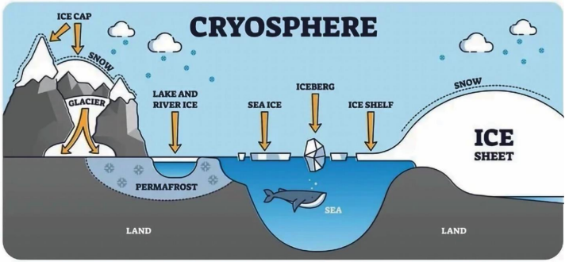
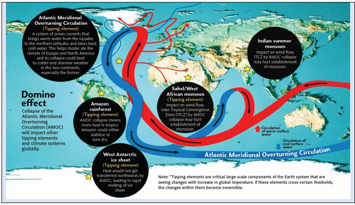
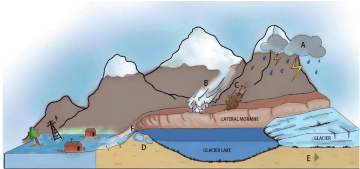
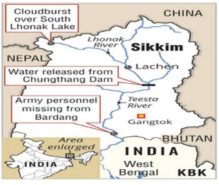
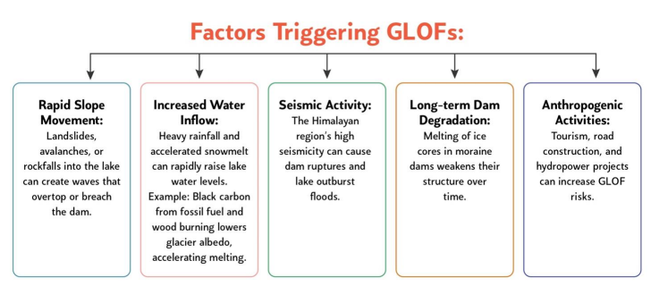

# Topic : Changes in critical geographical features (including water-bodies and polar ice caps) and, in flora and fauna and the effects of such changes.

### 1. Cryosphere : 

**1. Cryosphere and Climate Regulation**

The cryosphere, consisting of ice caps, glaciers, sea ice, and permafrost, is crucial for regulating the climate by reflecting sunlight and influencing ocean currents, which helps maintain global temperatures and water levels. Recently, Venezuela's Humboldt Glacier lost its last glacier, now downgraded to an ice field, due to rising temperatures, El Niño, and local climate changes.

----

**2. Causes and Consequences of Cryosphere Melting**

**Causes:**
- **Global Warming**: IPCC warns that a 1.5°C rise could rapidly melt the cryosphere, while 2.7°C or more will worsen the situation.
- **Albedo Effect**: Shrinking glaciers and sea ice reduce Earth's reflectivity, increasing solar absorption and accelerating warming. Example: 50% increase in solar absorption in the Arctic over 26 years.
- **Anthropogenic Activities**: Tourism, development, and emissions contribute to rising global temperatures.

**Consequences:**
- **Sea Level Rise (SLR)**: Melting ice causes sea level rise, impacting coastal areas. India’s 7,516 km coastline affects 170 million people.
- **Disrupted Ocean Circulation**: Freshwater from melting ice disrupts ocean currents, like the slowed Atlantic Meridional Overturning Circulation (AMOC), which decreased by 30% from 1994-2017.
- **Glacial Lake Outburst Floods (GLOFs)**: Over 5,000 glacial lakes in the Himalayas, with 200 potentially dangerous lakes in India, especially in Uttarakhand and Himachal Pradesh.

**Mitigation and Adaptation:**
- **Reduce Emissions**: Follow Paris Agreement targets.
- **Ecosystem-based Adaptation (EBA)**: Mangrove planting in Sri Lanka and India for coastal protection.
- **Technological Solutions**: Early warning systems like Sikkim's for GLOF management and monitoring by ISRO and GSI.
- **International Cooperation**: REDD+ projects for reducing deforestation.
- **Urban Planning**: Develop climate-resilient infrastructure in coastal cities.

Addressing cryosphere melting requires immediate and long-term strategies, aligned with SDGs 13, 9, 15, and 11, to mitigate impacts, preserve ecosystems, and adapt to changes.

### Note :

**Weakening of the Atlantic Meridional Overturning Circulation (AMOC)**

AMOC is a system of ocean currents that transports warm water from the equator to northern latitudes and returns cold water. Recent observations show its weakening, caused by:

- **Melting Ice Sheets**: Freshwater from melting ice reduces salinity and density, disrupting AMOC circulation, which can raise sea levels along the US east coast.
- **Weakened Gulf Stream**: Global warming impacts the Gulf Stream, contributing to AMOC instability and potentially causing cooling in Europe.
- **Increased Precipitation**: Altered salinity and density due to higher rainfall weaken AMOC’s strength.

-------

**1.1. Glacial Lake Outburst Floods (GLOFs)**

GLOFs occur when water is suddenly released from a glacial lake due to glacier melt, causing massive flooding. For example, a GLOF from Lhonak Lake devastated North Sikkim in 2023.

**Formation of Glacial Lakes**: As glaciers retreat from climate change, they leave depressions that fill with meltwater, forming glacial lakes. Over 5,000 glacial lakes have formed in the Himalayas, many held back by unstable moraines.

**Impacts of GLOFs**:
- **Loss of Life and Property**: Sudden floods can destroy communities with little warning.
- **Infrastructure Damage**: Roads, bridges, and hydropower projects are especially vulnerable.
- **Ecological Disruption**: Floods can disrupt river ecosystems and destroy habitats.

**Mitigation and Management Strategies**:
- **Government Measures**: NDMA has national guidelines on GLOF management, including land-use regulations in prone areas.
- **Early Warning Systems (EWS)**: Sensors and seismic monitors collect real-time data, like Sikkim’s early warning system at South Lhonak Lake.
- **Technical Measures**: Controlled drainage channels, tunnels, and spillways reduce lake volumes and lower lake levels in high-risk areas.

**Challenges**:
- Many glacial lakes are in remote locations, making monitoring and mitigation difficult.
- Lack of long-term data on glacial lake dynamics.
- Balancing development with GLOF risk management in Himalayan states.

Effective management of GLOFs requires scientific monitoring, engineering solutions, community preparedness, and regional cooperation.

-----