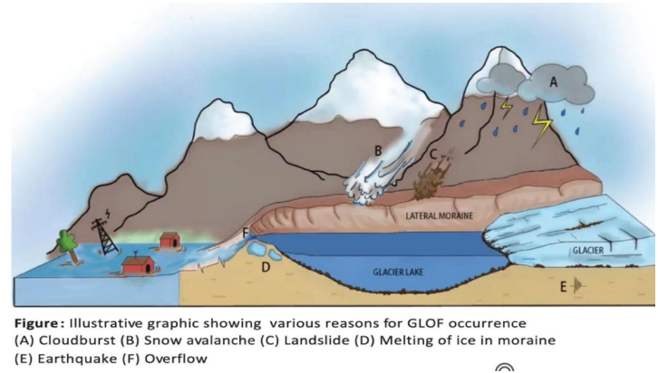
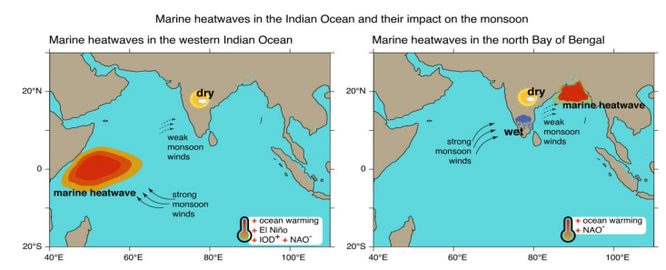
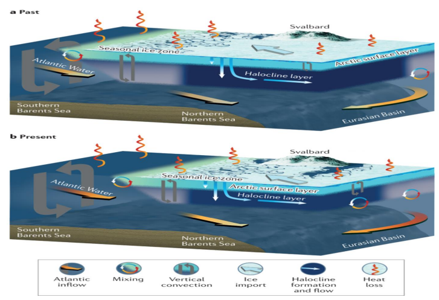
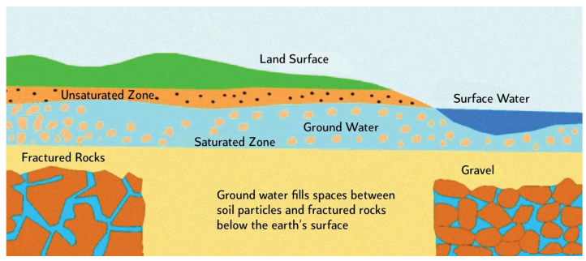
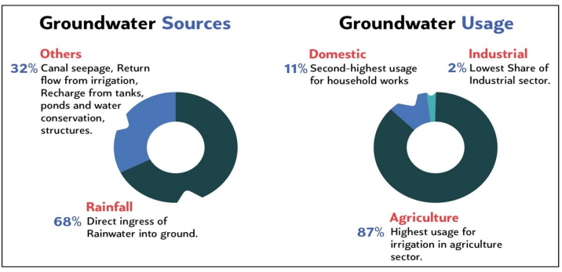

# Topic : Changes in critical geographical features (including water-bodies and polar ice caps) and, in flora and fauna and the effects of such changes.

-----
### 1. Cryosphere : 

----

**1. Cryosphere and Climate Regulation**

The cryosphere, consisting of ice caps, glaciers, sea ice, and permafrost, is crucial for regulating the climate by reflecting sunlight and influencing ocean currents, which helps maintain global temperatures and water levels. Recently, Venezuela's Humboldt Glacier lost its last glacier, now downgraded to an ice field, due to rising temperatures, El Niño, and local climate changes.

----

**2. Causes and Consequences of Cryosphere Melting**

**Causes:**
- **Global Warming**: IPCC warns that a 1.5°C rise could rapidly melt the cryosphere, while 2.7°C or more will worsen the situation.
- **Albedo Effect**: Shrinking glaciers and sea ice reduce Earth's reflectivity, increasing solar absorption and accelerating warming. Example: 50% increase in solar absorption in the Arctic over 26 years.
- **Anthropogenic Activities**: Tourism, development, and emissions contribute to rising global temperatures.

**Consequences:**
- **Sea Level Rise (SLR)**: Melting ice causes sea level rise, impacting coastal areas. India’s 7,516 km coastline affects 170 million people.
- **Disrupted Ocean Circulation**: Freshwater from melting ice disrupts ocean currents, like the slowed Atlantic Meridional Overturning Circulation (AMOC), which decreased by 30% from 1994-2017.
- **Glacial Lake Outburst Floods (GLOFs)**: Over 5,000 glacial lakes in the Himalayas, with 200 potentially dangerous lakes in India, especially in Uttarakhand and Himachal Pradesh.

**Mitigation and Adaptation:**
- **Reduce Emissions**: Follow Paris Agreement targets.
- **Ecosystem-based Adaptation (EBA)**: Mangrove planting in Sri Lanka and India for coastal protection.
- **Technological Solutions**: Early warning systems like Sikkim's for GLOF management and monitoring by ISRO and GSI.
- **International Cooperation**: REDD+ projects for reducing deforestation.
- **Urban Planning**: Develop climate-resilient infrastructure in coastal cities.

Addressing cryosphere melting requires immediate and long-term strategies, aligned with SDGs 13, 9, 15, and 11, to mitigate impacts, preserve ecosystems, and adapt to changes.

### Note :

**Weakening of the Atlantic Meridional Overturning Circulation (AMOC)**

AMOC is a system of ocean currents that transports warm water from the equator to northern latitudes and returns cold water. Recent observations show its weakening, caused by:

- **Melting Ice Sheets**: Freshwater from melting ice reduces salinity and density, disrupting AMOC circulation, which can raise sea levels along the US east coast.
- **Weakened Gulf Stream**: Global warming impacts the Gulf Stream, contributing to AMOC instability and potentially causing cooling in Europe.
- **Increased Precipitation**: Altered salinity and density due to higher rainfall weaken AMOC’s strength.

-------

**1.1. Glacial Lake Outburst Floods (GLOFs)**

GLOFs occur when water is suddenly released from a glacial lake due to glacier melt, causing massive flooding. For example, a GLOF from Lhonak Lake devastated North Sikkim in 2023.

**Formation of Glacial Lakes**: As glaciers retreat from climate change, they leave depressions that fill with meltwater, forming glacial lakes. Over 5,000 glacial lakes have formed in the Himalayas, many held back by unstable moraines.

**Impacts of GLOFs**:
- **Loss of Life and Property**: Sudden floods can destroy communities with little warning.
- **Infrastructure Damage**: Roads, bridges, and hydropower projects are especially vulnerable.
- **Ecological Disruption**: Floods can disrupt river ecosystems and destroy habitats.

**Mitigation and Management Strategies**:
- **Government Measures**: NDMA has national guidelines on GLOF management, including land-use regulations in prone areas.
- **Early Warning Systems (EWS)**: Sensors and seismic monitors collect real-time data, like Sikkim’s early warning system at South Lhonak Lake.
- **Technical Measures**: Controlled drainage channels, tunnels, and spillways reduce lake volumes and lower lake levels in high-risk areas.

**Challenges**:
- Many glacial lakes are in remote locations, making monitoring and mitigation difficult.
- Lack of long-term data on glacial lake dynamics.
- Balancing development with GLOF risk management in Himalayan states.

Effective management of GLOFs requires scientific monitoring, engineering solutions, community preparedness, and regional cooperation.

-----

### 2.Oceans : 

---

**2.1. Ocean Threats: Warming, Acidification, and Deoxygenation**

Oceans, covering 71% of Earth’s surface, are facing severe threats from ocean warming, acidification, and deoxygenation—known as the 'deadly trio.' These issues impact marine ecosystems and global climate.

**2.1. Ocean Warming**  
The ocean absorbs over 93% of excess heat from greenhouse gas emissions since the 1970s (IPCC SROCC, 2019). Impacts include:
- **Coral Bleaching**: A 50% decline in living corals in the Great Barrier Reef over the past three decades.
- **Species Migration**: Marine species, such as Indian oil sardine, are shifting poleward.
- **Polar Ice Melting**: Affects biodiversity from plankton to polar bears.
- **Impacts on India**: Rising sea surface temperatures in the Arabian Sea and Bay of Bengal are increasing the frequency of cyclones in the North Indian Ocean basin.

----

**2.2. Ocean Acidification**

Increased atmospheric CO2 is absorbed by the ocean, forming carbonic acid and lowering the water's pH. Impacts include:

- **Chemical Composition Changes**: Acidic waters dissolve calcium carbonate structures, harming organisms like corals, shellfish, and plankton.
- **Ecosystem Alterations**: Changes in ecosystems affect fisheries and coastal protection, such as the weakening of coral reefs in areas like the Gulf of Mannar and Lakshadweep.

----

**2.3. Ocean Deoxygenation**

Ocean deoxygenation is caused by rising temperatures and nutrient pollution, which decrease oxygen levels in seawater. Warm waters hold less oxygen, leading to hypoxic conditions. Impacts include:

- **Altered Marine Life Balance**: Hypoxia-tolerant species like jellyfish thrive in low-oxygen areas, pushing them into oxygen-rich zones.
- **Global Warming Contribution**: Deoxygenated waters release greenhouse gases like nitrous oxide and methane, worsening climate change.
- **Impacts on India**: Expanding Oxygen Minimum Zones (OMZ) in the Arabian Sea are affecting fisheries.

**Additional Phenomena:**

- **Marine Heatwaves (MHWs)**: Occur when sea surface temperatures are 5-7°C above average for at least five consecutive days.
  - **Causes**:
    - **Local Processes**: Ocean-atmosphere interactions and water mixing.
    - **El Niño**: Increases sea surface temperatures, influencing MHWs in tropical regions.
    - **Human Activities**: Greenhouse gas emissions from fossil fuel use and deforestation.
  - **Impacts on India**: Affects Southwest Monsoon patterns and increases extreme weather events (e.g., Cyclone Amphan, 2020).

- **Atlantification of the Arctic Basin**: The Arctic Ocean is becoming more like the Atlantic due to reduced sea ice and increased warm water inflow.
  - **Process**: Less sea ice allows warm Atlantic water to rise to the surface, accelerating ice melt and warming the region.
  - **Ecological Impacts**:
    - Reduced ice and freshwater availability.
    - Altered thermohaline circulation, potentially affecting Indian monsoon patterns.
    - Ecosystem disruption, impacting Arctic wildlife and food webs.

**Mitigation Strategies**:
- **Global Efforts**: 
  - Reduce CO2 emissions to limit global temperature rise (Paris Agreement).
  - Expand Marine Protected Areas (MPAs) and enforce the MARPOL Convention.
  - Achieve SDG 14 (Life Below Water).

- **Indian Initiatives**:
  - National Action Plan on Climate Change (NAPCC) focuses on sustainable development.
  - Coastal Regulation Zone (CRZ) Phase II (2022-2028) enhances coastal resilience.
  - Blue Economy Policy for sustainable coastal development.
  - Mangrove for the Future (MFF) program supports mangrove conservation for coastal protection and climate adaptation.

- **Sustainable Practices**:
  - Promote sustainable fisheries and aquaculture (e.g., Pradhan Mantri Matsya Sampada Yojana).
  - Reduce plastic pollution and marine debris (UN Global Partnership on Marine Litter).
  - Develop blue economy initiatives.

----

### 3. Water Resources :

----

**3.1. Groundwater**

Groundwater, sourced from rainwater that seeps through rocks and soil, is essential for drinking, farming, and industry. It sustains ecosystems and plays a key role in the water cycle. However, managing it sustainably is becoming more challenging due to global water shortages.

**Changes in Groundwater**:
- **Increase in Extraction**: Groundwater extraction rose slightly from 239.16 BCM in 2022 to 241.34 BCM in 2023.
- **Agriculture**: Accounts for nearly 90% of groundwater use, driven by power subsidies, MSP for water-intensive crops, and lack of regulation.
- **Urbanization and Infrastructure**: Deforestation and construction limit water percolation, reducing aquifer recharge.
- **Industrial and AI Use**: AI usage adds strain on water resources, with one AI search causing 10 times more pollution than a Google search.
- **Pollution**: Groundwater is contaminated by arsenic, fluoride, and heavy metals from human activities.

**Consequences of Groundwater Depletion**:
- **Disruption of the Hydrological Cycle**: Groundwater depletion leads to water shortages, affecting daily life and agriculture.
- **Shift of Earth’s Axis**: A 2021 study showed groundwater pumping tilted the planet nearly 80 cm east between 1993 and 2010.
- **Food Production Risks**: Over 60% of agricultural irrigation depends on groundwater, and its depletion threatens food supply, especially for water-intensive crops.
- **Health Hazards**: Contaminated groundwater can cause serious health issues like cancer and skin problems.
- **Economic Impact**: Groundwater scarcity can slow down industries, including tech and AI, which rely on it.

**Conclusion**:
To mitigate water stress, it’s crucial to address over-extraction, pollution, and inefficient use, ensuring food security, public health, and economic stability.

-----

**3.1.1. Current Status of Groundwater Use in India**

India, with 18% of the global population but only 2.4% of its land area, uses 4% of global water resources. According to World Bank - It is the largest consumer of groundwater, with usage set to rise due to population and economic growth.

**Challenges Associated with Groundwater Use**:
- **Demographic Pressure**: Per capita water availability dropped from 5,177 m³ in 1951 to 1,345 m³ in 2021 due to population growth.
- **Unsustainable Agricultural Practices**: The Green Revolution's legacy of water-intensive crops and electricity subsidies led to over-extraction, especially in states like Punjab and Haryana.
- **Governance Issues**: Multiple agencies (CGWB, State Ground Water Departments, local authorities) lead to inconsistent groundwater management.
- **Water Quality**: Contaminants like arsenic, fluoride, and nitrates affect millions in various districts.
- **Climate Change**: Changes in monsoon patterns and extreme weather events impact groundwater recharge.

**Steps Taken to Improve Groundwater Management**:
- **Model Groundwater Bill**: Proposes the creation of state groundwater authorities and a permit-based system for new wells.
- **Integration of Ministries**: The Ministry of Jal Shakti was formed to unify water resource management efforts.
- **Key Initiatives**:
  - **Atal Bhujal Yojana**: Focuses on participatory groundwater management.
  - **Jal Jeevan Mission**: Aims to provide tap water to all rural households by 2024.
  - **National Project on Aquifer Management (NAQUIM)**: Focuses on mapping and managing aquifers.

**Recommendations for Improving Groundwater Governance**:
- **Mihir Shah Committee Recommendations**: Unify CWC and CGWB into a National Water Commission for integrated management.
- **Reform Agricultural Policies**: Review subsidies and promote water-efficient crops and irrigation.
- **Enhance Urban Water Management**: Implement water-sensitive urban design and blue-green infrastructure.
- **Ecosystem Approach**: Rejuvenate traditional water harvesting structures and protect natural recharge zones.

**Conclusion**:
Despite progress, challenges from population growth, urbanization, and climate change persist. An integrated, community-focused approach aligned with SDGs 6 (Clean Water and Sanitation) and 11 (Sustainable Cities and Communities) is essential for India's water security.

**Global Models**:
- **Mexico**: Injects treated wastewater to replenish aquifers.
- **Chile**: Uses metering, leak detection, and wastewater reuse.
- **Brazil**: Implements water markets for allocation and funding recharge.
- **Australia**: Adopts integrated surface and groundwater management.

----

 **3.2. Water Bodies** 

  Include all natural or man-made structures like tanks, reservoirs, and ponds used for storing water for various purposes such as irrigation, industrial use, or recreation.  
  → These bodies collect water from sources like ice melt, streams, springs, rain, or diversion from rivers.  

---

 **Water Bodies Conservation:**

1. United Nations and Niti Aayog reports said that the demand for water will reach twice the available supply, and 40% of India’s population will not have access to clean drinking water by 2030.
2. One of the reasons is increasing negligence and lack of conservation of water bodies.

---

**Uses of Water Bodies:**

1. **Source of drinking water**  
   - Includes tanks, reservoirs, ponds, lakes, rivers, etc.
2. **Recharge groundwater**
3. **Maintain and restore the ecological balance**
4. **India is endowed with extraordinarily diverse water bodies**  
   - Tanks, ponds, reservoirs, rivers, lakes, ahars, bawdis, talabs, and others.
5. **Provide livelihood opportunities to a large number of people**
6. **Support biodiversity**

---

 **Issues with Water Bodies:**

1. **Issues of siltation and interrupted water flow from the catchment**
2. **Rapid urbanization and unplanned growth put waterbodies under stress.**
3. **Pollution due to untreated effluents and sewage**
4. **Decline in both the quality and quantity of these waterbodies**  
   - In urban India, the number of water bodies is declining rapidly. For example, 837 lakes lost in Bengaluru.
5. **Encroachment of waterbodies and loss of natural spaces as a major cause of flash floods**
6. **Groundwater depletion**  
   - 40% of India’s water supply comes from groundwater, with about 35% of districts facing critical or overexploited levels (CGWB).
7. **Water contamination**  
   - 70% of India’s water supply is contaminated (WHO).
8. **Economic impact**  
   - 6% loss in the country’s GDP (if this water crisis continues).

---

 **Some Steps Taken So Far:**

1. **Ministry of Environment, Forest and Climate Change (MoEF&CC):**  
   - Notified Wetlands (Conservation and Management) Rules, 2017.
2. **Central-level initiative:**  
   - Repair, Renovation, and Restoration of Water Bodies scheme in 2005.
3. **Policies and Acts:**  
   - Protection like Water (Prevention and Control of Pollution) Act, 2024.
4. **Community-driven initiatives:**  
   - Jal Shakti Abhiyan, a time-bound, mission-mode water conservation.
5. **Mission Amrit Sarovar (2022):**  
   - Developing and rejuvenating 75 water bodies per district.
6. **State example:**  
   - Gujarat’s Sujalam Sufalam Yojana created 32,000 new water bodies.

---

 **What Needs to Be Done:**

1. **Waterbodies need to be protected** through community management.  
   - For example, Gujarat’s Sujalam Sufalam Yojana.
2. **Urban planning needs to be engaged more critically** with the existing terrain.
3. **Emphasis on long-term goals (SDG-6):**  
   - Operation and maintenance along with the allocation of budget to sustain stability.
4. **Need for a comprehensive act for protection of urban waterbodies.**

----