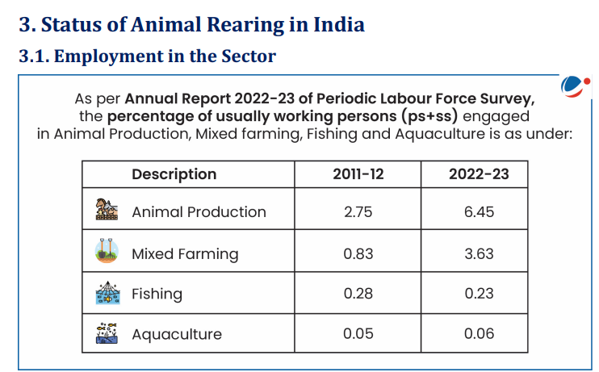
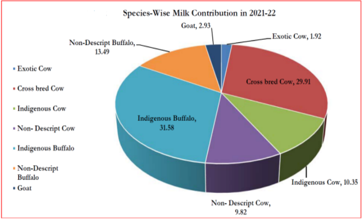
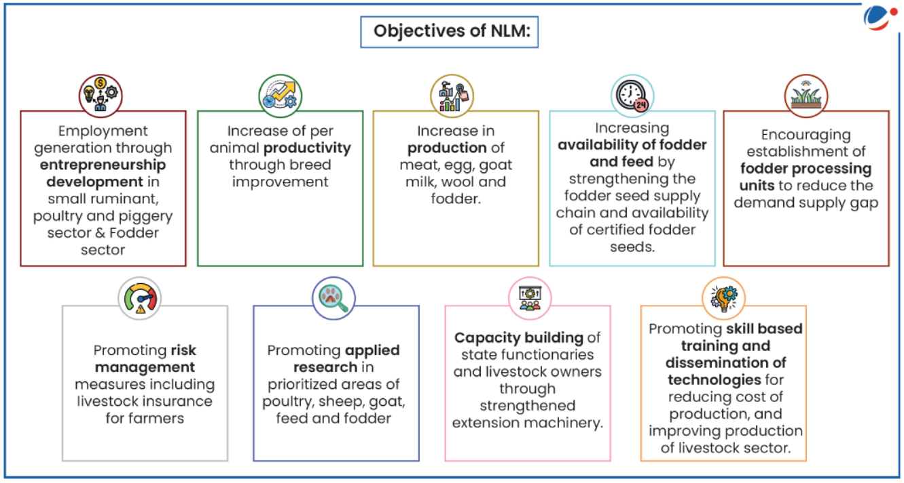
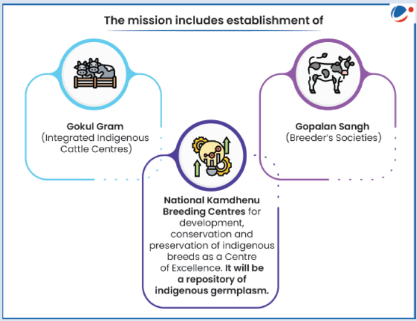
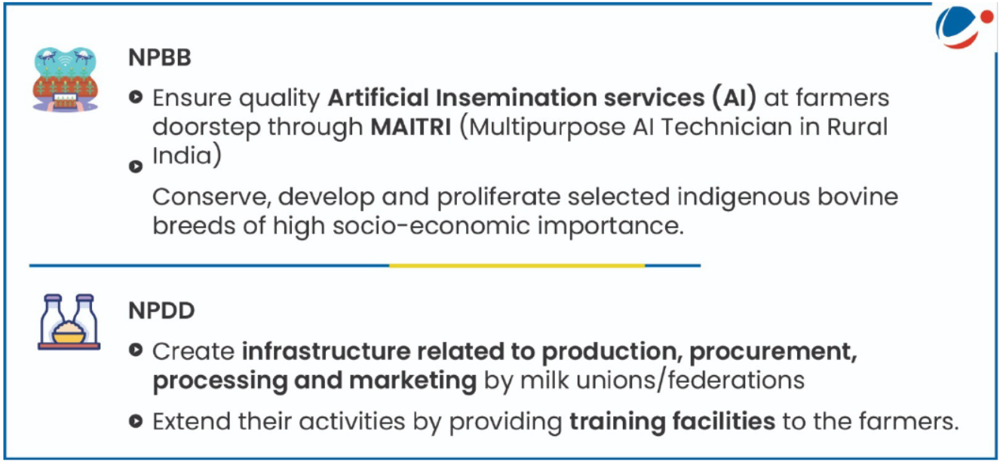
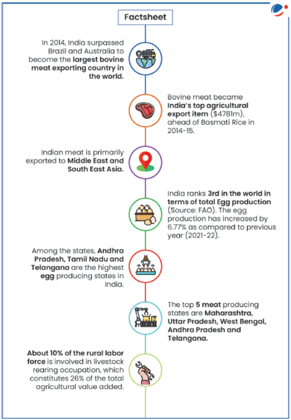
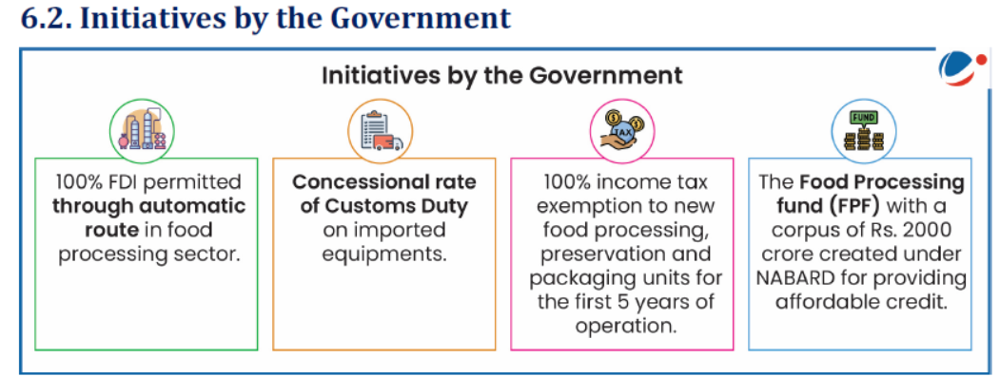

# Topic : Economics of animal-rearing.

**1. Introduction:**  

Animal husbandry involves raising livestock and selective breeding. It is a branch of agricultural science focused on the study and management of domesticated animal breeds to improve products and services. When combined with business practices, this field is known as Livestock Management.

----

**2. Significance of Animal Rearing :** 

Livestock plays a vital role in farmers' economies, especially in India, where mixed farming (combining crops and livestock) enhances resource efficiency. Livestock serves various purposes:

- **Income**  
  - Livestock provides supplementary income for many families, especially those with few animals.  
  - Cows and buffaloes generate regular income through milk sales.  
  - Sheep and goats help during emergencies, such as for weddings, medical expenses, children's education, or house repairs.  
  - Animals also act as assets, offering economic security.

- **Employment**  
  - Agriculture is seasonal, offering work for about 180 days a year. Livestock helps landless or small-scale farmers stay employed during off-seasons.

- **Food**  
  - Livestock products, like milk, meat, and eggs, are key sources of animal protein for livestock owners.

- **Draft**  
  - Bullocks are essential for tasks like ploughing, carting, and transporting goods, especially for small and marginal farmers.

- **Animal Waste**  
  - In rural areas, dung is used for fuel (dung cakes), fertilizer (farmyard manure), and plastering material.

- **Social Functions**  
  - Livestock offers social security, enhancing the status of owners, especially landless families.  
  - Animals are often gifted during weddings and used in various socio-religious rituals, such as worshiping cows and bulls.

----

----

----

**Livestock Production**  
According to the National Accounts Statistics 2019 by the Central Statistics Office (CSO), livestock output accounts for 31.81% of India's total agricultural and allied sector.

- **Milk**  
  - India is the largest producer of milk globally.  
  - Milk production in 2020-21 and 2021-22 was 209.96 million tonnes and 221.06 million tonnes, respectively, showing a 5.29% annual growth.  
  - The per capita milk availability was 444 grams/day in 2021-22.

- **Eggs**  
  - Poultry production has grown significantly over the past four decades, transitioning from traditional farming to commercial systems.  
  - India's poultry population is 851.81 million (according to the 20th Livestock Census), with egg production at 129.60 billion in 2021-22.  
  - Per capita availability in 2021-22 was around 95 eggs annually.

- **Wool Production**  
  - Wool production was 46.1 million kg in 2012-13, increasing to 48.1 million kg in 2014-15, but declined to 33.04 million kg in 2021-22.  
  - The growth rate in wool production was -10.53% in 2021-22.

- **Meat Production**  
  - Meat production increased from 5.95 million tonnes in 2012-13 to 9.29 million tonnes in 2021-22.

-----

**Challenges Faced by the Animal Husbandry Sector**  

- **Lower Farm Productivity**  
  - The average annual productivity of cattle in India was 1,777 kg per animal in 2019-20, compared to the global average of 2,699 kg.  
  - Outbreaks of diseases like Foot and Mouth Disease, Black Quarter infection, and Influenza continue to harm livestock health and lower productivity.

- **Lack of Access to Credit**  
  - The livestock sector receives only about 12% of the public expenditure on agriculture, which is disproportionate to its contribution to agricultural GDP.  
  - Financial institutions largely neglect the sector, with livestock's share of total agricultural credit never exceeding 4%.

- **Lack of Access to Organized Markets**  
  - Farmers often sell their produce in local markets, resulting in low profits.  
  - Informal market intermediaries exploit producers.

- **Loss of Pastures**  
  - Shrinking and degrading pastures, along with limited fodder, are major constraints preventing the sector from reaching its potential.

- **Insufficient Veterinary Services and Disease Control**  
  - There is a lack of infrastructure and trained personnel for timely disease diagnosis, reporting, and surveillance.  
  - The number of state and central laboratories is insufficient to cover the vast country.

- **Poor Quality Control**  
  - Testing for safety and quality of milk and livestock products at collection centers is almost nonexistent.  
  - Poor waste treatment and underutilization of dairy by-products are additional concerns.  
  - The lack of quality standards limits milk value addition and export potential.  
  - The demand for Indian ethnic meat products exists internationally, but the absence of international processing standards is a hindrance.

- **Non-Preference for Indigenous Species**  
  - India has a wide diversity of animals suited to harsh climates, limited nutrition, and disease resistance.  
  - Populations of indigenous breeds are declining due to the preference for highly productive exotic breeds.

----

**5. Government Initiatives :**

The government has introduced several schemes and plans to address these challenges.

----

**5.1. National Animal Disease Control Programme for FMD and Brucellosis :**  

**Key Features :** 

- The NADCP aims to control Foot and Mouth Disease (FMD) by 2025 and eradicate it by 2030, boosting domestic production and exports of milk and livestock products.  
- An intensive Brucellosis Control program will manage the disease in both animals and humans.  
- This is a Central Sector Scheme, with 100% funding from the Central Government to States/UTs.  
- The mission mode approach for disease eradication is the largest such effort globally for animal and human vaccination.  

----

**5.2. National Livestock Mission**

**Key Features:**

- **Focus Areas:**  
  - Entrepreneurship development  
  - Breed improvement in poultry, sheep, goats, and pigs, along with feed and fodder development.  
- **Sub-Missions:**  
  - Breed Development of Livestock and Poultry  
  - Feed and Fodder Development  
  - Innovation and Extension

-----

**5.3. Rashtriya Gokul Mission :** 

**Key Features**  

- The Rashtriya Gokul Mission (RGM), launched in December 2014, focuses on the development and conservation of indigenous bovine breeds. It continues under the Rashtriya Pashudhan Vikas Yojna from 2021 to 2026.  
- **Objectives:**  
  - Enhance bovine productivity and milk production using advanced technologies.  
  - Promote the use of high genetic merit bulls for breeding.  
  - Increase Artificial Insemination coverage by strengthening the breeding network and providing services at farmers' doorsteps.  
  - Support scientific and holistic conservation of indigenous cattle and buffalo.  

----

**5.4. Nationwide Artificial Insemination Programme**  

**Key Features :**

- The programme aims to inseminate 20,000 bovines per district across 600 districts.  
- It is a genetic up-gradation initiative to enhance milk production through low-cost breeding technology and improve the genetic merit of milch animals using high-quality seed.  
- All cows and buffaloes undergoing Artificial Insemination(AI) will be tagged and tracked through the Information Network on Animal Productivity and Health (INAPH) Database.  
- This is one of the largest breed improvement programmes, with 100% central funding.  

-----

**5.5. National Mission on Bovine Productivity**  

**Key Features**  

- Launched in November 2016, the mission is part of the Rashtriya Gokul Mission.  
- **Components:**  
  - **Pashu Sanjivni:** An animal wellness program providing health cards and unique IDs for animals, with data uploaded to the National Data Depository.  
  - **Advanced Breeding Technology:** Uses IVF, MOET, and sex-sorted semen techniques to improve the availability of disease-free, high genetic merit female bovines.  
  - **e-Pashuhaat:** A portal launched on 26 Nov 2016 to connect breeders and farmers for buying and selling germplasm.  
  - **National Bovine Genomic Centre for Indigenous Breeds (NBGC-IB).**

-----

**5.6. National Programme for Bovine Breeding and Dairy Development :**

**Key Features :**

- Launched in 2014 by merging four existing schemes:  
  - National Project for Cattle and Buffalo Breeding (NPCBB)  
  - Intensive Dairy Development Programme (IDDP)  
  - Strengthening Infrastructure for Quality & Clean Milk Production (SIQ & CMP)  
  - Assistance to Cooperatives (A to C)  
- The program aims to integrate milk production and dairying scientifically to increase milk production and productivity, meeting growing demand.  
- **Components:**  
  - National Programme for Bovine Breeding (NPBB)  
  - National Programme for Dairy Development (NPDD)  

  

- It includes provisions for rehabilitation assistance to improve sick milk cooperatives, with a central grant covering up to 50% of rehabilitation costs (up to Rs. 5 crore).

-----

**5.7. National Programme for Dairy Development (NPDD):**  

**Key Features**  

- The NPDD aims to improve milk quality and increase the share of organized milk procurement.  
- **Components:**  
  - **Component A:** Focuses on creating or strengthening infrastructure for quality milk testing equipment and primary chilling facilities for State Cooperative Dairy Federations, District Cooperative Milk Producers' Unions, SHGs, private dairies, Milk Producer Companies, and Farmer Producer Organisations.  
  - **Component B:** Provides financial assistance through the Japan International Cooperation Agency (JICA) as per an existing project agreement.

----

**5.8. Dairy Processing & Infrastructure Development Fund (DIDF):**  

**Key Features:**

- Announced in the Union Budget 2017-18, the DIDF has a corpus of Rs. 8,004 crores, managed by NABARD.  
- The scheme aims to modernize milk processing plants and machinery, and create additional infrastructure to process more milk.

----

**Pink Revolution: Overview and Challenges in Indian Meat Sector**

The Pink Revolution refers to the modernization of the meat and poultry processing sector in India through specialization, mechanization, and standardization.

**Challenges in the Indian Meat Sector:**

1. **Lack of Focus on Meat Animal Production:**
   - Issues include inadequate feed and fodder, poor quality breeding stock, high disease-related mortality, and lack of marketing infrastructure.

2. **Inadequate Infrastructure:**
   - Slaughterhouses often lack basic hygiene and efficient byproduct use. Retail meat shops also have minimal facilities, impacting hygiene and consumer trust.

3. **Animal Welfare Concerns:**
   - Overcrowded transportation of animals leads to stress, negatively affecting meat quality.

4. **Low Value Addition and Processing:**
   - Only 21% of meat is processed further, with most processing focused on buffalo meat for exports. This is significantly lower than the global average of 70%.

5. **Underutilization of By-products:**
   - A large portion of the animal's weight is wasted as byproducts. Limited processing capacity, market availability, and cost hinder byproduct recovery.

6. **Prevalence of Diseases:**
   - Foot and mouth disease (FMD) is a major concern. Control measures have been in place for 20 years, with immunization efforts in key export zones.

These challenges hinder the full potential of India's meat sector, requiring significant improvements in infrastructure, processing, and animal welfare.

-----

----

