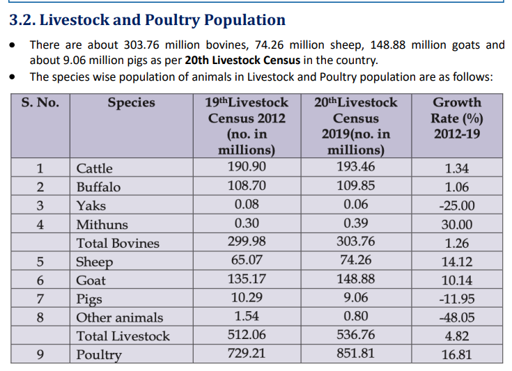
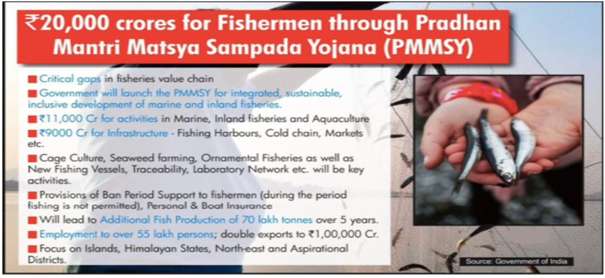

# Topic : Economics of animal-rearing.

**1. Introduction:**  

Animal husbandry involves raising livestock and selective breeding. It is a branch of agricultural science focused on the study and management of domesticated animal breeds to improve products and services. When combined with business practices, this field is known as Livestock Management.

----

**2. Significance of Animal Rearing :** 

Livestock plays a vital role in farmers' economies, especially in India, where mixed farming (combining crops and livestock) enhances resource efficiency. Livestock serves various purposes:

- **Income**  
  - Livestock provides supplementary income for many families, especially those with few animals.  
  - Cows and buffaloes generate regular income through milk sales.  
  - Sheep and goats help during emergencies, such as for weddings, medical expenses, children's education, or house repairs.  
  - Animals also act as assets, offering economic security.

- **Employment**  
  - Agriculture is seasonal, offering work for about 180 days a year. Livestock helps landless or small-scale farmers stay employed during off-seasons.

- **Food**  
  - Livestock products, like milk, meat, and eggs, are key sources of animal protein for livestock owners.

- **Draft**  
  - Bullocks are essential for tasks like ploughing, carting, and transporting goods, especially for small and marginal farmers.

- **Animal Waste**  
  - In rural areas, dung is used for fuel (dung cakes), fertilizer (farmyard manure), and plastering material.

- **Social Functions**  
  - Livestock offers social security, enhancing the status of owners, especially landless families.  
  - Animals are often gifted during weddings and used in various socio-religious rituals, such as worshiping cows and bulls.

----

----

----

**Livestock Production**  
According to the National Accounts Statistics 2019 by the Central Statistics Office (CSO), livestock output accounts for 31.81% of India's total agricultural and allied sector.

- **Milk**  
  - India is the largest producer of milk globally.  
  - Milk production in 2020-21 and 2021-22 was 209.96 million tonnes and 221.06 million tonnes, respectively, showing a 5.29% annual growth.  
  - The per capita milk availability was 444 grams/day in 2021-22.

- **Eggs**  
  - Poultry production has grown significantly over the past four decades, transitioning from traditional farming to commercial systems.  
  - India's poultry population is 851.81 million (according to the 20th Livestock Census), with egg production at 129.60 billion in 2021-22.  
  - Per capita availability in 2021-22 was around 95 eggs annually.

- **Wool Production**  
  - Wool production was 46.1 million kg in 2012-13, increasing to 48.1 million kg in 2014-15, but declined to 33.04 million kg in 2021-22.  
  - The growth rate in wool production was -10.53% in 2021-22.

- **Meat Production**  
  - Meat production increased from 5.95 million tonnes in 2012-13 to 9.29 million tonnes in 2021-22.

-----

**Challenges Faced by the Animal Husbandry Sector**  

- **Lower Farm Productivity**  
  - The average annual productivity of cattle in India was 1,777 kg per animal in 2019-20, compared to the global average of 2,699 kg.  
  - Outbreaks of diseases like Foot and Mouth Disease, Black Quarter infection, and Influenza continue to harm livestock health and lower productivity.

- **Lack of Access to Credit**  
  - The livestock sector receives only about 12% of the public expenditure on agriculture, which is disproportionate to its contribution to agricultural GDP.  
  - Financial institutions largely neglect the sector, with livestock's share of total agricultural credit never exceeding 4%.

- **Lack of Access to Organized Markets**  
  - Farmers often sell their produce in local markets, resulting in low profits.  
  - Informal market intermediaries exploit producers.

- **Loss of Pastures**  
  - Shrinking and degrading pastures, along with limited fodder, are major constraints preventing the sector from reaching its potential.

- **Insufficient Veterinary Services and Disease Control**  
  - There is a lack of infrastructure and trained personnel for timely disease diagnosis, reporting, and surveillance.  
  - The number of state and central laboratories is insufficient to cover the vast country.

- **Poor Quality Control**  
  - Testing for safety and quality of milk and livestock products at collection centers is almost nonexistent.  
  - Poor waste treatment and underutilization of dairy by-products are additional concerns.  
  - The lack of quality standards limits milk value addition and export potential.  
  - The demand for Indian ethnic meat products exists internationally, but the absence of international processing standards is a hindrance.

- **Non-Preference for Indigenous Species**  
  - India has a wide diversity of animals suited to harsh climates, limited nutrition, and disease resistance.  
  - Populations of indigenous breeds are declining due to the preference for highly productive exotic breeds.

----

**5. Government Initiatives :**

The government has introduced several schemes and plans to address these challenges.

----

**5.1. National Animal Disease Control Programme for FMD and Brucellosis :**  

**Key Features :** 

- The NADCP aims to control Foot and Mouth Disease (FMD) by 2025 and eradicate it by 2030, boosting domestic production and exports of milk and livestock products.  
- An intensive Brucellosis Control program will manage the disease in both animals and humans.  
- This is a Central Sector Scheme, with 100% funding from the Central Government to States/UTs.  
- The mission mode approach for disease eradication is the largest such effort globally for animal and human vaccination.  

----

**5.2. National Livestock Mission**

**Key Features:**

- **Focus Areas:**  
  - Entrepreneurship development  
  - Breed improvement in poultry, sheep, goats, and pigs, along with feed and fodder development.  
- **Sub-Missions:**  
  - Breed Development of Livestock and Poultry  
  - Feed and Fodder Development  
  - Innovation and Extension

-----

**5.3. Rashtriya Gokul Mission :** 

**Key Features**  

- The Rashtriya Gokul Mission (RGM), launched in December 2014, focuses on the development and conservation of indigenous bovine breeds. It continues under the Rashtriya Pashudhan Vikas Yojna from 2021 to 2026.  
- **Objectives:**  
  - Enhance bovine productivity and milk production using advanced technologies.  
  - Promote the use of high genetic merit bulls for breeding.  
  - Increase Artificial Insemination coverage by strengthening the breeding network and providing services at farmers' doorsteps.  
  - Support scientific and holistic conservation of indigenous cattle and buffalo.  

----

**5.4. Nationwide Artificial Insemination Programme**  

**Key Features :**

- The programme aims to inseminate 20,000 bovines per district across 600 districts.  
- It is a genetic up-gradation initiative to enhance milk production through low-cost breeding technology and improve the genetic merit of milch animals using high-quality seed.  
- All cows and buffaloes undergoing Artificial Insemination(AI) will be tagged and tracked through the Information Network on Animal Productivity and Health (INAPH) Database.  
- This is one of the largest breed improvement programmes, with 100% central funding.  

-----

**5.5. National Mission on Bovine Productivity**  

**Key Features**  

- Launched in November 2016, the mission is part of the Rashtriya Gokul Mission.  
- **Components:**  
  - **Pashu Sanjivni:** An animal wellness program providing health cards and unique IDs for animals, with data uploaded to the National Data Depository.  
  - **Advanced Breeding Technology:** Uses IVF, MOET, and sex-sorted semen techniques to improve the availability of disease-free, high genetic merit female bovines.  
  - **e-Pashuhaat:** A portal launched on 26 Nov 2016 to connect breeders and farmers for buying and selling germplasm.  
  - **National Bovine Genomic Centre for Indigenous Breeds (NBGC-IB).**

-----

**5.6. National Programme for Bovine Breeding and Dairy Development :**

**Key Features :**

- Launched in 2014 by merging four existing schemes:  
  - National Project for Cattle and Buffalo Breeding (NPCBB)  
  - Intensive Dairy Development Programme (IDDP)  
  - Strengthening Infrastructure for Quality & Clean Milk Production (SIQ & CMP)  
  - Assistance to Cooperatives (A to C)  
- The program aims to integrate milk production and dairying scientifically to increase milk production and productivity, meeting growing demand.  
- **Components:**  
  - National Programme for Bovine Breeding (NPBB)  
  - National Programme for Dairy Development (NPDD)  

  

- It includes provisions for rehabilitation assistance to improve sick milk cooperatives, with a central grant covering up to 50% of rehabilitation costs (up to Rs. 5 crore).

-----

**5.7. National Programme for Dairy Development (NPDD):**  

**Key Features**  

- The NPDD aims to improve milk quality and increase the share of organized milk procurement.  
- **Components:**  
  - **Component A:** Focuses on creating or strengthening infrastructure for quality milk testing equipment and primary chilling facilities for State Cooperative Dairy Federations, District Cooperative Milk Producers' Unions, SHGs, private dairies, Milk Producer Companies, and Farmer Producer Organisations.  
  - **Component B:** Provides financial assistance through the Japan International Cooperation Agency (JICA) as per an existing project agreement.

----

**5.8. Dairy Processing & Infrastructure Development Fund (DIDF):**  

**Key Features:**

- Announced in the Union Budget 2017-18, the DIDF has a corpus of Rs. 8,004 crores, managed by NABARD.  
- The scheme aims to modernize milk processing plants and machinery, and create additional infrastructure to process more milk.

----

**Pink Revolution: Overview and Challenges in Indian Meat Sector**

The Pink Revolution refers to the modernization of the meat and poultry processing sector in India through specialization, mechanization, and standardization.

**Challenges in the Indian Meat Sector:**

1. **Lack of Focus on Meat Animal Production:**
   - Issues include inadequate feed and fodder, poor quality breeding stock, high disease-related mortality, and lack of marketing infrastructure.

2. **Inadequate Infrastructure:**
   - Slaughterhouses often lack basic hygiene and efficient byproduct use. Retail meat shops also have minimal facilities, impacting hygiene and consumer trust.

3. **Animal Welfare Concerns:**
   - Overcrowded transportation of animals leads to stress, negatively affecting meat quality.

4. **Low Value Addition and Processing:**
   - Only 21% of meat is processed further, with most processing focused on buffalo meat for exports. This is significantly lower than the global average of 70%.

5. **Underutilization of By-products:**
   - A large portion of the animal's weight is wasted as byproducts. Limited processing capacity, market availability, and cost hinder byproduct recovery.

6. **Prevalence of Diseases:**
   - Foot and mouth disease (FMD) is a major concern. Control measures have been in place for 20 years, with immunization efforts in key export zones.

These challenges hinder the full potential of India's meat sector, requiring significant improvements in infrastructure, processing, and animal welfare.

-----

----

**Fisheries in India: Overview**

Fisheries are a key sector in India, providing food, nutrition, employment, and income. It supports the livelihoods of over 28 million people, especially in marginalized communities. Fish is an affordable, nutritious source of animal protein, helping combat hunger and malnutrition.

- **Economic Contribution**: Fisheries contribute 1.24% to India's Gross Value Added (GVA) and 7.28% to agricultural GVA.
- **Management**: Fisheries are a state subject in India. Inland fisheries are managed entirely by state governments, while marine fisheries are jointly managed by the Central and Coastal State/UT governments.

----

**Constraints in the Growth of the Fisheries Sector**

1. **Marine Fisheries:**
   - Limited expansion due to overcapacity in territorial waters.
   - Weak regulations, inefficient management, and reliance on traditional fishing methods.

2. **Inadequate Infrastructure:**
   - Poor infrastructure such as fishing harbors, landing centers, cold chain systems, and distribution networks.
   - Challenges in processing, value addition, traceability, certification, and lack of skilled manpower.

3. **Inland Capture Fisheries:**
   - Seasonal fishing, depleted stocks, tenure and lease rights issues, outdated harvesting technology, and low investment hinder growth.

4. **Culture Fisheries:**
   - Limited access to institutional credit, high borrowing costs, poor infrastructure for all stages of aquaculture, low technology adoption, and a shortage of skilled workers and extension services.

----

**National Fisheries Policy 2020: Mission and Objectives**

**Mission:**
The policy aims to create an ecologically sustainable, economically viable, and socially inclusive fisheries sector that contributes to the economic well-being of fishers and fish farmers, ensuring food and nutritional security for the country.

**Objectives:**
1. Establish a strong management and regulatory framework with legal support for effective resource management using an Ecosystem Approach to Fisheries (EAF).
2. Modernize and diversify fishing practices, focusing on sustainability and the infusion of science and technology.
3. Conserve native fish genetic resources and their ecosystems.
4. Strengthen the fisheries value chain by improving infrastructure, reducing post-harvest losses, and promoting value-added products.
5. Create employment and entrepreneurship opportunities along the value chain to increase incomes and improve living standards of fishers and farmers.
6. Ensure food and nutritional security by increasing the availability of safe, affordable, and quality fish.

-----

**Pradhan Mantri Matsya Sampada Yojana (PMMSY): Overview**

**Introduction:**
Launched in September 2020 by PM Narendra Modi, the scheme aims to boost fish production to 220 lakh metric tons by 2024-25, up from 137.58 lakh metric tons in 2018-19, with an annual growth rate of about 9%.

**Objectives:**
1. Increase fish production by 70 lakh metric tons by 2024-25.
2. Boost fisheries export earnings to Rs. 1,00,000 crores.
3. Double the incomes of fishers and fish farmers.
4. Reduce post-harvest losses from 20-25% to about 10%.
5. Create 55 lakh direct and indirect employment opportunities in the fisheries sector.
6. **PM-MKSSY Sub-scheme:** Aimed at supporting micro and small enterprises in the fisheries sector, with an investment of ₹6,000 crore over the next four years.

-----

**Blue Revolution – Neel Kranti Mission: Overview**

The Blue Revolution, under the **Integrated Development and Management of Fisheries (Central Sector Scheme)**, aims to boost fisheries production and productivity from both inland and marine resources, focusing on sustainable aquaculture practices.

**Objectives:**
1. Increase fish production sustainably for economic growth.
2. Modernize the fisheries sector with a focus on new technologies.
3. Ensure food and nutritional security.
4. Generate employment and increase export earnings.
5. Promote inclusive development and empower fishers and aquaculture farmers.
6. Strengthen institutional arrangements for the fisheries sector.
7. Improve fisheries data and GIS systems, assisting state governments with data collection and water body mapping.
8. Enhance Monitoring, Control, and Surveillance (MCS) systems, including biometric ID cards for marine fishers and vessel registration.
9. Implement welfare schemes for fishers, such as housing, basic amenities, insurance, and grants to fisher cooperatives.

An Integrated National Fisheries Action Plan 2020 has been developed to achieve the goals of the Blue Revolution.

----

**Operation Flood: Major Achievements**

Launched in 1970 by the **National Dairy Development Board (NDDB)** under the guidance of **Verghese Kurien**, Operation Flood became the world’s largest dairy development program.

**Key Achievements:**
1. **Global Impact**: Transformed India from a milk-deficient nation to the world’s largest milk producer, surpassing the USA in 1998. By 2010–11, India contributed about 17% of the global milk output.
2. **Increased Milk Availability**: Over 30 years, it doubled milk availability per person and made dairy farming a major rural employment source.
3. **National Milk Grid**: A nationwide system that links producers to consumers in over 700 towns and cities, stabilizing prices and ensuring fair market rates for producers.
4. **Cooperative Structure**: The program relied on village-level milk producer cooperatives, which provided services, inputs, and technology to members.
5. **Self-Sufficiency**: By 1975, India stopped importing milk and milk products. For the last 15 years, India has maintained its position as the largest milk producer, thanks to Operation Flood and the White Revolution.

-----

**Need for a Second White Revolution: Overview**

India's milk production must increase significantly to meet growing demand due to urbanization and population growth. By 2050-51, India will need around **600 million metric tons** of milk annually (65 crore liters/day), up from the current **176 million metric tons** (48 crore liters/day). This requires a growth rate of **3.2% CAGR** over the next 40 years, which can only be achieved with stable and remunerative prices for dairy farmers. Therefore, the need for a **Second White Revolution** is crucial.

**Suggested Methods to Achieve Growth:**

1. **Large-Scale Dairy Farms:**
   - Establish integrated dairy farms by cooperatives and corporates with automated milking, feeding, processing, and in-house breed improvement.
   - These farms can sell milk to other plants or add value through processing.

2. **Hub and Spoke Model:**
   - **Hub**: A large farm with integrated facilities for milking, feed production, and processing, housing over 500 cows.
   - **Spokes**: Smaller, satellite farms with 50-200 cows each, focusing on milking and cattle management, supported technically by the hub.
   - The anchor farm provides veterinary care, feed management, and training, creating a socially inclusive system.

3. **Progressive Dairy Farmer Model:**
   - Large investments in farm infrastructure by an anchor, with cow stalls leased to farmers who manage them under guidance.
   - The anchor buys back the milk from farmers, allowing small farmers to benefit from technology and scale.
   - This model includes the concept of **hostels for cows** and mid-sized dairy farms with 200-300 cattle.

4. **Community Model:**
   - Community ownership and management of dairy infrastructure, such as housing, breeding, feeding, and milking, under a cooperative or producer company model.
   - Farmers in a localized area can share technical support services.
   - Equipment such as milking machines and storage facilities is owned collectively by the community, with no restriction on milk sales to specific entities.

  -----

Extra : 

**Livestock Farming and Climate Change: Overview**

**Role of Livestock in the Indian Economy:**
Livestock farming is an integral part of India's agricultural economy, contributing significantly to the gross agricultural production value. It includes the rearing of animals such as cattle, goats, poultry, and horses for food and other human uses, including milk, meat, wool, and leather.

**Impacts of Livestock Farming on Climate Change:**
- According to the **FAO**, livestock farming contributes approximately **14.5%** of human-induced greenhouse gas (GHG) emissions. 
- Major emissions come from **methane** (produced by enteric fermentation in animals) and **nitrous oxide** (from manure storage and fertilizer use).
- Additional emissions result from **land use changes** related to feed production, processing, and the manufacturing of fertilizers and pesticides.

**Impact of Climate Change on Livestock Farming:**
- **Heat Stress**: Reduces milk and meat production, impacts embryo development, and increases embryonic mortality in cattle.
- **Species Composition Changes**: Alters livestock productivity as climate affects the survival of certain species.
- **Health Risks**: Increased risks of diseases due to warmer, wetter climates.
- **Adaptive Mechanisms**: Animals may initiate adaptive responses, which can reduce their productive potential.
- **Water Scarcity**: Irregular water availability affects forage quality and livestock productivity.

---

**Measures to Make Livestock Farming Sustainable and Resilient:**

1. **Breeding and Conservation:**
   - Implement **breeding programs** to improve livestock adaptation to changing environments and resistance to stress and shocks.
   - Focus on conserving **animal genetic diversity** for resilience.

2. **Grazing Management:**
   - Balance the **spatial and temporal grazing pressure** to optimize land use and minimize overgrazing.
   - Introduce **leguminous species** and manage nutrient recycling for better soil and forage health.

3. **Circular Bio-Economy Integration:**
   - Enhance the integration of livestock into the **circular bio-economy** by recycling nutrients and energy from animal waste, reducing dependency on external inputs.

4. **Improved Livestock Productivity:**
   - Improve **feed quality** to boost livestock productivity.
   - Establish **veterinary infrastructure** to reduce disease, parasite, and insect burdens, ensuring better health and productivity.

5. **Scientific Assessment and Framework:**
   - Strengthen the knowledge base on the **impact of climate change** on livestock, and develop **guidelines** for better livestock management practices.

6. **Additional Measures:**
   - Provide **training for farmers** on scientific rearing practices.
   - Use **weather information** and **weather-index-based insurance** to enhance resilience to climate change.

By implementing these strategies, livestock farming can become more sustainable and resilient, helping mitigate climate change impacts while ensuring long-term productivity and sustainability.

-----

**Livestock-based Integrated Farming System (IFS): Overview**

**Integrated Farming System (IFS):**
IFS is an agricultural approach where multiple, interdependent, and often interrelated production systems (such as crops, animals, and subsidiary enterprises) are combined to maximize nutrient utilization and minimize environmental impact. It involves using the outputs from one system as inputs for another, creating a mutually beneficial cycle of production.

**Livestock-based IFS:**
Livestock-based IFS incorporates livestock raising, crop farming, and sometimes fish culture. For example, in **fish-cum-pig farming**, the waste from pigs is used as manure to nourish zooplankton and phytoplankton in a pond, which, in turn, serve as nutrients for fish. The pond's biomass-rich bottom soil is then used for crops or vegetables.

---

**Benefits of Livestock-based IFS:**

1. **Increased Productivity:**
   - IFS intensifies crop and allied activities, boosting **yields per unit area** and enhancing overall productivity.

2. **Sustainability:**
   - Waste recycling from different systems in IFS increases **sustainability**, minimizes environmental pollution, and optimizes resource use.

3. **Balanced Nutrition:**
   - IFS ensures a **diverse range of food** production (crops, livestock, eggs, milk, etc.), providing small-scale farmers with a balanced and varied diet.

4. **Profitability:**
   - By reducing input costs through resource sharing (e.g., using livestock waste for crops), IFS lowers the cost of production and boosts farmers' **purchasing power**.

5. **Income Stability:**
   - Livestock-based IFS offers **year-round income** from multiple sources such as crops, meat, milk, and eggs, ensuring stable cash flow for farmers.

6. **Employment Generation:**
   - The combination of crops and livestock increases labor demand, helping to reduce **underemployment** in rural areas.

7. **Energy Savings:**
   - Cattle dung can be used as a **biomass energy source**, reducing dependency on fossil fuels like petrol and diesel.

8. **Fodder Availability:**
   - Crop by-products and waste are effectively repurposed as **fodder** for livestock, addressing fodder shortages.

---

**Conclusion:**
Livestock-based IFS is a sustainable, efficient, and profitable agricultural model. It has been traditionally practiced in India, especially in the North-Eastern region, and has the potential to be expanded nationwide. By promoting integrated, closed-cycle farming, IFS can help achieve higher productivity, environmental sustainability, and improved livelihoods, contributing to the goal of doubling farmers’ income and fostering sustainable development in developing countries.

-----

**Poor Quality and Inadequate Availability of Feeds and Fodder: Impact on Livestock Productivity in India**

**Introduction:**
Livestock plays a significant role in India's agricultural economy, with cattle, buffaloes, goats, and sheep being integral to rural livelihoods. However, despite the large livestock population, **productivity** in India remains low. For example, the average annual productivity of cattle in India is 1777 kg per animal, which is considerably lower than the global average of 2699 kg per animal per year. The main factors contributing to this low productivity are intrinsic issues like genetic limitations and extrinsic factors such as poor nutrition, poor feed management, ineffective veterinary care, and inadequate feed and fodder.

---

**Quality and Availability of Feeds and Fodder:**
The **availability and quality of feed and fodder** are critical in determining the productivity of livestock. According to the Indian Grassland and Fodder Research Institute, there is a significant shortfall in the availability of key feed resources:
- **Dry fodder**: There is a deficit of 23.4% in dry fodder availability.
- **Green fodder**: A shortfall of 11.24% exists.
- **Concentrates**: A deficit of 28.9% has been reported for concentrates (protein-rich feed).

The lack of sufficient, high-quality feed is one of the primary reasons behind low productivity in the sector.

---

**Reasons for Poor Quality and Shortage of Feed and Fodder:**

1. **Pressure on Land:**
   - The land area dedicated to **fodder cultivation** has remained stagnant at around 4% of the total cropping area. This is due to the increasing demand for food grains, oilseeds, and pulses, along with declining land size and encroachment on grazing lands. As a result, livestock mainly depend on **crop residues** (which make up more than 44% of the feed) that are low in nutritional value, high in fiber, and deficient in essential nutrients like crude protein.

2. **Issues with Crop Residues and Dry Fodder:**
   - Farmers are increasingly using **high-yielding dwarf crop varieties** (such as wheat, maize, and sorghum), which produce less straw. Moreover, **straw** is often diverted for use in industries like paper production or for brick-making. Additionally, **straw-burning** is a widespread practice, further reducing the availability of dry fodder.

3. **Price Volatility:**
   - The prices of **feed ingredients** are highly volatile, leading feed manufacturers to substitute cheaper ingredients, which often compromise the quality of the feed. This adversely impacts the health and productivity of the livestock.

4. **Limited Adoption of Improved Fodder Varieties:**
   - Farmers are often unaware of or lack access to **improved fodder varieties**. The absence of an assured market for fodder crops discourages adoption, and as a result, farmers rely on traditional, often low-quality fodder varieties.

---

**Measures to Improve Quality and Quantity of Fodder:**

1. **Cooperatives and Grazing Lands:**
   - Establishing **fodder cooperatives** and increasing the area of **common grazing lands** can help ensure a consistent and adequate supply of feed and fodder for livestock. This can be especially helpful in regions with limited private land.

2. **Integrated Farming Systems (IFS):**
   - Implementing **silvi-pastoral** (combining forestry and pasture) and **horti-pastoral** models can substantially increase fodder production. Additionally, unused farmland areas can be converted into **fodder production zones**, improving the overall availability of feed.

3. **Buffer Stocks and Fodder Banks:**
   - **Community fodder banks** can be established where surplus fodder is stored as **hay, silage, or fodder blocks** for use during scarcity periods. This can help manage fodder availability in times of shortage, particularly during droughts.

4. **Support for Farmers:**
   - Providing **credit facilities**, **assured markets**, and **forward and backward linkages** for fodder production can incentivize farmers to produce high-quality fodder. Additionally, promoting **fodder production** through initiatives like **fodder producer organizations (FPOs)** can help address the supply-demand gap.

5. **Government Initiatives:**
   - The government has recognized the importance of **fodder production** and has initiated measures such as using **MGNREGA** (Mahatma Gandhi National Rural Employment Guarantee Act) funds to develop **fodder farms**. There are also plans to promote **quality fodder seeds** and link **fodder deficit states** with those producing surplus fodder.

---

**Conclusion:**
The poor quality and inadequate availability of feeds and fodder are major contributors to low livestock productivity in India. To address this, it is essential to implement strategies like fostering **cooperatives**, adopting **integrated farming systems**, establishing **fodder banks**, and supporting farmers through financial incentives and education. With the increasing demand for livestock products and the rising livestock population, ensuring a consistent supply of quality feed and fodder is crucial for enhancing productivity and sustaining the growth of India's livestock sector.

-----

**Women’s Contribution to Livestock Rearing in India and the Issues They Face**

**Introduction:**
The livestock sector plays a vital role in the rural economy of India, accounting for 5% of the national income and 28% of agricultural GDP as of 2018-19. In recent years, the sector has grown rapidly, with a growth rate of 7.9% over six years, compared to 2% growth in crop farming. Livestock provides a crucial source of income, especially for poor, landless, and marginal farmers. In this context, **women** play an indispensable role in livestock rearing, contributing not only to the household income but also to food security and nutrition.

---

**Contribution of Women to Livestock Rearing in India:**
1. **Workforce Participation:**
   - Women make up **about 69%** of the workforce engaged in the livestock sector, with even higher participation rates in tribal states such as Jharkhand, Chhattisgarh, and Odisha, where women's contribution can reach up to **90%**.
   
2. **Dairy Cooperatives:**
   - Women are increasingly involved in **dairy cooperatives**, with **31% of all dairy cooperative members** being women as of 2020-21. The number of women’s dairy cooperative societies grew from 18,954 in 2012 to 32,092 in 2015-16, and the number of women members rose from **5 million** in 2015-16 to **5.4 million** in 2020-21.
   
3. **Daily Livestock Care:**
   - Women are primarily responsible for the **care and management** of livestock. They are involved in tasks such as:
     - **Milking** ewes and cows.
     - Providing **feed**, **fodder**, and **water** to the animals.
     - **Caring for newborn lambs/kids** and sick animals.
     - **Grazing** goats and sheep, especially by young girls.
   
4. **Ownership and Livestock Management:**
   - **Livestock ownership**, particularly small stock and poultry, is often more **equitable** for women than other assets like land or capital. Women in rural areas tend to have more control over livestock compared to land, making it an important asset for their economic empowerment.

---

**Issues Faced by Women in the Livestock Sector in India:**

1. **Lack of Gender-Disaggregated Data:**
   - There is a lack of reliable **data on women’s participation** in the livestock sector. Surveys like the **Periodic Labour Force Survey** do not collect specific data on women involved in livestock rearing, making their contributions **invisible** to policymakers and hindering the development of targeted interventions.

2. **Limited Access to Credit and Capital:**
   - Women, especially those in poor households, often lack **collateral** to secure loans for purchasing livestock. This financial exclusion limits their ability to expand or improve their livestock operations.

3. **Limited Access to Extension Services:**
   - **Extension services**, which provide crucial information and guidance on livestock management, are **scarce** for women. Many women face challenges in accessing these services due to **distance**, **cost**, and **gender norms**, which often prevent them from directly participating in such programs.

4. **Lack of Technical Knowledge:**
   - Women livestock farmers often lack the **technical knowledge** needed for tasks like **breeding**, **veterinary care**, and **artificial insemination**, as these responsibilities are predominantly carried out by men. This creates a gap in their ability to improve their livestock management practices.

5. **Lack of Decision-Making Power:**
   - Despite their significant involvement in livestock rearing, women often lack decision-making power in matters concerning livestock and **dairy boards**. Even in **women-only dairy cooperatives**, men typically hold the power to make decisions. Furthermore, **women from marginalized communities**, such as landless or poor Scheduled Caste households, rarely have a voice in the sector's governance.

---

**Conclusion:**
Women play a critical role in livestock rearing in India, contributing significantly to the livelihood of rural households. However, they face several challenges, including the lack of gender-disaggregated data, limited access to credit, insufficient extension services, and technical knowledge gaps. To address these issues, it is essential to ensure **gender equality** in decision-making processes, provide better access to **resources**, and improve the availability of **extension services** for women in the livestock sector. Recognizing women’s contributions and addressing their challenges will not only empower them but also enhance the productivity and sustainability of India’s livestock sector.

------

**Re-Energising the Livestock Sector: A Key to Sustainable Livelihood and Increased Income for Indian Farmers**

**Introduction:**
The **livestock sector** plays a crucial role in India's economy, contributing **4.11%** to the country's GDP and about **25.6%** to the agricultural GDP. According to the 20th **Livestock Census (2019)**, the livestock population has increased by **4.6%** compared to the 2012 census. Despite this growth, the sector faces several challenges that hinder its potential to become a sustainable source of livelihood and income for farmers in India. 

---

**Challenges Faced by the Livestock Sector:**

1. **Outbreak of Diseases:**
   - The livestock sector is frequently affected by **disease outbreaks** such as **foot-and-mouth disease (FMD)**, **lumpy skin disease (LSD)**, **African swine fever**, and **black quarter infections**. These diseases significantly affect the health of livestock and lead to a decline in productivity, which directly impacts farmers' income.

2. **Feed and Fodder Deficit:**
   - Rapid **urbanization** has led to shrinking land sizes and reduced green cover, resulting in a severe **shortage of feed and fodder**. This shortage is particularly critical in regions where access to quality fodder is limited, affecting the overall health and productivity of livestock.

3. **Limitations in Cross-Breeding:**
   - **Artificial insemination services** in India face several limitations, such as a **lack of quality germplasm**, inadequate **infrastructure**, and **insufficient technical manpower**. As a result, the crossbred population remains low—only **16.6%** in cattle, **21.5%** in pigs, and **5.2%** in sheep, limiting the potential for improved livestock productivity.

4. **Inadequate Extension Services:**
   - **Extension services**—including veterinary care, vaccinations, disease prevention, and awareness programs—remain inadequate. This results in **low productivity** and poor health management, reducing the overall potential of the livestock sector.

5. **Thermal Stress:**
   - Rising temperatures and **heat waves** adversely affect livestock, leading to issues such as **embryonic mortality**, changes in **reproductive cycles**, **low fertility rates**, and **reduced disease resistance**. This thermal stress significantly impacts the fertility and health of animals, further decreasing productivity.

---

**Measures to Re-Energise the Livestock Sector:**

To overcome these challenges and enhance the potential of the livestock sector, several measures should be implemented:

1. **Strengthening Market Linkages:**
   - Developing **strong linkages between production and markets** is crucial. Establishing **co-operatives**, **producers' associations**, and promoting **contract farming** can ensure that farmers receive fair prices for their livestock products and improve market access.

2. **Mandatory Vaccination and Veterinary Surveillance:**
   - **Primary vaccination** for livestock should be made **mandatory**, with **regular veterinary surveillance** conducted in a time-bound manner to prevent and control diseases, ensuring healthier livestock and higher productivity.

3. **Adoption of High-Yielding Breeds:**
   - The adoption of **high-yielding breeds**, along with access to **easy and timely credit** and **insurance** for farmers, can significantly boost livestock productivity. Supporting the development of **feed and fodder markets** in dryland areas will help address the shortage of feed.

4. **Creation of Indigenous Breed Gene Banks:**
   - Establishing **gene banks** for indigenous breeds can support **research** and help in the **conservation** of breeds that are well adapted to local climates and diseases. These breeds can also serve as a valuable resource for improving overall livestock resilience.

5. **Support for Existing Schemes:**
   - Existing schemes such as the **National Livestock Mission (NLM)**, **Animal Husbandry Infrastructure Development Fund (AHIDF)**, **National Programme for Dairy Development Fund (NPDD)**, and **Rashtriya Gokul Mission (RGM)** should receive **increased budgetary allocation** and enhanced support. Clear objectives and proper implementation of these schemes will help improve the sector's overall productivity.

6. **Infrastructure for Export:**
   - Developing **export infrastructure**, including establishing **food safety testing labs** and meeting the requirements of importing countries, will open new markets for Indian livestock products, further boosting the sector's growth.

---

**Conclusion:**
Re-energising the livestock sector is undoubtedly a **key** to ensuring **sustainable livelihoods** and increasing the income of Indian farmers. By addressing the existing challenges through a combination of improved infrastructure, better access to technology, and enhanced support for policies and schemes, the livestock sector can unlock its full potential. Empowering farmers with the right tools and resources will not only increase their income but also make the sector more **resilient** and **sustainable** in the long run.

------

