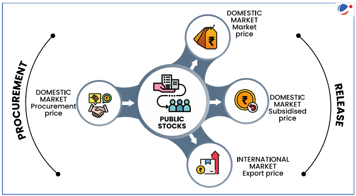

# Topic :  Issues of buffer stocks

**1. Introduction :**  

A **buffer stock** system is a mechanism designed to stabilize agricultural prices by balancing the supply of food grains in the market. It involves the government purchasing and storing food during surplus harvests to prevent prices from falling below a target level, and releasing stocks during periods of scarcity to prevent prices from rising above a target range.

**Function of Buffer Stocks**  
- **Stabilizing Prices**: The main aim is to neutralize fluctuations in the production of crops, ensuring that prices remain stable regardless of seasonal variations.
- **Surplus Production**: During periods of abundant harvest, the government procures crops from farmers at a **Minimum Support Price (MSP)** to prevent market prices from plummeting. This ensures that farmers benefit from their surplus production and do not face financial losses.
- **Deficit Production**: During times of crop failure or shortages, the government releases these buffer stocks in a controlled manner. This ensures that consumers have access to food grains at affordable prices and prevents price hikes due to supply shortages. It also helps in maintaining food security and ensuring the availability of essential food grains for the population.  

The buffer stock system plays a crucial role in balancing the interests of both **farmers** (by stabilizing their income) and **consumers** (by ensuring stable prices and availability).

----

**2. Buffer Stock Policy of India**

The **buffer stock policy** in India was introduced during the **Fourth Five Year Plan (1969-74)**. Under this policy, a buffer stock of food grains is maintained by the **Food Corporation of India (FCI)** on behalf of the Government of India. The primary objective is to stabilize the prices of essential food grains by ensuring adequate supply during times of scarcity.

**Key Features of the Buffer Stock Policy:**

1. **Buffer Norms**:  
   The **Cabinet Committee on Economic Affairs (CCEA)**, chaired by the Prime Minister, fixes the buffer stock norms on a quarterly basis—on **1st April, 1st July, 1st October, and 1st January** of each financial year. The norms were revised in **January 2015** to enhance the buffer system's effectiveness.

2. **Components of Operational Stock**:  
   The operational stock refers to the food grains earmarked for:
   - **Targeted Public Distribution System (TPDS)**
   - **Other Welfare Schemes (OWS)**  
   - **Food Security Stocks/Reserves**

3. **Strategic Reserve**:  
   In addition to buffer norms, a **strategic reserve** is maintained for emergency situations. This reserve includes:
   - **30 lakh tonnes of wheat**  
   - **20 lakh tonnes of rice**

4. **Pulses Buffer Stock**:  
   From **2015**, the government also decided to create a buffer stock for **pulses** to stabilize their prices. The buffer stock for pulses is set at **1.5 lakh tonnes**, with procurement managed by organizations like **NAFED**, **SFAC**, and **FCI**.

5. **Excess Stock Management**:  
   Any food stock above the minimum buffer norms is considered **excess stock**. The government can manage this excess stock by:
   - Exporting it
   - Selling it through **open market sales**  
   - Allocating it **additionally to states**  

The buffer stock system is essential for preventing inflationary pressures on food prices, ensuring food security, and managing the risks associated with fluctuating agricultural production in India.

----

----

**3. Critical Evaluation of Buffer Stocks Policy in India**

The buffer stock policy, while essential for stabilizing food prices and ensuring food security, has encountered several inefficiencies and challenges. Below is a critical evaluation of its shortcomings:

1. **Open-Ended Procurement**:
   The Food Corporation of India (FCI) acts as the "buyer of last resort," purchasing large quantities of grain from the market. This system is open-ended, and the government’s commitment to procurement has increased significantly over time. For instance, in **2016-17**, the government procured more than **30% of the marketable surplus of wheat**. This approach leads to over-procurement, especially when market conditions are favorable, and results in unnecessary grain stocks.

2. **Procurement Prices Have Become Support Prices**:
   Initially, procurement prices were set to maintain buffer stocks. However, these prices have evolved into **support prices**, leading to unintended consequences. Farmers now have an incentive to sell as much grain as possible at these prices, even when supply is abundant. In times of scarcity, the government may face challenges in ensuring adequate supply for the public, and in times of excess production, markets fail to adjust properly. The FCI’s storage capacity often falls short, resulting in the **excessive damage of procured grains**.

3. **One Tool Serving Multiple Objectives**:
   The buffer stock system tries to meet **two conflicting objectives**: ensuring **remunerative prices for farmers** and providing **subsidized food grains** to the poor. This dual purpose creates conflicts and inefficiencies. The gap between the **purchase price** (which is often higher) and the **issue price** (subsidized price for consumers) results in a larger **subsidy bill** for the government. The FCI ends up purchasing grains at high prices, while distributing them at much lower prices, leading to financial strain.

4. **Inefficient Inventory Management**:
   The FCI’s inventory management is inefficient due to several factors:
   - **Counter-Cyclical Procurement**: The government should ideally procure grains during **good harvests** (when supplies are abundant) and release them during **poor harvests** (when supplies are low). However, the FCI’s practices sometimes contradict this ideal. For instance, during **bad crop years**, the government withholds stocks, expecting higher off-take from the PDS, while simultaneously ramping up procurement. This leads to **price distortions** in the market.
   - **Excess Stocks**: Even after fulfilling the needs of **food security schemes**, **millions of tons** of grain remain in the FCI’s warehouses. There is no clear policy to manage these **residual stocks**, and the lack of a **proactive inventory management system** further exacerbates inefficiencies.

5. **Rising Cost of Operation**:
   The FCI incurs substantial costs in the management of buffer stocks. These include:
   - **Acquisition costs**: This covers the price of purchasing grains and related procurement incidentals.
   - **Distribution costs**: This includes the costs of distributing grains to states and UTs under welfare schemes.
   - **Buffer-carrying costs**: These are the costs related to warehousing and maintaining strategic reserves of grains. The **annual buffer-carrying cost** has more than **doubled** since 2001-02, leading to significant **fiscal burden** on the government.

6. **De-Facto Nationalization of the Grain Market**:
   The government’s procurement of more than **75% of the marketable surplus** has led to a situation where very little grain is available in the **open market**. This shortage drives up prices in the open market, diminishing the benefits that subsidies provide to consumers. Furthermore, laws like the **Essential Commodities Act** and **APMC Act**, along with state government interventions, distort the market dynamics, adversely affecting **price competitiveness**. This hinders India’s ability to compete in the **global grain market**.

Overall, while the buffer stock system serves an important purpose in maintaining food security, its inefficiencies—particularly in procurement, storage, and distribution—have led to high costs and market distortions, and require significant reforms to ensure its sustainability and effectiveness.

------