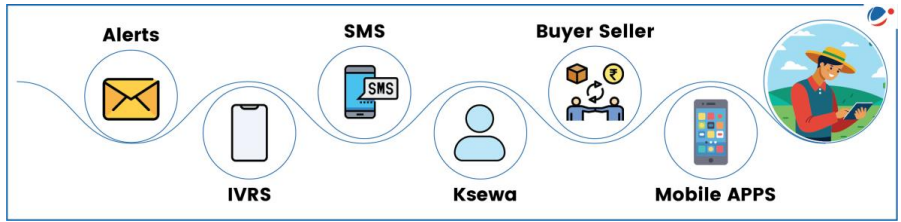
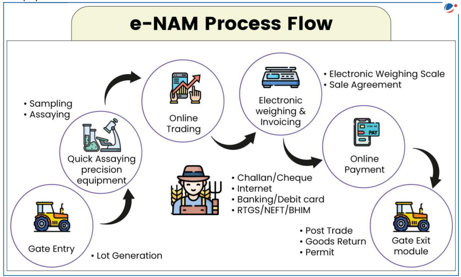

# Topic : E-technology in the aid of farmers.

**1. Introduction**

The agriculture sector is vital to India, providing livelihoods for 58% of the population and contributing 18% to GDP. However, growth in agriculture has been slow, with a 1.4% increase in GVA during FY24.

Key challenges hindering growth include:

- Low productivity
- Fragmented landholding
- Market imbalances due to over/under production
- Lack of modern agricultural practices and farm marketing reforms
- Global competition requiring higher quality products at competitive prices

To overcome these issues, farmers need better training in resource management and production. E-technology can play a crucial role in addressing these challenges and improving farmers' livelihoods.

-----

Note :

**E-Technology and E-Agriculture**

E-technology refers to the use of electronic devices, satellite communication, mobile services, and applications to transmit information through technology.

E-agriculture is the application of Information and Communication Technology (ICT) in agriculture, focusing on how ICT can support agricultural development.

------

**2. Uses of E-Technology for Farmers**

E-technology can benefit the agriculture sector in several ways:

- **Improved Decision-Making**: By providing timely and relevant information on:
  - Agro-inputs (seeds, fertilizers, pesticides)
  - Crop and soil health management
  - Weather forecasting and disaster preparedness
  - Agro-processing, marketing, and market support
  - Agro-finance and farm business management
  - Government schemes
  - Localized farm-related information

- **Skill and Capacity Building**: Enhances farmers' skills, improving productivity while ensuring sustainability and cost-effectiveness.

- **Networking**: Facilitates connections with academia, industry, and government agencies, helping farmers access new technologies and find markets for their produce.

Experts believe that integrating IT into agriculture could lead to a second Green Revolution in India, providing farmers with timely, cost-effective information.

-------

**3. Drivers of E-Technology in Agriculture**

Key factors driving the adoption of e-technology in agriculture include:

- **Affordable Connectivity and Tools**: The growth of mobile, wireless, and internet industries has made connectivity and tools more accessible and cost-effective.
- **Advances in Data Management**: Ongoing research in the IT sector has improved data storage and exchange.
- **Innovative Business Models**: Collaboration between the government, private sector, and other stakeholders has fostered new business models.
- **Information Accessibility**: The open access movement and social media have democratized the availability of information.

------

**4. Initiatives Related to E-Technology to Aid Farmers**

Various government and private sector initiatives aim to harness e-technology to address challenges in agriculture. One such initiative is:

**4.1 National e-Governance Plan in Agriculture (NeGP-A)**  
The Government has launched the **National e-Governance Plan in Agriculture (NeGP-A)**, a centrally sponsored scheme to promote agricultural development using ICT. The program provides farmers with timely access to information through various channels, including:

- Internet
- Touch Screen Kiosks
- Krishi Vigyan Kendras (KVKs)
- Kisan Call Centres (KCC)
- Agri-Clinics
- Common Service Centers (CSCs)
- Mobile services (Broadcast, IVRS, messaging, and voice recognition)

Under this initiative, various ICT-based applications have been developed to offer integrated services to farmers in agriculture and allied sectors.

-----

**4.2 Information Technology Vision 2020**

The **National Agricultural Policy** emphasizes the role of Information Technology (IT) in accelerating agricultural development. In line with this, the Department of Agriculture and Cooperation (DAC) created the **Information Technology Vision 2020**, which aims to:

- Provide agricultural information directly to farmers to enhance productivity and income.
- Offer 24/7 extension and advisory services using IT.
- Enable networking within the agriculture sector, both nationally and globally, with government departments maintaining comprehensive databases.

Additionally, the DAC has developed over 80 portals, applications, and websites (in collaboration with the National Informatics Centre), including key platforms like SEEDNET, DACNET, and AGMARKNET.

-----

**4.3 Kisan SMS Portal**

In 2013, the Government of India developed the **Kisan SMS Portal** to provide farmers with timely information, seasonal advisories, and services through SMS in local languages. This portal, created by the Department of Agriculture and Cooperation, offers several key features:

- Farmers can register queries about weather, soil type, market conditions, and more.
- Information is sent to farmers in their regional or local languages.
- SMS notifications are targeted to farmers within the jurisdiction of relevant experts or officers.
- The portal delivers information on government schemes, expert advisories, and market updates.
- Officers can send SMS updates to farmers within their jurisdiction or specific areas.
- It integrates an existing database of farmers for better service delivery.

**Benefits of the Kisan SMS Portal:**

- **Timely crop advisories** help farmers adopt appropriate technologies suited to local conditions.
- **Access to government schemes** ensures farmers can benefit from available support.
- **Weather-related advice** helps farmers adopt effective practices during adverse conditions.
- **Disease/pest control** is enhanced by immediate advisories to affected regions.
- **Improved crop selection** through tailored advisory on varieties and breeds.
- **Market information** empowers farmers with better bargaining power.

-------

**4.4 Kisan Sabha App**

The **Kisan Sabha App** offers several key benefits for farmers:

- **Timely Logistics Support**: Provides cost-effective and efficient logistics to farmers.
- **Profit Margins**: Reduces middlemen involvement, allowing farmers to directly connect with institutional buyers and increase their profits.
- **Market Rates Comparison**: Helps farmers find the best market prices by comparing nearby mandis and booking the cheapest freight vehicles.
- **One-Stop Platform**: Serves as a hub for farmers, mandi dealers, and truckers to connect, optimize operations, and improve their market access.
- **Direct Sales**: Facilitates direct sales from farmers to buyers, cutting out intermediaries.

----

**4.5 Crop Insurance Mobile App**

The **Crop Insurance Mobile App**, developed under the Digital India initiative, offers the following features:

- **Premium Calculation**: Helps farmers calculate insurance premiums for notified crops based on area, coverage, and loan amount (for loanee farmers).
- **Insurance Details**: Provides information on normal and extended sum insured, premium rates, and subsidy details for any notified crop in a designated area.

----

**4.6 National Agriculture Market (e-NAM)**

The **e-NAM** is a pan-India electronic trading platform designed to connect APMCs and market yards, creating a unified national market for agricultural commodities. Key features include:

- **Logistics Support**: Provides cost-effective and timely logistics for farmers.
- **Middleman Reduction**: Increases farmer profit margins by directly connecting them with institutional buyers.
- **Market Rates**: Helps farmers find the best prices by comparing nearby mandis and booking the cheapest freight vehicles.
- **Single Platform**: Serves as a hub for farmers, mandi dealers, and truckers to optimize their operations and connect more efficiently.
- **Direct Purchase**: Facilitates direct transactions between farmers and buyers.

**Mission & Objectives:**

- **Uniform Market Procedures**: Streamlines procedures across markets, reduces information asymmetry, and enables real-time price discovery based on demand and supply.
- **APMC Integration**: Integrates APMCs nationwide through a common platform to support pan-India trade, transparent auctions, and timely online payments.

**Key Modules:**

- **e-NWRs Integration**: Allows small farmers to trade stored produce directly from registered warehouses.
- **FPO Module**: Enables Farmer Producers' Organizations (FPOs) to upload produce details for remote bidding.
- **Logistics Module**: Links large logistics platforms, enhancing transportation options for inter-state trade.

**Benefits:**

- **Efficiency & Transparency**: Improves mandi operations, reduces costs, and enhances market access.
- **Expanded Market Access**: Provides more options for farmers and local traders through warehouse sales and secondary trading.
- **Reduced Intermediation Costs**: Lowers costs for bulk buyers, processors, and exporters.
- **Price Stability**: Leads to better returns for farmers, lower transaction costs for buyers, and stable prices for consumers.

As of March 16, 2023, 1,361 mandis across 23 states and 4 UTs have been integrated with the e-NAM platform.

-------