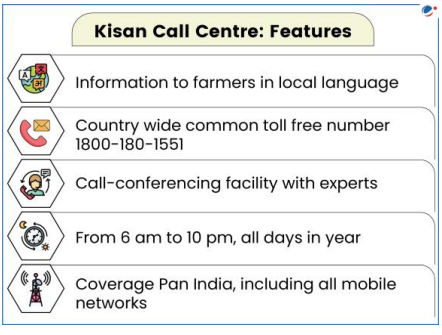
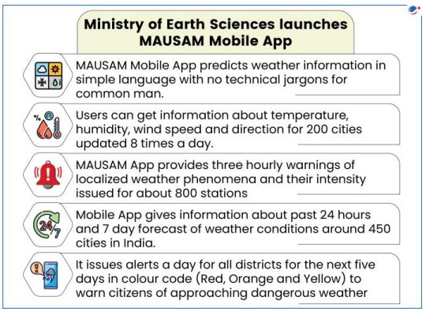

# Topic : E-technology in the aid of farmers.

**1. Introduction**

The agriculture sector is vital to India, providing livelihoods for 58% of the population and contributing 18% to GDP. However, growth in agriculture has been slow, with a 1.4% increase in GVA during FY24.

Key challenges hindering growth include:

- Low productivity
- Fragmented landholding
- Market imbalances due to over/under production
- Lack of modern agricultural practices and farm marketing reforms
- Global competition requiring higher quality products at competitive prices

To overcome these issues, farmers need better training in resource management and production. E-technology can play a crucial role in addressing these challenges and improving farmers' livelihoods.

-----

Note :

**E-Technology and E-Agriculture**

E-technology refers to the use of electronic devices, satellite communication, mobile services, and applications to transmit information through technology.

E-agriculture is the application of Information and Communication Technology (ICT) in agriculture, focusing on how ICT can support agricultural development.

------

**2. Uses of E-Technology for Farmers**

E-technology can benefit the agriculture sector in several ways:

- **Improved Decision-Making**: By providing timely and relevant information on:
  - Agro-inputs (seeds, fertilizers, pesticides)
  - Crop and soil health management
  - Weather forecasting and disaster preparedness
  - Agro-processing, marketing, and market support
  - Agro-finance and farm business management
  - Government schemes
  - Localized farm-related information

- **Skill and Capacity Building**: Enhances farmers' skills, improving productivity while ensuring sustainability and cost-effectiveness.

- **Networking**: Facilitates connections with academia, industry, and government agencies, helping farmers access new technologies and find markets for their produce.

Experts believe that integrating IT into agriculture could lead to a second Green Revolution in India, providing farmers with timely, cost-effective information.

-------

**3. Drivers of E-Technology in Agriculture**

Key factors driving the adoption of e-technology in agriculture include:

- **Affordable Connectivity and Tools**: The growth of mobile, wireless, and internet industries has made connectivity and tools more accessible and cost-effective.
- **Advances in Data Management**: Ongoing research in the IT sector has improved data storage and exchange.
- **Innovative Business Models**: Collaboration between the government, private sector, and other stakeholders has fostered new business models.
- **Information Accessibility**: The open access movement and social media have democratized the availability of information.

------

**4. Initiatives Related to E-Technology to Aid Farmers**

Various government and private sector initiatives aim to harness e-technology to address challenges in agriculture. One such initiative is:

**4.1 National e-Governance Plan in Agriculture (NeGP-A)**  
The Government has launched the **National e-Governance Plan in Agriculture (NeGP-A)**, a centrally sponsored scheme to promote agricultural development using ICT. The program provides farmers with timely access to information through various channels, including:

- Internet
- Touch Screen Kiosks
- Krishi Vigyan Kendras (KVKs)
- Kisan Call Centres (KCC)
- Agri-Clinics
- Common Service Centers (CSCs)
- Mobile services (Broadcast, IVRS, messaging, and voice recognition)

Under this initiative, various ICT-based applications have been developed to offer integrated services to farmers in agriculture and allied sectors.

-----

**4.2 Information Technology Vision 2020**

The **National Agricultural Policy** emphasizes the role of Information Technology (IT) in accelerating agricultural development. In line with this, the Department of Agriculture and Cooperation (DAC) created the **Information Technology Vision 2020**, which aims to:

- Provide agricultural information directly to farmers to enhance productivity and income.
- Offer 24/7 extension and advisory services using IT.
- Enable networking within the agriculture sector, both nationally and globally, with government departments maintaining comprehensive databases.

Additionally, the DAC has developed over 80 portals, applications, and websites (in collaboration with the National Informatics Centre), including key platforms like SEEDNET, DACNET, and AGMARKNET.

-----

**4.3 Kisan SMS Portal**

In 2013, the Government of India developed the **Kisan SMS Portal** to provide farmers with timely information, seasonal advisories, and services through SMS in local languages. This portal, created by the Department of Agriculture and Cooperation, offers several key features:

- Farmers can register queries about weather, soil type, market conditions, and more.
- Information is sent to farmers in their regional or local languages.
- SMS notifications are targeted to farmers within the jurisdiction of relevant experts or officers.
- The portal delivers information on government schemes, expert advisories, and market updates.
- Officers can send SMS updates to farmers within their jurisdiction or specific areas.
- It integrates an existing database of farmers for better service delivery.

**Benefits of the Kisan SMS Portal:**

- **Timely crop advisories** help farmers adopt appropriate technologies suited to local conditions.
- **Access to government schemes** ensures farmers can benefit from available support.
- **Weather-related advice** helps farmers adopt effective practices during adverse conditions.
- **Disease/pest control** is enhanced by immediate advisories to affected regions.
- **Improved crop selection** through tailored advisory on varieties and breeds.
- **Market information** empowers farmers with better bargaining power.

-------

**4.4 Kisan Sabha App**

The **Kisan Sabha App** offers several key benefits for farmers:

- **Timely Logistics Support**: Provides cost-effective and efficient logistics to farmers.
- **Profit Margins**: Reduces middlemen involvement, allowing farmers to directly connect with institutional buyers and increase their profits.
- **Market Rates Comparison**: Helps farmers find the best market prices by comparing nearby mandis and booking the cheapest freight vehicles.
- **One-Stop Platform**: Serves as a hub for farmers, mandi dealers, and truckers to connect, optimize operations, and improve their market access.
- **Direct Sales**: Facilitates direct sales from farmers to buyers, cutting out intermediaries.

----

**4.5 Crop Insurance Mobile App**

The **Crop Insurance Mobile App**, developed under the Digital India initiative, offers the following features:

- **Premium Calculation**: Helps farmers calculate insurance premiums for notified crops based on area, coverage, and loan amount (for loanee farmers).
- **Insurance Details**: Provides information on normal and extended sum insured, premium rates, and subsidy details for any notified crop in a designated area.

----

**4.6 National Agriculture Market (e-NAM)**

The **e-NAM** is a pan-India electronic trading platform designed to connect APMCs and market yards, creating a unified national market for agricultural commodities. Key features include:

- **Logistics Support**: Provides cost-effective and timely logistics for farmers.
- **Middleman Reduction**: Increases farmer profit margins by directly connecting them with institutional buyers.
- **Market Rates**: Helps farmers find the best prices by comparing nearby mandis and booking the cheapest freight vehicles.
- **Single Platform**: Serves as a hub for farmers, mandi dealers, and truckers to optimize their operations and connect more efficiently.
- **Direct Purchase**: Facilitates direct transactions between farmers and buyers.

**Mission & Objectives:**

- **Uniform Market Procedures**: Streamlines procedures across markets, reduces information asymmetry, and enables real-time price discovery based on demand and supply.
- **APMC Integration**: Integrates APMCs nationwide through a common platform to support pan-India trade, transparent auctions, and timely online payments.

**Key Modules:**

- **e-NWRs Integration**: Allows small farmers to trade stored produce directly from registered warehouses.
- **FPO Module**: Enables Farmer Producers' Organizations (FPOs) to upload produce details for remote bidding.
- **Logistics Module**: Links large logistics platforms, enhancing transportation options for inter-state trade.

**Benefits:**

- **Efficiency & Transparency**: Improves mandi operations, reduces costs, and enhances market access.
- **Expanded Market Access**: Provides more options for farmers and local traders through warehouse sales and secondary trading.
- **Reduced Intermediation Costs**: Lowers costs for bulk buyers, processors, and exporters.
- **Price Stability**: Leads to better returns for farmers, lower transaction costs for buyers, and stable prices for consumers.

As of March 16, 2023, 1,361 mandis across 23 states and 4 UTs have been integrated with the e-NAM platform.

-------

**4.7 Seednet**  
The **Seednet India Portal** is a national initiative by the Union Ministry of Agriculture and Farmers Welfare to provide information on quality seeds. Key features include:

- Information on seed sector aspects like quality control, seed replacement rate, seed multiplication ratio, and types of seeds (breeder, foundation, certified).
- Details on seed varieties, seed banks, seed testing labs, dealers, certification agencies, and more.

-----

**4.8 DACNET**  
**DACNET** is an initiative by the Department of Agriculture and Cooperation (DAC), Ministry of Agriculture, aimed at leveraging information technology to improve governance and service delivery. Key benefits of DACNET include:

- **Faster Services**: Reduced processing time for services from over a year to under three months.
- **Efficiency**: Focused on ease-of-use, speed, accuracy, reduction of corruption, and affordability in service delivery.

-----

**4.9 AGMARKNET**  
**AGMARKNET** (Agricultural Marketing Information Network) is a collaboration between the Directorate of Marketing and Inspection (DMI) and the National Informatics Center (NIC). Key features include:

- Coverage of 3,245 market nodes and 300 commodities, offering information in 10 languages.
- Provides valuable data on prices, arrivals, availability, trends, laws, and analysis to producers, traders, and consumers.
- Connected to 2,784 agricultural markets and State Agricultural Marketing Boards, facilitating real-time data sharing across portals.
- Used by food processing units, traders, and village kiosks to help farmers make informed decisions.

----

**4.10 Kisan Call Centres (KCC)**  

Launched in 2004, the **Kisan Call Centres (KCCs)** provide agriculture-related information to farmers via toll-free phone lines. Key features:

- Accessible nationwide via a common eleven-digit number, available on all telecom networks, including private providers.
- Queries are answered in 22 local languages, ensuring farmers receive information in their dialect.

----

**4.11 AGRISNET**  
**AGRISNET** is part of the Central Sector Plan Scheme "Strengthening/Promoting Agricultural Informatics & Communications," implemented by the Department of Agriculture & Cooperation. Its main objectives:

- Enhance services to the farming community through the use of Information and Communication Technology (ICT).

----

**5. Private Sector Initiatives**

**5.1 Green SIM**  
Implemented by IFFCO Kisan Sanchar Limited (IKSL), this service delivers up to four free voice messages daily on agriculture-related topics in 22 languages. It includes content on agriculture, animal husbandry, insurance, and more. IKSL also offers a mobile app and online portal for broader access.

**5.2 Facebook for Farmers and Extension Workers**  
In Kerala, the state government uses Facebook to enhance agricultural extension services. Farmers and agricultural officers must maintain social media accounts to stay connected with local agricultural departments, boosting productivity and profitability.

**5.3 E-choupal**  
ITC’s e-Choupal connects farmers to vital information, storage, and agricultural tools. It reaches over 4 million farmers across 35,000 villages, improving market access and reducing exploitation by middlemen. It operates in 10 states, helping farmers produce better yields and profits.

**5.4 SasyaSree**  
SasyaSree is a Telugu-language portal providing localized agricultural information, including crop management practices, government schemes, and market prices, aimed at farmers in eight districts of Andhra Pradesh.

**5.5 mkrishi**  
Developed by Tata Consultancy Services (TCS), mkrishi offers personalized farming advice in voice and visual formats through mobile phones, helping farmers improve their practices.

**5.6 eSagu**  
eSagu is a personalized agro-advisory system developed by IIIT Hyderabad, providing timely, farm-specific advice to improve productivity for individual farmers.

-------

**6. Weather-based Information through Various e-Initiatives**

**Weather Forecast under NeGP-A**  
The National e-Governance Plan in Agriculture (NeGP-A) provides weather forecast and agro-met advisories to farmers through multiple channels, including SMS, at the district level, focusing on natural calamities like drought.

**Gramin Krishi Mausam Sewa (GKMS)**  
Implemented by the Department of Agriculture, Maharashtra, and the IMD, this service offers weather-related advisories to farmers, supporting better decision-making in farming practices.

**Climate Change Knowledge Network – Indian Agriculture (CCKN-IA)**  
Collaborating with IMD, the Government of Maharashtra, and GIZ, this project provides weather advisories and climate information to farmers, aiding in adapting to climate change.

**National Agricultural Drought Assessment and Monitoring System (NADAMS)**  
Led by the Mahalanobis National Crop Forecast Centre (MNCFC), this initiative uses satellite data to monitor drought at district levels, with monthly assessments and online access.

**IMD Drought Monitoring**  
In coordination with State Agricultural Universities and the State Departments of Agriculture, IMD monitors drought and other calamities using rainfall and climate data, such as Aridity Index and NDVI.

**Mausam & Meghdoot Apps**  
Launched by the Ministry of Earth Sciences, these mobile apps provide weather updates and other features for farmers, using data from IMD weather stations across the country.

------

**7. Digital India and Agriculture Sector**

**Introduction**  
Launched in 2015, the *Digital India* programme aims to empower citizens with digital access to government services and livelihood opportunities. The initiative focuses on three core components:  
- **Digital Infrastructure**  
- **Digital Services**  
- **Digital Literacy**

It prioritizes the use of mobile phones for *mGovernance* and *mServices*, with *mAgriculture* and *mGramBazar* being key components that directly impact agricultural extension and marketing services.

**Benefits to Farmers**  
- **Digitally Empowered Rural Economy**: Transforms rural India into a knowledge-based economy.
- **Universal Connectivity**: Aims to provide phone and broadband connectivity in 250,000 villages.
- **Timely Services**: Extends IT-based services to farmers, enhancing access to crucial information.
- **Improved Agricultural Governance**: Promotes efficiency in agriculture through digital literacy and e-delivery of services.

-----