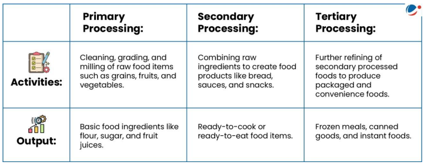

# Topic : Food processing and related industries in India- scope’ and significance, location, upstream and downstream requirements

**1. Introduction :**

The food processing industry transforms raw agricultural products into consumable food through physical, chemical, and mechanical processes. It plays a vital role in improving food safety, quality, and shelf life, catering to the needs of a growing global population.

----

**2. Why Food Processing Industry?**

The Food Processing Industry (FPI) connects agriculture and industry, impacting both people and the environment. Its significance includes:

- **Reducing food wastage**: By using surplus or imperfect produce, FPI helps minimize global food waste, estimated at one-third of total food, and reduces post-harvest losses in India, valued at Rs. 90,000 crore.
- **Reducing malnutrition**: Fortification of processed foods enhances nutrition by adding essential vitamins and minerals.
- **Preservation**: Techniques like canning, freezing, and dehydration extend food shelf life, preventing spoilage.
- **Employment generation**: FPI offers both direct and indirect job opportunities in a labor- and technology-intensive sector.
- **Increasing farmer income**: Growing demand for processed food boosts the need for raw materials, increasing farmers' earnings.
- **Enhanced food safety**: Processes like pasteurization and sterilization reduce harmful microorganisms, ensuring food safety.
- **Crop diversification**: A growing market encourages farmers to diversify crops and practice mixed farming.

-----

