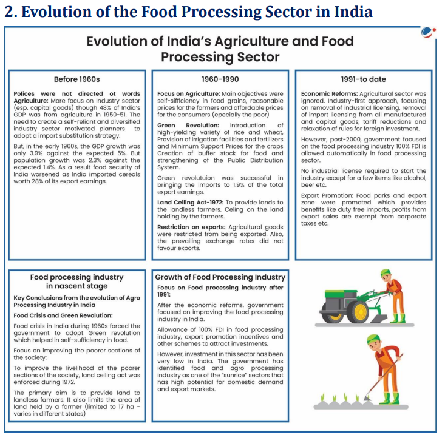
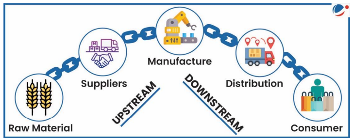
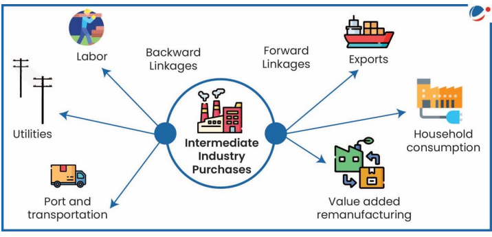
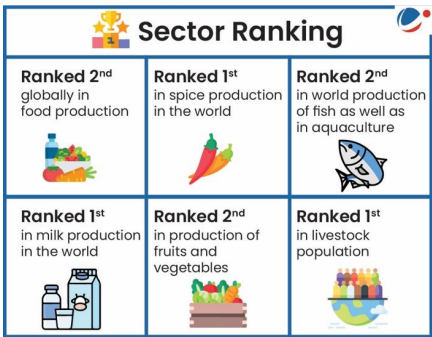
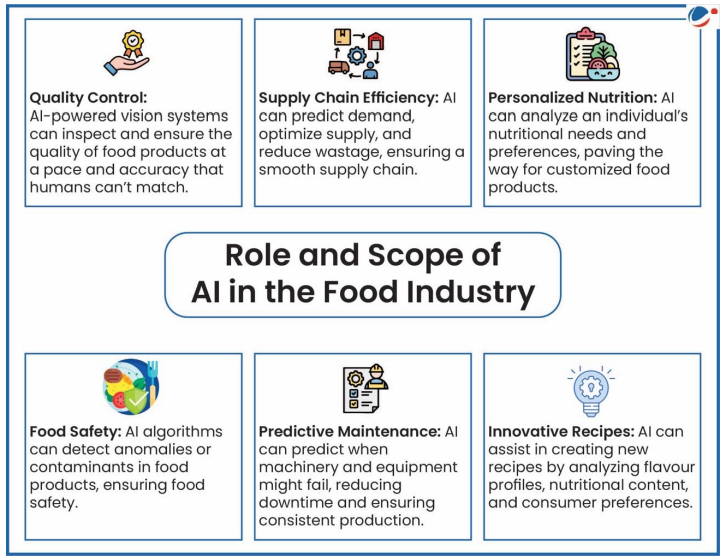
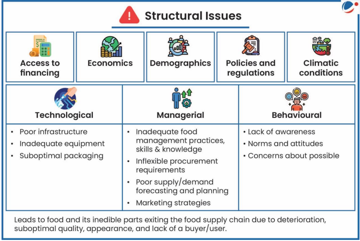
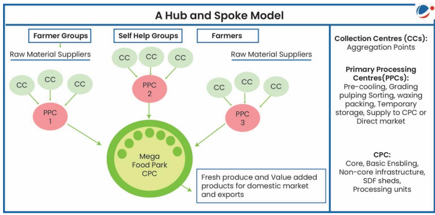
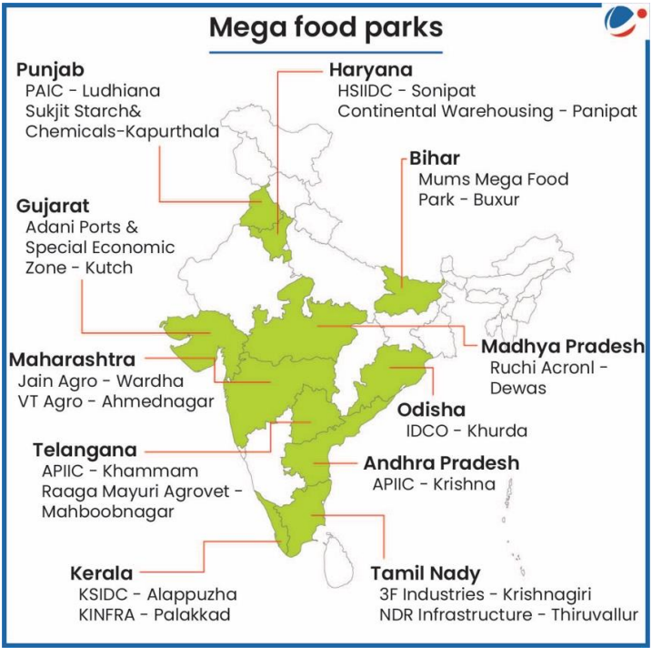
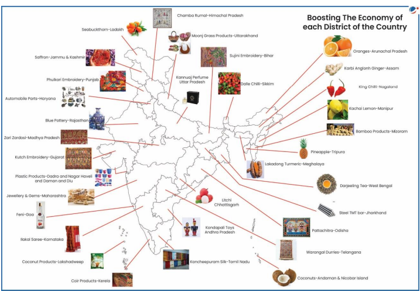

# Topic : Food processing and related industries in India- scope’ and significance, location, upstream and downstream requirements

**1. Food Processing Industry**  
The food processing industry transforms raw agricultural products into consumable food through physical, chemical, and mechanical processes. It plays a vital role in improving food safety, quality, and shelf life, catering to the needs of a growing global population.

---

**2. Why Food Processing Industry?**  
The Food Processing Industry (FPI) connects agriculture and industry, impacting both people and the environment. Its significance includes:

- **Reducing Food Wastage**: By using surplus or imperfect produce, FPI helps minimize global food waste, estimated at one-third of total food, and reduces post-harvest losses in India, valued at Rs. 90,000 crore.
- **Reducing Malnutrition**: Fortification of processed foods enhances nutrition by adding essential vitamins and minerals.
- **Preservation**: Techniques like canning, freezing, and dehydration extend food shelf life, preventing spoilage.
- **Employment Generation**: FPI offers both direct and indirect job opportunities in a labor- and technology-intensive sector.
- **Increasing Farmer Income**: Growing demand for processed food boosts the need for raw materials, increasing farmers' earnings.
- **Enhanced Food Safety**: Processes like pasteurization and sterilization reduce harmful microorganisms, ensuring food safety.
- **Crop Diversification**: A growing market encourages farmers to diversify crops and practice mixed farming.

---

**3. Location of Food Processing Industries in India**  

India's food processing industry is diverse, with a clear distinction between the unorganized and organized sectors, each contributing significantly to the nation's economy and employment.

### Unorganized Sector:
India has approximately 2.5 million unorganized micro food processing enterprises. These units contribute significantly to employment, providing jobs to about **74.3% of the workforce** in the food processing industry. Interestingly, **a third of this workforce is women**, which highlights the sector's role in empowering women, particularly in rural areas. Despite the large workforce, these enterprises account for only **10% of the total output** and **27% of the value addition** in the sector, showcasing a large gap in productivity compared to the organized sector. One reason for this is that these small-scale enterprises have low investment in infrastructure, with **only 7% of their investment directed towards plant and machinery**.

A notable feature of these micro-enterprises is their geographical distribution: nearly **66% of them are in rural areas**, where they play a crucial role in local economies and livelihoods. Furthermore, **80% of these units are family-run**, indicating a reliance on traditional, small-scale operations. Rural locations allow for easy access to raw agricultural products, which are often processed close to the point of production.

### Organized Sector:
In contrast, the organized sector, with about **40,000 units**, is more capital-intensive and contributes more significantly to the country's food processing output. This sector holds **93% of the sector's plant and machinery value**, signifying its advanced technological capabilities and higher production efficiency. It accounts for **26% of employment** in the food processing sector, but its real contribution lies in the output: the organized sector generates **90% of the total output** and contributes **72% to the Gross Value Added (GVA)**. This stark difference in productivity between the organized and unorganized sectors reflects the higher capital, technology, and scale of operations in the former.

### Geographical Distribution:
The location of food processing industries in India is influenced by several factors such as access to raw materials, proximity to transportation hubs, and availability of skilled labor. The food processing factories are primarily concentrated in **coastal states** like **Andhra Pradesh, Maharashtra, Karnataka, Gujarat, and West Bengal**. These states benefit from their access to **marine resources**, particularly seafood, which drives the growth of food processing units such as fish canning, seafood freezing, and marine-based exports. 

- **Andhra Pradesh** has a significant number of seafood processing units due to its extensive coastline, with major ports like Visakhapatnam facilitating export.
- **Maharashtra** and **Gujarat** are also major players, both having large seafood processing industries. Maharashtra is also a major producer of fruits and vegetables, making it a hub for fruit processing, while Gujarat excels in the processing of oilseeds and dairy products.
- **West Bengal** is another coastal state with a large fish processing industry, driven by its extensive river networks and proximity to the Bay of Bengal, making it a major exporter of seafood.

In contrast, major **non-coastal states** like **Uttar Pradesh (UP)**, **Punjab**, and **Haryana** have significant food processing industries, albeit driven by different factors:

- **Uttar Pradesh** is India's largest producer of food grains, especially wheat and sugarcane, and the state is home to numerous food processing units that focus on processing grains, sugar, and dairy products.
- **Punjab** is known for its high production of rice and wheat, leading to a focus on **rice milling** and **flour mills**. Additionally, **dairy processing** is a major industry, especially in regions like Amritsar and Ludhiana.
- **Haryana**, another major agricultural state, focuses on the processing of cereals, vegetables, and milk products. The state’s proximity to Delhi also benefits it in terms of infrastructure and market access.

### Reasons for the Location of Food Processing Units:
1. **Proximity to Raw Materials**: Coastal states have access to marine resources, driving the growth of seafood processing industries. Inland states like Punjab and Uttar Pradesh, with large agricultural outputs, naturally support grain, dairy, and fruit processing units.
   
2. **Infrastructure and Transportation**: States with well-developed road, rail, and port infrastructure (like Gujarat and Maharashtra) are favorable locations for food processing. These transport networks help in the easy movement of raw materials to processing units and finished goods to markets.

3. **Labor Availability**: Many food processing units in rural areas rely on the availability of labor, often sourced from the local population or from surrounding areas. The unorganized sector, which is predominantly rural, thrives on the availability of inexpensive labor for small-scale production.

4. **Market Access**: Proximity to major urban centers or export hubs is a crucial factor in the location of organized food processing industries. States like Gujarat, Maharashtra, and West Bengal have well-established connections to both domestic and international markets, enabling easy access to a broad customer base.

5. **Government Policies and Support**: States offering subsidies, incentives, and a conducive business environment for the food processing sector attract more investment. For example, the **National Mission on Food Processing** has incentivized food processing in various states, leading to increased investment in infrastructure and technological advancements.

### Conclusion:
The food processing industry in India is crucial for the economy, offering employment and supporting rural livelihoods, especially in the unorganized sector. However, the organized sector leads in terms of output and value addition due to its advanced infrastructure and technology. The geographical location of food processing units in India is largely determined by the availability of raw materials, infrastructure, labor, and market access. Coastal states like Andhra Pradesh and West Bengal excel in seafood processing, while inland states like Punjab and Uttar Pradesh are major centers for cereal, dairy, and grain processing.

-----

-----

**4.1. Upstream and Downstream Requirements**  

**Upstream Operations**  
Upstream operations refer to the initial stages of the supply chain, where raw materials are sourced, acquired, and transported to manufacturing facilities. Key activities include supplier selection, procurement, and inventory management. Efficient upstream operations ensure a continuous and reliable supply of raw materials.

**Upstream Requirements**:
- Accessibility to raw materials
- Modern extraction techniques
- Strong linkages with farmers
- Storage facilities for materials like grains, meat, and fish
- Quality testing facilities
- Transport facilities
- Skilled workforce

---

**Downstream Operations**  
Downstream operations involve the final stages of the supply chain, where finished products are distributed to customers. Activities include warehousing, transportation, and order fulfillment. Efficient downstream operations are crucial for timely delivery, customer satisfaction, and maintaining a competitive market edge.

**Downstream Requirements**:
- Latest processing techniques and machinery
- Quality testing facilities
- Organized retail stores for efficient distribution
- Skilled workforce

-----

**4.2. Backward and Forward Linkages**  

**Backward Linkage**  
Backward linkages refer to the connection between Food Processing Industries (FPIs) and raw material sources. For example, the supply of tomatoes to a ketchup manufacturer.

**Forward Linkage**  
Forward linkages connect FPIs to the markets through distribution networks, including physical infrastructure like storage facilities, road, and rail networks.

**Sideways Linkage**  
Sideways linkages involve the use of by-products or waste from the main industrial activity. For instance, food processing industries using agricultural raw materials may generate waste used for producing fuel, biofuels, paper pulp, or fertilizer.

---

**Significance of Linkages**  

- **For Farmers**:
  - Ensures better returns for their produce, especially for marginal and medium farmers.
  - Encourages the growth of high-quality products.
  
- **For Consumers**:
  - Guarantees the timely delivery of food products.
  
- **For Industry**:
  - Reduces food wastage, particularly for perishable products like fruits, vegetables, and dairy.
  - High-quality products and better infrastructure lead to cost savings and enhanced efficiency.

**Additional Notes**:
- These linkages create a level playing field for all stakeholders and help in facing competition.
- They improve hygiene and food safety standards, leading to better acceptance of processed food domestically and internationally.

---

**Existing Challenges in Establishing Robust Linkages**  
- Small, fragmented marketable surpluses due to divided holdings.
- High seasonality of raw material production.
- Numerous intermediaries in the supply chain.
- Poor infrastructure such as cold storage, transport, and electricity.
- Industry fragmentation, with a large unorganized sector.
- Substandard levels of processing industries.
- Insufficient information for farmers and small processors.
- Conflicting legislation, lack of coordination, and administrative delays.
- Underdeveloped food testing network.

-----

**5. Scope and Significance of the Food Processing Sector in India**  

The **food processing sector** in India is pivotal to the economy, with vast potential for growth due to the country’s shift from food scarcity to surplus. It plays a significant role in **employment**, **economic development**, and **agricultural growth**, with increasing opportunities for expansion.

#### 1. **Contribution to Employment and Economic Growth**
- The sector employs **74.3% of the workforce** in food processing, with a significant portion in rural areas and a notable share of **female workers**.
- The **organized sector**, though smaller in terms of employment (26%), accounts for **90% of output** and **72% of Gross Value Added (GVA)**, significantly contributing to the economy.
- The sector is expected to attract **US $33 billion in investments** over the next decade and generate **9 million person-days of employment** (CII estimate).
- It contributed **10.54% to the GVA of the manufacturing sector** and **11.57% to the GVA of the agriculture sector** in 2020-21.

#### 2. **Impact on Agriculture**
- The sector enhances agricultural productivity by converting raw agricultural products into value-added goods, improving farmers' incomes and reducing post-harvest losses.
- **Cold storage**, **processing**, and **packaging** technologies help extend the shelf life of perishable products, contributing to **food security**.

#### 3. **Growing Domestic Market**
- With a population of over **1.4 billion** and a rising middle class, there is a substantial and growing demand for processed foods. As consumer preferences shift towards **convenience**, **healthy**, and **ready-to-eat foods**, the domestic market for processed foods is expanding rapidly.

#### 4. **Exports and Global Trade**
- India, as one of the world’s largest food producers, has significant export potential. Processed food exports have grown, with products like **spices, dairy, seafood, and fruit** gaining popularity in global markets.
- In 2020, processed food exports were valued at over **$20 billion**, and this figure is expected to grow due to improved infrastructure, packaging, and quality standards.

#### 5. **Technological Advancements**
- The sector is witnessing innovations in **cold storage**, **modern milling technologies**, and **automation**, which improve food quality and shelf life. Emerging technologies like **blockchain** and **artificial intelligence** are also helping to streamline supply chains and improve operational efficiency.

#### 6. **Challenges and Opportunities**
- Despite its growth potential, the sector faces challenges, including **supply chain inefficiencies**, **regulatory hurdles**, and a need for more **skilled labor**.
- **Investment in infrastructure**, such as **cold storage** and **transportation networks**, presents a major opportunity to reduce food wastage and improve overall efficiency in the sector.

### Conclusion
The **food processing sector** in India has a significant role to play in the nation’s economic and agricultural future. With the country’s large food surplus, growing demand for processed foods, and export opportunities, India has the potential to become a global leader in food processing. Overcoming existing challenges with technological advancements and infrastructure development will further enhance its growth and contribution to employment, economic development, and food security.

-----

**6. Potential/scope of Processed Food Sector in India**  

The food processing market in India is a rapidly growing industry with significant potential, as highlighted by the following points:

- **Demand**: With over 1.34 billion people and food being a major part of consumer budgets, the sector has huge growth potential. India’s consumer spending is expected to reach $6 trillion by 2030.
- **Export Competitiveness**: India has a cost advantage in raw materials, making processed food exports competitive. The share of processed food in agri-exports grew from 13.7% in 2014-15 to 25.6% in 2022-23.
- **Raw Material Availability**: As an agrarian economy, India has a steady supply of raw materials, being a global leader in fruit production, including mangoes, bananas, and pomegranates, and the second-largest producer of fruits and vegetables.
- **Favorable Government Initiatives**: Government schemes like the Production Linked Incentive Scheme for Food Processing Industry (PLISFPI) and the Pradhan Mantri Formalisation of Micro Food Processing Enterprises (PM FME) promote the sector.
- **Scope for Development**: The industry, though large, is still in its early stages. Processing levels were at 2.7% for vegetables, 4.5% for fruits, 15.4% for fish, 21.1% for milk, and 34.2% for meat in 2020-21.
- **Employment Generation**: The sector can generate non-farm employment, particularly in rural areas, reducing disguised unemployment. It is expected to create 9 million jobs by 2024.
- **Investments**: With 100% Foreign Direct Investment (FDI) allowed, India’s food processing sector attracts global investors, boosting agricultural income and employment. FDI in the sector reached $12.46 billion from April 2000 to December 2023.
- **Forward-Backward Linkages**: The sector can drive the rural economy by connecting agriculture, industry, and consumers, increasing farm prices, reducing waste, promoting crop diversification, generating jobs, and boosting exports.
- **Food Security**: The FPI sector plays a key role in addressing food security, providing nutritious and wholesome food to the population.

------

**7. Challenges faced by Food Processing Industry in India**

### Structural Issues in Food Processing Industry:

1. **Access to Financing**  
   Difficulty in getting loans or funds to improve facilities and processes.

2. **Economics**  
   High costs and low returns make it hard to sustain the business.

3. **Demographics**  
   Limited skilled labor and workforce for the industry.

4. **Policies and Regulations**  
   Complicated rules and lack of clear guidelines hinder growth.

5. **Climatic Conditions**  
   Weather changes and poor storage lead to spoilage.

---

### Technological Challenges:

1. **Poor Infrastructure**  
   Lack of modern facilities for production and storage.  

2. **Inadequate Equipment**  
   Use of outdated machinery reduces efficiency.  

3. **Suboptimal Packaging**  
   Poor packaging leads to spoilage and lower shelf life.

---

### Managerial Challenges:

1. **Inadequate Skills and Practices**  
   Lack of knowledge about modern food processing methods.  

2. **Inflexible Procurement**  
   Strict and outdated buying processes slow operations.  

3. **Poor Supply/Demand Planning**  
   Failing to match supply with market demand causes losses.  

4. **Weak Marketing Strategies**  
   Poor promotion reduces sales and limits reach.

---

### Behavioral Challenges:

1. **Lack of Awareness**  
   People don't know the benefits of processed food.  

2. **Norms and Attitudes**  
   Resistance to new techniques and habits.  

3. **Concerns About Risks**  
   Fear of adopting new processes due to potential failure.  

---

### Overall Impact:  
These challenges cause food wastage, reduce quality, and discourage buyers, hurting the industry.

------

The food processing industry in India faces several challenges that hinder its growth and efficiency:

- **Informalization in Food Processing**: Approximately 75% of the industry is unorganized, leading to inefficiencies in production systems.
- **Lack of Efficient Supply Chain Infrastructure**: Inadequate processing and storage capacity result in higher wastage, production costs, and lower value addition.
- **Lower Value Addition**: Despite being a major agricultural producer, India's food processing and value addition levels remain low, affecting competitiveness, export performance, and farmers' income.
- **Private Participation**: Cold chain infrastructure requires heavy investment with long payback periods, which is beyond the capacity of many individual food processors. High costs and limited credit access discourage private sector participation.
- **Inadequate Linkage Between Processors and Farmers**: Lack of coordination between processors, exporters, and farmers leads to mismatches between industry needs and agricultural produce supply.
- **Formal Credit Facility**: MSME-based food processing units struggle to access bank credit due to the seasonal and perishable nature of their products.
- **Bureaucratic Hurdles**: The industry faces multiple clearance requirements for setting up units, which are time-consuming and costly, especially for small processors.
- **Labour Laws**: Compliance with labour laws related to layoffs, retrenchment, and closures is difficult for seasonal units, affecting their commercial viability.
- **Marketing of Processed Food**: Micro and small processors struggle with marketing and branding due to limited resources, impacting their sector performance.
- **Lack of Awareness**: Many processors face challenges accessing government scheme benefits due to a lack of awareness and guidance.
- **Inadequate Training**: There is a lack of sector-specific entrepreneurship development and incubation services, which hampers sector growth.
- **Seasonality of Operations**: The industry operates seasonally due to the nature of agriculture, unlike developed countries where technological advancements allow year-round operations.
- **Coordination in Research**: While many research institutes focus on product and process improvements, there is a lack of coordination in research and dissemination of findings to the industry.
- **Limited Ability to Control Quality and Safety**: The large unorganized segment and numerous players make it difficult to implement consistent quality and safety norms, leading to issues like milk adulteration and carbide use for fruit ripening.

-----

**8. Policy Initiatives and Measures Taken by the Government**  

To support the growth of the food processing sector, the government has implemented several key reforms:

- **Licensing Exemptions**: Most processed food items are exempt from licensing under the Industries (Development and Regulation) Act, 1951, except for small-scale sector items and alcoholic beverages.
- **Bank Lending**: The food processing industry was included in the priority sector for bank lending in 1999.
- **Foreign Direct Investment (FDI) Relaxations**: The government has relaxed FDI norms, allowing up to 100% FDI in food product e-commerce through the automatic route. Full repatriation of profits and capital is allowed.
- **Duty Exemptions**: Zero duty imports of capital goods and raw materials are allowed for 100% export-oriented units, with full duty exemption for units in export processing zones.
- **Budget Allocation**: In the Interim Budget 2024-25, the Ministry of Food Processing Industries was allocated Rs. 3,290 crores (~US$ 396 million), a 13% increase over the previous fiscal year.
- **Food Map and Investor Portal**: The government has launched a food map on the Ministry’s website, indicating surplus and deficit areas, and an Investor’s Portal to promote investment in food processing.
- **APMC Reforms and Contract Farming**: Reforms have been made to promote contract farming, which will ensure a steady supply of raw materials to the food processing industry. 
  - **Agri Export Zones (AEZ)**: Established since 2001, AEZs function similarly to Special Economic Zones (SEZs) for agricultural products, offering tax rebates to promote exports. 60 AEZs were notified by 2004-05.
- **Food Safety and Standards Authority of India (FSSAI)**: FSSAI is enhancing food testing infrastructure by upgrading 59 existing labs and setting up 62 new mobile testing labs. It has issued regulations for food product standards, safety, contaminants, and food additives.
- **International Best Practices in Fertilizer Research**: The Indian Council for Fertilizer and Nutrient Research (ICFNR) has adopted global best practices to provide farmers with high-quality fertilizers at affordable rates, aiming to ensure food security.

------

### 8. Schemes related to Food Processing Industries: 

**8.1.PM Kisan SAMPADA Yojana**  

PM Kisan SAMPADA Yojana is a comprehensive initiative aimed at developing modern infrastructure and improving supply chain management from farm gate to retail outlet. It aims to:

- Boost the food processing sector.
- Provide better returns for farmers, contributing to doubling their income.
- Create significant rural employment opportunities.
- Reduce agricultural produce wastage.
- Increase food processing levels.
- Enhance processed food exports.

Key schemes under PM Kisan SAMPADA Yojana include:

- **Mega Food Parks**  
- **Integrated Cold Chain and Value Addition Infrastructure**  
- **Food Processing & Preservation Capacity Expansion**  
- **Agro-processing Clusters Infrastructure**  
- **Backward and Forward Linkages Creation**  
- **Food Safety and Quality Assurance Infrastructure**  
- **Human Resources and Institutions Development**  
- **Operation Greens**  

**Agro-Processing Cluster Scheme under PMKSY**  

This scheme aims to develop modern infrastructure and common facilities for food processing units, adopting a cluster approach. Key features include:

- Connecting farmers/producers with processors and markets via an efficient supply chain.
- Development of Basic Enabling Infrastructure (roads, water, power, drainage, ETP).
- Core Infrastructure like warehouses, cold storage, IQF, sorting, grading.
- At least 5 processing units with a minimum investment of Rs. 25 crore (US$ 3 million).
- Required land area: Minimum of 10 acres, leased/purchased for at least 50 years.

**Integrated Cold Chain and Value Addition Infrastructure Scheme under PMKSY**  

This scheme aims to establish a continuous cold chain from farm to consumer, including pre-cooling, storage, and distribution. It focuses on temperature-controlled storage, packing, and transportation for products like horticulture, dairy, and meat.

----

**8.2.Operation Greens**  

Launched in the Union Budget 2018-19 with a budget of Rs. 500 crore (US$ 71.5 million), *Operation Greens* aims to enhance the agricultural value chain by promoting Farmer Producers Organizations (FPOs), agri-logistics, processing facilities, and professional management. Initially focused on the Tomato, Onion, and Potato (TOP) value chains, the initiative was expanded under the "Aatmanirbhar Bharat Package" following COVID-19 disruptions to include all fruits and vegetables (TOTAL).  

In the Union Budget 2021-22, the scope was further broadened to include 22 perishable crops, focusing on long-term interventions for Integrated Value Chain Development Projects.

----

**8.3.Mega Food Park Scheme**  

Launched in 2008, the *Mega Food Parks Scheme* provides financial assistance of up to Rs. 50 crore to establish modern food processing infrastructure. Its goal is to create a value chain from farm to market using a cluster-based, hub-and-spokes model.  

The scheme consists of three layers:  
- **Central Processing Centre (CPC)**: Located on 80-100 acres, where value-added products are processed for domestic or export markets.  
- **Primary Processing Centres (PPC)**: Surrounding the CPC, where sorting, grading, pre-cooling, and packaging take place.  
- **Collection Centres (CCs)**: These aggregation and storage centres collect produce from farmers, middlemen, and markets.  

Implemented by a Special Purpose Vehicle (SPV), the scheme has sanctioned 41 food parks, with 24 operational and 17 under development as of December 2023. The scheme was discontinued from April 1, 2021, though committed liabilities remain.

-----

-----

**8.4.Scheme for Formalization of Micro Food Processing Enterprises**  

The *Scheme for Formalization of Micro Food Processing Enterprises* was approved by the Union Cabinet, with an outlay of Rs. 10,000 crore. The scheme focuses on formalizing the unorganized food processing sector across India.  

### Objectives:  
- Support the creation of global food manufacturing champions.  
- Promote Indian food brands.  
- Increase off-farm employment opportunities.  
- Ensure remunerative prices for farm produce, thereby improving farmers' income.  

### Features:  
- The scheme is funded by both the Government of India and States at a 60:40 ratio.  
- It targets assisting 2 lakh micro-enterprises with credit-linked subsidies.  
- The scheme will run from 2020-21 to 2024-25.  
- It will focus on perishables and employ a cluster approach.  

### Support for Individual Micro-Units:  
- Micro enterprises can receive a credit-linked subsidy of 35% of the eligible project cost, up to Rs. 10 lakh.  
- Beneficiaries need to contribute at least 10%, with the remaining balance covered by a loan.  
- On-site skill training, technical up-gradation, and assistance for DPR (Detailed Project Report) preparation will be provided.  

### Implementation Strategy:  
- Seed capital of Rs. 4 lakh per SHG will be provided for working capital and small tools.  
- Grants will be given to FPOs for backward/forward linkages, common infrastructure, packaging, and marketing.  

### Administrative and Implementation Mechanisms:  
- The scheme will be monitored by an Inter-Ministerial Empowered Committee (IMEC) chaired by the Minister of Food Processing Industries.  
- State/UT-level committees, led by the Chief Secretary, will oversee proposals for expanding and establishing new micro-units.  
- Annual Action Plans prepared by States/UTs will be approved by the Government of India.  
- A third-party evaluation and mid-term review will be included.  
- States/UTs will designate a Nodal Department and Agency for implementation.  

### National Portal & MIS:  
- A national portal will be set up for application submissions, and all scheme activities will be conducted via this platform.  

### Benefits:  
- The scheme aims to benefit nearly 8 lakh micro-enterprises through access to information and formalization.  
- 2 lakh micro-enterprises will receive credit-linked subsidies for expansion and upgradation.  
- It will help formalize, grow, and make micro-units more competitive.  
- An estimated 9 lakh skilled and semi-skilled jobs will be generated.  
- Increased access to credit, particularly for women entrepreneurs and those in Aspirational Districts.  
- Improved integration with organized markets and better access to common services like sorting, grading, processing, packaging, and storage.

------

**8.5.Gram Samriddhi Yojna**

The *Gram Samriddhi Yojna* aims to strengthen the unorganized food processing sector, particularly in rural areas. The scheme focuses on empowering cottage industries, farmer producers' organizations, and individual food processors by improving their capacity, technology, skills, and entrepreneurship, while also strengthening the supply chain from farm to market.

### Key Features:
- **Target Area:** The scheme focuses on the unorganized food processing sector, which is primarily located in rural areas. Around 66% of unorganized food processing units are situated in rural regions, with 80% of these units being family-run businesses.
- **Financial Support:** The scheme is backed by a funding of Rs. 3,000 crore, provided by the World Bank and the Government of India.
- **Objectives:**  
  - Enhance the capacity and technology of the unorganized food processing sector.
  - Improve skill development and entrepreneurship among food processors.
  - Strengthen the farm-to-market supply chain, ensuring a smoother flow of agricultural products to processing units and markets.
  - Foster growth within the cottage industry, farmer producers’ organizations, and individual food processors.

### Focus Areas:
- **Capacity Building:** Support to increase the production capacity of unorganized food processing units.
- **Technology Upgrade:** Providing access to modern technology and practices to improve the efficiency and competitiveness of the food processing units.
- **Skill and Entrepreneurship Development:** Programs designed to enhance skills and promote entrepreneurship, ensuring sustainable growth in rural food processing sectors.
- **Supply Chain Strengthening:** Focus on creating a seamless supply chain from farm to market, ensuring better access to raw materials and improving market linkages for food products.

The *Gram Samriddhi Yojna* is an essential step toward the growth and formalization of rural food processing, providing economic opportunities, improving local economies, and promoting sustainable agricultural practices in rural India.

------

**8.6.Scheme for Cold Chain, Value Addition, and Preservation Infrastructure**

The *Scheme for Cold Chain, Value Addition, and Preservation Infrastructure* aims to address the critical shortage of cold storage facilities in India and facilitate the creation of integrated cold chain and preservation infrastructure. The objective is to ensure an uninterrupted cold chain from farm to consumer, which is essential for reducing wastage and preserving the quality of perishable goods.

### Key Features:

- **Objective:** The scheme focuses on the creation of integrated cold chain and preservation infrastructure to ensure that perishable goods such as fruits, vegetables, dairy, meat, and fish can be transported and stored under controlled conditions, without any interruption from farm to consumer.
  
- **Types of Facilities to Be Created:**
  1. **Minimal Processing Centers at Farm Gate Level:**  
     - These centers will be established near farms and will include facilities for **weighing**, **sorting**, **grading**, **pre-cooling**, **Controlled Atmosphere (CA)/Modified Atmosphere (MA) storage**, **Individual Quick Freezing (IQF)**, and **normal storage**. This ensures that products are processed and cooled immediately after harvest, improving their shelf life and quality.
  
  2. **Mobile Pre-cooling Vans and Reefer Trucks:**  
     - The scheme provides for **mobile pre-cooling vans** and **reefer trucks** to ensure quick and efficient cooling of perishable goods during transportation, preventing spoilage during the transit from farm to storage or market.
  
  3. **Distribution Hubs:**  
     - These hubs will serve as central points for distribution and will have facilities such as **multi-purpose cold stores**, **variable humidity stores**, **quick freezing**, and **blast freezing**. These hubs will ensure that products maintain their freshness and quality throughout the distribution network.

### Impact:
- The development of cold chain infrastructure will minimize post-harvest losses of perishable goods, enhance the quality and shelf life of food products, and enable farmers to access markets more efficiently.
- It will improve the **value addition** process by ensuring that products can be stored, processed, and transported in optimal conditions, adding greater value to agricultural produce and improving the overall competitiveness of the food processing sector.

------

**8.7.Modernization of Abattoirs**

The *Modernization of Abattoirs* scheme aims to improve the efficiency, hygiene, and environmental sustainability of abattoirs in India. By promoting the adoption of modern slaughtering practices and technologies, the scheme seeks to improve the entire slaughtering process, waste management, and by-product utilization. The initiative is designed to ensure the safe, hygienic, and efficient processing of meat, with a focus on the welfare of animals and the sustainability of the meat industry.

### Key Features:

- **Objective:**  
  The scheme aims to modernize existing abattoirs or establish new ones that adhere to scientific and hygienic slaughtering standards. This will include the adoption of advanced technologies for **waste management**, **by-product utilization**, and the provision of **chilling facilities** for meat preservation, ensuring a hygienic and efficient supply chain.

- **Key Components:**
  1. **Scientific and Hygienic Slaughtering:**  
     - Modern abattoirs will implement **scientific slaughtering practices** to ensure animal welfare and hygiene, reducing the risk of contamination and ensuring compliance with food safety standards.
  
  2. **Waste Management Technology:**  
     - Abattoirs will apply **modern technology for waste management**, including waste disposal, recycling, and efficient by-product utilization, reducing environmental impact and improving sustainability.
  
  3. **Chilling Facility:**  
     - The introduction of **chilling facilities** will ensure that meat is stored at the correct temperature post-slaughter, preventing spoilage and maintaining product quality.
  
  4. **Retail Cold Chain Management:**  
     - The scheme also focuses on the establishment of **retail cold chain management systems** to ensure that processed meat remains fresh and safe throughout the distribution process.

- **Mode of Implementation:**
  - The modernization will be implemented through **Public-Private Partnerships (PPP)**, where local bodies (such as **panchayats or municipalities**) will play a role in the operation of the projects.
  - The schemes will be carried out under **Build-Own-Operate (BOO)** or **Build-Operate-Transfer (BOT)** models, or through **Joint Ventures (JVs)**, ensuring local involvement and shared responsibilities in the operation and maintenance of the abattoirs.

### Expected Benefits:
- **Improved Hygiene and Food Safety:** By adopting modern slaughtering techniques and ensuring hygienic practices, the scheme will enhance the safety and quality of meat products.
- **Environmental Sustainability:** Advanced waste management technologies will minimize the environmental impact of slaughterhouses.
- **Better Meat Quality and Shelf Life:** The introduction of chilling facilities and cold chain management will ensure that meat products maintain their freshness from slaughter to retail.
- **Economic Growth and Employment:** Modernized abattoirs will contribute to the development of the meat processing sector, generate employment opportunities, and improve the livelihoods of workers and local communities.

This scheme will modernize the meat processing sector, ensuring that India’s abattoirs align with global food safety standards while improving the efficiency and sustainability of the sector.

-------

**8.8.Make in India: Food Processing Sector**

As part of the **Make in India** campaign, the **food processing sector** was identified as one of the 25 key focus areas for development. The initiative aims to boost the manufacturing sector in India, encourage innovation, and promote economic growth by making India a global hub for manufacturing and production. The food processing sector, in particular, has been a key area due to its potential to create employment, reduce food wastage, and enhance export capabilities.

### Key Features of Make in India in the Food Processing Sector:

- **Focus Area in Make in India:**  
  The **food processing industry** was recognized as a high-potential sector under the Make in India campaign. This sector plays a critical role in adding value to India's agricultural produce, reducing wastage, and creating employment, particularly in rural areas.

- **Objective:**  
  The main aim is to **transform India into a global manufacturing hub** for processed food products by promoting the development of modern infrastructure, technological innovation, and private investments. By focusing on the food processing sector, the government hopes to **increase the sector's contribution to GDP**, enhance exports, and improve farmers’ income.

- **Sector Skill Councils (SSCs):**  
  As part of the campaign, the government, in collaboration with industry bodies such as the **Federation of Indian Chambers of Commerce and Industry (FICCI)**, established **31 Sector Skill Councils (SSCs)** to promote skill development and ensure a steady supply of skilled workforce. The **Food Processing Industry (FPI) SSC** is one of the councils that focuses on building skills related to food processing and manufacturing.
    - These SSCs are tasked with developing training modules, certification programs, and promoting skill development at various levels to ensure that the workforce is ready to meet the growing demands of the food processing sector.

- **Key Initiatives under Make in India for Food Processing:**
  1. **Promoting Investments:**  
     The campaign seeks to attract **foreign direct investment (FDI)** in the food processing sector by relaxing regulations, offering incentives, and creating a more investor-friendly environment.
  
  2. **Infrastructure Development:**  
     The focus is on improving the **infrastructure for food processing**, including establishing modern processing units, cold chain logistics, and storage facilities, which will help in reducing food wastage and increasing the shelf life of products.
  
  3. **Skill Development:**  
     With the establishment of **Sector Skill Councils**, the Make in India initiative aims to provide training and certification to individuals in the food processing sector. This will help improve the quality and efficiency of the workforce, making them more competitive in the global market.
  
  4. **Technology Upgradation:**  
     The campaign promotes the adoption of **advanced technologies** for food processing, packaging, and storage, helping food processors improve product quality, reduce costs, and meet international standards.

### Expected Benefits:
- **Boosting Employment:** The food processing sector's growth under the Make in India campaign is expected to create significant employment opportunities, particularly in rural areas, where the majority of food processing units are located.
- **Reduced Food Wastage:** With improved infrastructure and cold chain facilities, the Make in India initiative will help in reducing the high levels of food wastage that occur due to inadequate storage and transport systems.
- **Increased Export Potential:** By improving the quality and processing capacity, India can increase its share in global food exports, making it a key player in the global food market.
- **Increased Investment:** The relaxed FDI norms and the establishment of a conducive environment for business will likely attract greater private and foreign investment into India’s food processing sector.

The **Make in India** initiative, focusing on the food processing sector, aims to not only modernize and expand the industry but also empower local food processors and farmers, contributing to overall economic growth and development.

----

**8.9.TRIFOOD Project**

The **TRIFOOD Project** is an initiative launched by the **Ministry of Tribal Affairs**, **Ministry of Food Processing Industries (FPI)**, and **TRIFED** (Tribal Cooperative Marketing Development Federation of India) with the goal of enhancing the income of tribal communities in India. This project focuses on improving the livelihoods of tribal forest gatherers by providing them with better opportunities to utilize and add value to **Minor Forest Produce (MFP)** that they collect from forests.

### Key Features and Objectives of the TRIFOOD Project:

- **Collaboration Between Ministries and TRIFED:**
  The **TRIFOOD Project** is a collaborative effort involving the **Ministry of Tribal Affairs**, the **Ministry of Food Processing Industries**, and **TRIFED**. This partnership aims to empower tribal communities by facilitating the value addition and processing of MFP, which includes a wide range of forest-based products like **honey, tamarind, medicinal plants, and various fruits and nuts**.

- **Objective of the Project:**
  The primary objective of the **TRIFOOD Project** is to **enhance the income of tribal forest gatherers** by improving the processing, value addition, and marketing of Minor Forest Produce (MFP). By creating facilities for processing and branding MFP products, the project aims to:
    - Increase the value of MFP products, making them more marketable and profitable for tribal communities.
    - Improve the overall income and livelihoods of tribal forest gatherers, who rely on these products for their sustenance.
    - Promote the sustainable use of forest resources, ensuring that these activities contribute to the long-term well-being of tribal communities and the environment.

- **Value Addition to Minor Forest Produce (MFP):**
  The project focuses on **value addition** to MFP collected by tribal people, such as:
    - **Processing** of raw MFP into consumable or usable forms (e.g., honey processing, nut processing, etc.).
    - **Packaging and branding** of MFP products to increase their market appeal.
    - **Creating value-added products** from MFP, which will fetch higher prices in the market.

- **Establishment of Processing Units:**
  The project aims to set up **processing units** in tribal areas to help gatherers process their collected MFP at the local level. This will help in:
    - Reducing dependence on middlemen, thereby ensuring better prices for tribal gatherers.
    - Enhancing the shelf life of MFP and improving marketability.
    - Creating local employment opportunities, as processing units will require skilled labor.

- **Market Access and Branding:**
  The **TRIFOOD Project** will work on **branding and marketing** tribal MFP products under a unified label, helping to establish a market identity for tribal produce. This initiative will:
    - Open up new markets for MFP products, both domestically and internationally.
    - Provide **direct market access** to tribal gatherers, reducing exploitation by middlemen.
    - Ensure that MFP products are marketed in a manner that highlights their **sustainability** and **ethnic origin**, potentially attracting premium prices.

- **Capacity Building and Skill Development:**
  In addition to setting up infrastructure, the project focuses on providing **training and skill development** to tribal communities to improve their processing techniques, business management, and marketing skills. This includes:
    - **Entrepreneurial training** for tribal gatherers, enabling them to form **producer groups** or cooperatives.
    - **Technical training** in modern food processing methods and sustainable harvesting practices.

### Expected Benefits:
- **Increased Income for Tribal Communities:**  
  The project is expected to **raise the income** of tribal gatherers by improving the market value of their MFP. This will create more **economic opportunities** for the tribal population, particularly in remote areas.

- **Sustainability of Forest Resources:**  
  By promoting the **sustainable collection and processing** of MFP, the TRIFOOD project will contribute to the **sustainable management** of forest resources, ensuring their continued availability for future generations of tribal communities.

- **Job Creation:**  
  The establishment of processing units and the expansion of MFP-related activities are expected to create **local jobs** in tribal regions, empowering the community and reducing migration to urban areas in search of work.

- **Improved Market Access and Reduced Exploitation:**  
  The project will ensure that tribal communities have **direct access to markets** and are not exploited by intermediaries. Through better pricing and branding, tribal gatherers can gain a larger share of the profits.

- **Cultural and Economic Empowerment:**  
  The TRIFOOD project aligns with efforts to preserve and promote the **cultural heritage** of tribal communities by encouraging the use of traditional knowledge in processing MFP while integrating it into modern value chains.

### Conclusion:
The **TRIFOOD Project** is a significant step towards improving the lives of tribal communities in India by leveraging their traditional knowledge and resources in a sustainable and profitable manner. Through value addition, better market access, and skill development, the project aims to transform the economic landscape of tribal areas, ensuring both economic and social empowerment.

------

**8.10.Food Processing Fund**

The **Food Processing Fund** is a special fund set up by the **National Bank for Agriculture and Rural Development (NABARD)** with an allocation of INR 2,000 crore. It was introduced in **FY 2014-15** to provide **affordable credit** to food processing units, particularly those located in **Mega Food Parks** and **Designated Food Parks** across India.

### Key Features and Objectives of the Food Processing Fund:

- **Objective:**
  The **Food Processing Fund** aims to **support the growth and development** of the food processing industry by providing financial assistance to food processing units. The fund’s primary goal is to:
  - Facilitate access to affordable **credit for food processing units**, especially those in **Mega Food Parks** and **Designated Food Parks**.
  - Improve the **infrastructure and operational efficiency** of food processing units.
  - Encourage the establishment and expansion of food processing units, which will lead to higher **value addition**, **employment generation**, and **reduced wastage** in the food supply chain.

- **Financial Support:**
  The **INR 2,000 crore** allocated to the fund is aimed at:
  - Offering **affordable loans** to food processing units.
  - **Reducing the financial burden** on small and medium food processors who may otherwise struggle to secure funding from commercial banks at competitive rates.
  - Promoting **sustainable and modern food processing practices**.

- **Target Beneficiaries:**
  The fund primarily targets food processing units in **Mega Food Parks** and **Designated Food Parks**, which are set up by the government to provide **modern infrastructure** for food processing. These parks play a crucial role in:
  - Providing **centralized processing facilities** to multiple food processing units.
  - Ensuring **economies of scale** by clustering food processors in designated zones.
  - Encouraging the creation of **value-added food products**, thus improving the competitiveness of Indian food products in global markets.

- **Types of Support:**
  The **Food Processing Fund** provides financial assistance for:
  - Establishing new food processing units.
  - **Upgrading existing food processing infrastructure** to meet modern standards.
  - **Building essential infrastructure** such as storage facilities, refrigeration units, and distribution hubs.
  - Improving the **cold chain infrastructure** that ensures better storage, transportation, and preservation of food products, reducing post-harvest losses.

- **Affordable Credit:**
  The **fund** offers **low-interest loans** to eligible food processing units, making it easier for small and medium enterprises (SMEs) to access capital for their operations. This initiative helps:
  - **Lower the cost of borrowing** for food processors.
  - Encourage **investment in new technologies**, automation, and modern food processing techniques that can improve productivity and quality.
  - Promote **sustainability** and efficiency within the food processing sector by financing the installation of energy-efficient machinery and systems.

- **Implementation and Monitoring:**
  The **Food Processing Fund** is implemented by NABARD, with the assistance of various state and central government agencies. The fund is allocated to eligible food processing units through **commercial banks**, **regional rural banks**, and **cooperative banks** that partner with NABARD. The project financing is subject to:
  - A well-defined **eligibility criteria** and **project approval process**.
  - Monitoring mechanisms to ensure that the financial support provided leads to the intended improvements in food processing capacities and operations.

### Expected Benefits:
- **Improved Food Processing Infrastructure:**  
  The fund will result in better **food processing facilities**, which will help to increase the processing capacity and value addition within the food industry.

- **Reduction in Post-Harvest Losses:**  
  By improving infrastructure such as **cold storage and refrigeration**, the fund will help reduce wastage of agricultural produce, which is a significant challenge in India.

- **Enhanced Competitiveness:**  
  With affordable loans, food processors can modernize their equipment and adopt **advanced processing techniques**, thus improving the quality and competitiveness of food products in both domestic and international markets.

- **Job Creation and Rural Development:**  
  As food processing units expand and modernize, they will create **employment opportunities** in both urban and rural areas, contributing to the overall **economic development** of rural India.

- **Boost to the Food Processing Industry:**  
  The **Food Processing Fund** will provide the much-needed capital infusion to the food processing sector, enhancing its **overall growth** and **contribution to the economy**.

### Conclusion:
The **Food Processing Fund** plays a crucial role in facilitating the growth and modernization of India's food processing sector. By providing **affordable and accessible credit**, the fund helps improve the **infrastructure, efficiency**, and **competitiveness** of food processing units, especially in Mega Food Parks and Designated Food Parks. The initiative will contribute to the **reduction of post-harvest losses**, **enhanced income for farmers**, and the **creation of more jobs** in the food processing industry, ultimately strengthening India's food value chain.

-----

**8.11.One District One Product (ODOP) Scheme**

The **One District One Product (ODOP)** scheme was launched by the **Government of Uttar Pradesh** to **encourage and revive local arts and craft products**. It aims to support **Micro, Small, and Medium Enterprises (MSMEs)** by promoting products that are unique to specific districts in Uttar Pradesh. The program is designed to boost the production, visibility, and sales of indigenous and specialized products/crafts from the region, thereby **generating employment** at the district level.

### Key Objectives of the ODOP Scheme:
- **Preservation and Development of Local Crafts:**  
  The program aims to **preserve and develop traditional crafts and skills**, ensuring that these local arts continue to thrive and are passed down to future generations.

- **Increase in Incomes and Local Employment:**  
  By promoting local crafts, the ODOP scheme aims to increase **income levels** and **employment opportunities** in the districts. This will also help in reducing **migration for employment** as people will find better opportunities within their own regions.

- **Improvement in Product Quality and Skill Development:**  
  The scheme focuses on improving the **quality of products** and enhancing the skills of artisans, which will lead to **higher standards** in production and better market acceptance.

- **Transformation of Products through Branding and Packaging:**  
  The ODOP program helps in **modernizing and enhancing** the presentation of traditional products, making them more attractive to a wider market through **branding, packaging**, and design improvements.

- **Connection with Tourism:**  
  By linking **traditional products with tourism**, the scheme encourages tourists to purchase locally made items as **souvenirs**, creating additional sales opportunities and promoting local culture.

- **Addressing Economic Differences and Regional Imbalances:**  
  The ODOP scheme aims to address **economic disparities** and **regional imbalances** by ensuring that every district gets the opportunity to develop its unique products and contribute to the local economy.

- **National and International Promotion:**  
  After successful implementation at the **State level**, the ODOP initiative aims to expand the scope of products to the **national** and **international markets**, increasing the reach of indigenous products beyond Uttar Pradesh.

### Implementation Strategy:
Under the ODOP scheme, **one product per district** is selected for promotion. The product should have historical or cultural significance and be traditionally associated with that district. For example, **Lucknow** is known for its **zari-zardozi** and **chikan kari** (embroidery), which have been **GI-tagged** (Geographical Indication) to denote that they are specific to that region. The manufacturing and promotion of such products are supported through various sub-schemes and initiatives.

### Sub-Schemes under ODOP:
The following **sub-schemes** help facilitate the growth and success of the ODOP program:

1. **Common Facility Centre (CFC) Scheme:**  
   This scheme focuses on establishing **common infrastructure** where artisans and producers can access modern machinery, tools, and technology for processing and manufacturing. The aim is to **centralize resources**, reduce costs, and improve product quality.

2. **Marketing Development Assistance Scheme:**  
   This scheme provides **marketing support** to promote ODOP products in local, national, and international markets. It focuses on the development of **branding, packaging, and promotional campaigns** to make the products more appealing to consumers. It also helps in organizing **trade fairs and exhibitions** for increased exposure.

3. **Finance Assistance Scheme (Margin Money Scheme):**  
   Under this scheme, **financial assistance** is provided to MSMEs in the ODOP program in the form of **loans** or **margin money** for the establishment or expansion of production units. The aim is to **facilitate access to capital** for artisans and producers, making it easier to modernize their operations and increase production capacity.

4. **Skill Development Scheme:**  
   The **Skill Development Scheme** focuses on **training and capacity building** for artisans and workers involved in the production of ODOP products. The objective is to equip them with the skills and knowledge required to improve product quality, adopt new technologies, and meet market demands effectively.

### Expected Benefits of the ODOP Scheme:
- **Employment Generation at the District Level:**  
  The scheme will generate **local employment** by providing opportunities for artisans and small businesses involved in the production of traditional crafts. This will help reduce unemployment and migration from rural areas.

- **Boost to Local Economy:**  
  By focusing on unique products from each district, the ODOP scheme will stimulate local economies, promote entrepreneurship, and increase the overall economic growth of rural areas.

- **Improved Global Visibility:**  
  The scheme aims to take Uttar Pradesh's indigenous products to **national and international markets**, thus promoting **cultural diversity** and the rich heritage of the state. This will create export opportunities, increasing revenue from foreign markets.

- **Preservation of Heritage:**  
  The scheme plays a key role in **preserving cultural heritage** by focusing on traditional products and craftsmanship. By modernizing these industries, the scheme ensures the survival of unique regional arts and crafts.

- **Infrastructure Development:**  
  The establishment of **common facility centers** and provision of **marketing development assistance** will help improve infrastructure and increase the efficiency of production, which will lead to better quality products and higher sales.

### Conclusion:
The **One District One Product (ODOP)** scheme is a significant step toward reviving and promoting the **traditional crafts** and **unique products** of Uttar Pradesh. By focusing on the development of **local skills, product quality**, and **marketing**, the scheme not only supports artisans and MSMEs but also fosters **employment creation** and **economic growth** at the district level. Through modern interventions such as **branding, packaging**, and **financial assistance**, the ODOP program aims to **bring traditional products into the mainstream market** and create opportunities for these products to shine on national and international platforms.

------