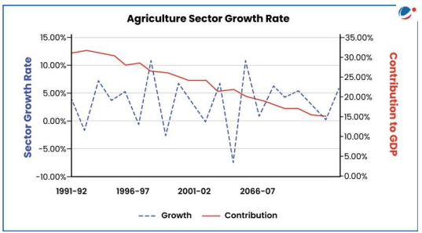

# Topic :  Food security

**1. Introduction to Food Security**

According to the FAO's 2001 report, food security is when "all people, at all times, have physical, social, and economic access to sufficient, safe, and nutritious food that meets their dietary needs for an active and healthy life."

The **World Summit on Food Security** identified **four pillars of food security**:

1. **Availability**: Sufficient food must be produced or accessible through imports or aid.
2. **Access**: People must have the economic and physical means to acquire food.
3. **Utilization**: Food must be used properly for nutrition, health, and well-being.
4. **Stability**: Food security should be maintained over time without disruptions from crises or natural disasters.

Food security requires not just the availability of food, but also the **purchasing power** to access it. Thus, ensuring food security involves addressing these four interconnected pillars to ensure consistent, nutritious, and affordable food for everyone.

-----

**2. Food Security and the Constitution of India**

While the **Constitution of India** does not explicitly mention the right to food, the **right to life** under **Article 21** has been interpreted by the Supreme Court and the NHRC to include the **right to live with human dignity**, which encompasses the **right to food** and other basic necessities.

Additionally, **Article 47** (Directive Principles of State Policy) directs the state to prioritize **raising nutrition levels**, improving the **standard of living**, and enhancing **public health** as part of its fundamental duties.

Malnutrition is the silent assassin and is devastating to not just large swathes of the population but also to the nation's economy.
-----

**3. Qualitative and Quantitative Dimensions of Food Security**

Food security has two key dimensions:

1. **Quantitative Dimension**: This refers to the overall **food availability** in the economy.
2. **Qualitative Dimension**: This pertains to the **nutritional requirements** being met.

### Quantitative Dimension of Food Security in India
India became **self-sufficient** in food grains in the 1970s due to the **Green Revolution** and has maintained this since. For the **2023-2024** crop year, India's food grains production is estimated at **309.34 million tonnes (MT)**. India is self-sufficient in producing major food crops like **wheat** and **rice**, meeting per capita food needs.

**Per Capita Net Availability of Food Grain**:
- In **2014**, the availability was **489g/day**.
- It declined slightly to **484.3g/day** in **2018**.
- By **2022**, it increased to **514g/day**.

### Qualitative Dimension of Food Security in India
While food availability is sufficient, **distribution inequalities** and **disproportionate purchasing power** hinder the nutritional security of vulnerable groups. Key findings include:

- The **undernourished population** declined from **249.4 million** (2004-06) to **224.3 million** (2019-21).
- **Stunting in children** under 5 years dropped from **47.8%** (2012) to **34.7%** (2019).
- **Obesity in adults** grew from **25.2 million** (2012) to **70 million** (2023).
- **Anaemia in women** increased from **53%** (2015-16) to **57%** (2019-20); for men, it rose from **22.7%** to **25%.
- **Anaemia in children (6-59 months)** rose dramatically by **8.5%**, reaching **67.1%**.
- The percentage of infants exclusively breastfed grew from **55%** (2015-16) to **64%** (2019-21).
- India's **Global Hunger Index (2023)** ranks **113th** out of **125 countries**, behind **Bangladesh**, **Pakistan**, and **Nepal**.

-----

**4. Challenges in Ensuring Food Security**

Several factors pose challenges to achieving food security:

1. **Climate Change**: The changing climate can disrupt food production, leading to unpredictable effects on food availability.
2. **Growing Global Population**: An increasing global population places higher demand on food resources, affecting both availability and access.
3. **Rising Food Prices**: Inflation and market fluctuations can make food less affordable, especially for economically disadvantaged populations.
4. **Poor Agricultural Growth Rate**: The slow growth in agricultural productivity hampers food security, as shown by declining growth rates in the sector.
5. **Environmental Stress**: Factors such as land degradation, water scarcity, and loss of biodiversity strain agricultural systems.

Additionally, many people in India are economically backward and cannot afford sufficient nutritious food, even though government support programs are in place. India's public procurement and food distribution systems have faced scrutiny in international forums like the **WTO**.

To address both **quantitative** and **qualitative** aspects of food security, India has implemented several food-based safety nets and monitoring programs:

- **Public Distribution System (PDS)**
- **Integrated Child Development Scheme (ICDS)**
- **Mid-Day Meals Program (MDM)**
- **National Nutrition Mission (POSHAN ABHIYAAN)**

------

**4.1. Integrated Child Development Scheme (ICDS)**

Launched in 1975, the **Integrated Child Development Scheme (ICDS)** is one of the largest child intervention programs globally. It offers a comprehensive package of six basic services aimed at children up to 6 years of age, and pregnant and lactating mothers. The key services include:

1. **Supplementary Feeding**: Provides additional nutrition (500 calories and 12-15g of protein for children, 600 calories and 18-20g of protein for pregnant mothers).
2. **Immunization**: Vaccines to protect children from preventable diseases.
3. **Health Checkups**: Regular health screenings for early detection and treatment.
4. **Referral Services**: Referrals for children or mothers needing specialized medical care.
5. **Health and Nutrition Education**: Educates adult women on health and nutrition practices.
6. **Non-Formal Pre-School Education**: Early childhood education for children aged 3-6 years.

-----

**4.2. Mid-Day Meal (MDM) Scheme**

Launched in 1995, the **Mid-Day Meal (MDM) Scheme** is the world's largest school feeding program, reaching approximately 11 crore children in schools and Education Guarantee Centres (EGS) across India. The scheme aims to achieve the following objectives:

- **Increase Enrolment and Attendance**: Encourage children to enroll and attend school regularly.
- **Reduce Dropout Rates**: Minimize student dropouts.
- **Improve Nutritional Status**: Enhance the nutritional intake of primary school children.

Since 2008-09, the scheme has expanded to include children in upper primary classes (up to Class VIII). The nutritional norms are as follows:

- **Primary Students**: 300 calories and 8-12g of protein.
- **Upper Primary Students**: 700 calories and 20g of protein.

-----

**4.3. Critical Appraisal of ICDS and MDM**

India’s flagship programs, **ICDS** and **MDM**, aimed at combating malnutrition, face several challenges:

1. **Limited Impact**: Despite significant financial investments (Rs 8,000 crore/year), the impact of **ICDS** and **MDM** on malnutrition remains limited, especially in states with high malnutrition rates, which often have low coverage of these schemes.
   
2. **Poor Quality Meals**: Many schools provide nutrient-deficient meals, compromising the effectiveness of **MDM** in addressing malnutrition.

3. **Narrow Focus of ICDS**: The **ICDS** primarily focuses on the **Supplementary Nutrition Program (SNP)** for children aged 3-6 years, neglecting infants (0-3 years), a critical period for nutrition.

4. **Hidden Hunger**: **ICDS** meals are often nutrition-deficient, leading to hidden hunger among children, manifesting as deficiencies in iodine, calcium, iron, or Vitamin A.

5. **Neglected Functions in ICDS**: Other important functions, such as child immunization and preschool education, are often neglected, except in some states like Tamil Nadu.

6. **Implementation Issues**: **ICDS** suffers from poor implementation, with vacant posts (such as CDPOs and supervisors) in many states.

7. **Corruption and Misuse**: **ICDS** faces rampant corruption, with resources misused, including **panjiri** (energy mix meant for children) being diverted for feeding cattle in some areas like Uttar Pradesh.

8. **Contractual Issues in MDM**: **MDM** has fallen prey to private contractors and political interference, with influential groups gaining contracts through **SHGs** and **Mahila Mandals**, undermining the scheme's goals.

------

**4.4. National Nutrition Mission (NNM)**

The **National Nutrition Mission** (NNM) is a flagship program led by the **Ministry of Women and Child Development (WCD)**, in collaboration with other ministries like **Health and Family Welfare** and **Drinking Water and Sanitation**, ensuring convergence with various initiatives.

**Target**: The mission aims to reduce:
- **Stunting**, **undernutrition**, and **low birth weight** by 2% annually.
- **Anaemia** among children (6-59 months) and women/adolescent girls (15-49 years) by 3% annually.
- **Stunting** to drop from **38.4%** (NFHS-4) to **25%** by 2022 (**Mission 25 by 2022**).

**Salient Features**:
- **NNM** monitors, supervises, sets targets, and guides nutrition interventions through a **life-cycle approach**.
- **Mapping of malnutrition-related schemes** for better coordination.
- Real-time **ICT-based monitoring system**.
- **Incentives** for states/UTs meeting targets and **Anganwadi Workers (AWW)** using IT tools.
- **Measurement** of children’s height at **Anganwadi Centres**.
- **Social audits** to track children’s health progress.
- Establishment of **Nutrition Resource Centres**.

-------

**3.4. National Food Security Act, 2013**

The **National Food Security Act, 2013** marks a shift from a welfare-based to a **rights-based approach** to food security. It legally entitles **75%** of the rural population and **50%** of the urban population to receive subsidized food grains through the **Targeted Public Distribution System (TPDS)**, covering about **67%** of the total population.

The Act aims to ensure **food and nutritional security** by providing access to adequate, affordable, and quality food for all citizens, supporting a life with dignity.

**Key Features of the Act**:
- **Coverage**: Up to **75%** of rural and **50%** of urban population is entitled to subsidized food grains under TPDS.
- **Entitlements**: 
  - **35 kg of foodgrains per month** for **Antyodaya Anna Yojana (AAY)** households.
  - **5 kg per person per month** for **Priority Household (PHH)**.
- **Identification of Beneficiaries**: Done by State/UT Governments, which set their own criteria.
- **Head of Family**: The eldest woman (18+ years) in a household is considered the "Head of Family" for ration card issuance.

**Food Security & Nutritional Security**:
- The Act focuses on **food security** through expanded PDS, but achieving **nutritional security** depends on how households utilize the subsidized food.
  
**Impact of Cereal Subsidies**:

- **Income Effect**: Subsidized cereals free up money for households to purchase other nutritious foods like milk, fruits, and meat.
- **Substitution Effect**: Savings from subsidized cereals may be used for other needs, potentially diverting funds from food expenditure.

Though **communicable diseases** are still prevalent in India, **non-communicable diseases (NCDs)** like cardiovascular diseases, diabetes, and cancer are rising. The consumption of processed and refined foods is increasing, contributing to the rise in NCDs. Interestingly, increasing incomes have not improved diets, as people often abandon healthier foods like small millets in favor of processed ones.

-----

**4. WTO and India’s Food Security Objectives**

India’s food security policies, especially its public stockholding programs and related subsidies, have been a significant point of contention at the **World Trade Organization (WTO)**.

### 4.1. Key Issues at the WTO

- **Public Stockholding Programs**: India procures food grains (like rice and wheat) from farmers at **minimum support prices (MSPs)** and distributes them through the **Public Distribution System (PDS)** at subsidized rates to the poor. While the **WTO Agreement on Agriculture (AoA)** permits public stockholding, it imposes limits on the amount of subsidies that can be given without disrupting international trade.
  
- **Subsidy Limits and WTO Rules**: The AoA classifies domestic support measures into different boxes:
  - **Amber Box**: Subsidies that distort trade and are subject to reduction commitments, such as MSPs.
  - **De Minimis**: Minimal domestic support that is exempt from reduction commitments, which for developing countries is set at **10%** of the total value of agricultural production.
  
  India argues that its food security programs are essential for supporting its large population, but other WTO members argue that India’s subsidies exceed these limits, distorting international trade.

- **Peace Clause**: During the **Bali Ministerial Conference** in 2013, the WTO introduced a **temporary Peace Clause** to protect developing countries’ public stockholding programs from legal challenges even if they exceed subsidy limits. However, this clause is temporary and subject to conditions, leading to uncertainty and ongoing disputes until a permanent solution is reached.

---

**4.2. Background and Context**

- **India’s Food Security Needs**: A large portion of India's population lives in poverty and relies on subsidized food. Public stockholding programs are crucial for ensuring food security and supporting rural livelihoods by providing a minimum price to farmers.

- **Global Trade Concerns**: Countries like the **United States** and **Australia**, major agricultural exporters, argue that India’s high subsidies and stockpiling can cause excessive production, leading to dumping of surplus goods in international markets. This disrupts global trade and negatively impacts farmers in other countries.

- **WTO's Norms and Reform Pressures**: WTO rules on agricultural subsidies were initially designed to reduce the high subsidies of developed countries. Developing nations like India argue for more flexibility due to their specific developmental needs, creating tensions and calls for reforms to update the existing frameworks.

----

**4.3. International Reactions and Negotiations**

- **Developed Countries**: Countries like the **US** and the **EU** criticize India's subsidy regime, claiming it distorts global trade and undermines fair competition. They call for stricter enforcement of WTO rules and greater transparency in India’s stockholding operations.

- **Developing Countries**: Many developing nations support India, recognizing the significance of its food security programs and the challenges faced by low-income farmers. They argue for more flexible rules or exceptions within the WTO framework to accommodate these needs.

- **WTO Negotiations**: WTO discussions have been prolonged, with no clear agreement on a permanent solution. India continues to advocate for a broader interpretation of the **Peace Clause** or a permanent exemption for its public stockholding programs.

----

**4.4. Challenges and Considerations**

- **Compliance vs. Food Security**: India faces a challenge in balancing WTO rules with its food security needs. Adhering to subsidy limits may hinder its ability to support farmers and provide affordable food to its large population.

- **Transparency and Accountability**: There are calls for greater transparency in India’s stockholding and subsidy practices. Improved reporting and compliance mechanisms could address international concerns while supporting India's domestic objectives.

- **Future of Global Agricultural Trade**: The debate over India's foodgrain policy highlights broader issues in global agricultural trade, such as the disparity in subsidy practices between developed and developing countries. There is a growing need for reforms to establish a fair and equitable trading system.

-----

### Extra points : 

**1. The Scheme for Modernization and Reforms through Technology in Public Distribution System (SMART-PDS) has transformative potential beyond food security for India.Discuss.**

The **SMART-PDS** (Scheme for Modernization and Reforms through Technology in Public Distribution System) utilizes modern ICT and automation to transform India's PDS. It creates a national-level dashboard to monitor PDS operations using advanced technologies.

### Role in Food Security:
- **Timely food delivery**: SMART-PDS ensures the distribution of food grains to 800 million beneficiaries under the National Food Security Act (NFSA).
- **Preventing leakages**: Smart ration cards, Aadhaar seeding, and automation help reduce corruption and leakage.
- **Portability**: It allows beneficiaries to access food from any Fair Price Shop under the One Nation One Ration Card (ONORC) system.

### Benefits Beyond Food Security:
- **Data-driven decisions**: Data generated helps in understanding beneficiaries’ needs, migration patterns, and supporting other welfare schemes like Ayushman Bharat and PM-SVANidhi.
- **Improved accountability**: Real-time monitoring through a national dashboard ensures better oversight of PDS operations.
- **Efficient supply chain**: Integration of various PDS operations improves logistics and reduces wastage.
- **Technology upgrades**: It addresses state-level technological gaps and standardizes PDS operations nationwide.

In conclusion, SMART-PDS not only strengthens food security but also enhances government efficiency and welfare scheme delivery. Its timely implementation is crucial for sustainable reforms in India’s public distribution system.

----

**2. Examine how digital transformation of the Public Distribution System (PDS) in India has helped in addressing the challenges besetting it.**

The **Public Distribution System (PDS)** in India aims to manage food scarcity by distributing food grains at affordable prices, ensuring food security, stabilizing prices, and maintaining buffer stocks. However, it faces several challenges:

### Challenges:
- **Bogus cards and ghost beneficiaries**: Fake beneficiaries divert grains to the black market, causing shortages for the needy.
- **Identification failures**: Poor biometric data, connectivity issues, or lack of Aadhaar prevent rightful beneficiaries from receiving food.
- **Leakages**: Around 46.7% of food grains are lost during transportation.
- **Impact on women**: Women face difficulties in updating their ration cards when they marry, often losing access to food rations.

### Impact of Digital Transformation:
- **Increased transparency**: End-to-end computerization improves efficiency and transparency in food grain distribution, as seen in states like Chhattisgarh and Tamil Nadu.
- **Accurate beneficiary identification**: ePoS devices at Fair Price Shops (FPSs) ensure biometric/Aadhaar authentication for accurate distribution.
- **Better tracking**: GPS tracking of trucks prevents diversion and leakage of food grains.
- **Data centralization**: Platforms like IM-PDS and Annavitran enable nationwide portability of ration cards under the One Nation, One Ration Card (ONORC) initiative.

### Measures for Improvement:
- Enhance connectivity, improve network speed, and install more ePoS devices at FPSs.
- Strengthen technical support through call centers and promote digital literacy to ensure better adoption of technology. 

These steps will help address the PDS challenges and improve its effectiveness.

------

**3. What do you mean by operational stocks and strategic reserves in the context of foodgrain stocking norms of India? Provide a critical evaluation of the buffer stocking policy of India**

**Operational stocks** refer to the reserves maintained to meet distribution needs under public welfare schemes, while **strategic reserves** are surplus stocks held beyond operational requirements to stabilize food prices and address emergencies.

### Significance of Buffer Stocking Policy:
India’s buffer stocking policy ensures food security, stabilizes prices, and addresses fluctuations in supply and demand. It helps in preventing price spikes and ensures a steady food supply during crises.

### Critical Evaluation:
- **Open-ended procurement**: The government purchases unlimited grains at Minimum Support Price (MSP), leading to excessive stocks. For example, in August 2023, stocks of rice and wheat far exceeded official limits.
- **Financial burden**: The gap between procurement prices and the issue price leads to large subsidies, with the food subsidy bill reaching Rs. 2.88 lakh crore in FY 2021-22.
- **Ineffective procurement**: Fixed MSPs create challenges when market conditions change between sowing and harvesting, leading to excess or insufficient procurement.
- **Storage issues**: Inadequate storage facilities and poor conditions result in significant grain wastage, with over 1500 MT lost annually due to pests and leaks.
- **Limited private sector involvement**: High MSPs and regulations like the Essential Commodities Act limit private sector participation in the grain market.
- **Lack of crop diversification**: Overemphasis on wheat and rice leads to surpluses of these crops while other essential crops, like oilseeds, face deficits, forcing India to import edible oils.

### Conclusion:
There is a need to reevaluate and streamline the buffer stocking policy to reduce financial strain, improve efficiency, and promote crop diversification for better food security management.

------

**4. India faces the ‘triple burden of malnutrition’ that threatens to erode the growth and development of its human resources and economy. Explain. Also highlight the role of the National Nutrition Strategy to address the nutritional challenges.**

The **triple burden of malnutrition** refers to the coexistence of **under-nutrition**, **hidden hunger**, and **overweight** children under five years of age, which significantly hampers the growth and development of individuals and the economy.

### Status of Malnutrition in India:
- **Human development impact**: Malnutrition adversely affects children’s education, leading to cognitive deficits and physical productivity losses. Malnourished children earn 20% less as adults and contribute to a loss of 17.3% of India's productive years due to malnutrition-related illness or early death (Lancet journal, 2018).
- **Economic cost**: Micronutrient malnutrition costs India between 0.8% to 2.5% of its GDP, amounting to $15–46 billion, while additional healthcare costs can reduce GDP by 2-11%.

### National Nutrition Strategy:
Launched by NITI Aayog in 2017, the **National Nutrition Strategy** aims for a **Kuposhan Mukt Bharat** by 2022, with the following key features:
- **Reduce malnutrition**: Targets all forms of malnutrition by 2030, focusing on vulnerable groups.
- **National Nutrition Mission**: Integrates interventions across sectors like health, women and child development, and public distribution.
- **Decentralized approach**: Encourages local innovation and accountability through flexible planning at the state and district levels.
- **Child and maternal care**: Focuses on breastfeeding, micronutrient supplementation, and improved care for undernourished children and mothers.
- **Governance reforms**: Promotes convergence of programs like ICDS and Swachh Bharat, targeting vulnerable communities with evidence-based models.

### Conclusion:
The **National Nutrition Strategy** plays a vital role in addressing the triple burden of malnutrition and improving the health, learning capacities, and productivity of India's population. Continued efforts are needed to achieve sustainable improvements in nutrition.

------

**5.Though the National Food Security Act, 2013, is considered as a potential revolutionary step towards the fight against hunger, it has inherent challenges, which need to be addressed to ensure food security for all. Discuss.**

The **National Food Security Act (NFSA), 2013** was enacted to address hunger, undernourishment, and poverty in India. It aims to provide subsidized food grains to about 67% of the population (75% in rural areas and 50% in urban areas) through the Public Distribution System (PDS).

### Revolutionary Steps in Fighting Hunger:
- **Food entitlement**: Priority households receive five kilograms of wheat, rice, and millets per person each month at subsidized prices (Rs. 3/kg for wheat, Rs. 2/kg for rice, Rs. 1/kg for millets).
- **Support for pregnant women**: Free meals and maternity benefits (up to Rs. 6,000) for pregnant women.
- **Child nutritional care**: Free meals at anganwadis for children under six years old, and mid-day meals for children aged 6-14 in schools.
- **Food security allowance**: Cash benefits in case of non-supply of food grains.

### Challenges:
- **Infrastructure issues**: Poor conditions in anganwadis, including inadequate sanitation, clean spaces, and staff, hinder the effective delivery of services.
- **Storage limitations**: The Food Corporation of India faces inadequate storage facilities, leading to wastage and pilferage of food grains.
- **Lack of awareness**: Many beneficiaries are unaware of their entitlements, such as those under the Antyodaya Anna Yojana or the One Nation One Ration Card plan, and migrants face difficulties accessing benefits.
- **Exclusion of beneficiaries**: Aadhaar-based digitalization has led to exclusions due to technical issues like fingerprint mismatches.
- **Nutrition deficiencies**: The provision of food grains alone does not address the broader need for a balanced, nutritious diet.
- **Financial burden**: The cost of providing food to 67% of the population places a significant strain on the government budget.

### Conclusion:
To address these issues, the NFSA requires improvements in infrastructure, digital systems, and awareness campaigns. Incorporating nutritional security alongside food security is essential for achieving the Act's objectives.

-------------------

