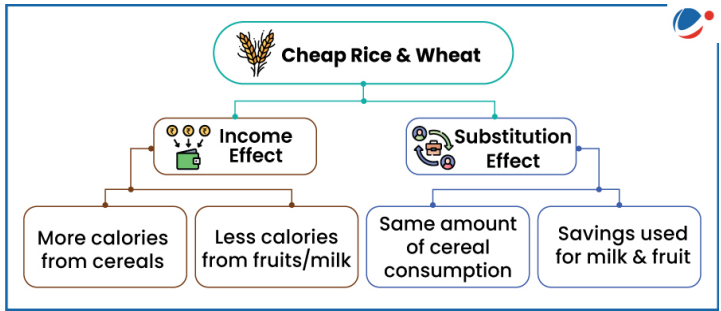

# Topic :  Food security

**1. Introduction to Food Security**

According to the FAO's 2001 report, food security is when "all people, at all times, have physical, social, and economic access to sufficient, safe, and nutritious food that meets their dietary needs for an active and healthy life."

The **World Summit on Food Security** identified **four pillars of food security**:

1. **Availability**: Sufficient food must be produced or accessible through imports or aid.
2. **Access**: People must have the economic and physical means to acquire food.
3. **Utilization**: Food must be used properly for nutrition, health, and well-being.
4. **Stability**: Food security should be maintained over time without disruptions from crises or natural disasters.

Food security requires not just the availability of food, but also the **purchasing power** to access it. Thus, ensuring food security involves addressing these four interconnected pillars to ensure consistent, nutritious, and affordable food for everyone.

-----

**2. Food Security and the Constitution of India**

While the **Constitution of India** does not explicitly mention the right to food, the **right to life** under **Article 21** has been interpreted by the Supreme Court and the NHRC to include the **right to live with human dignity**, which encompasses the **right to food** and other basic necessities.

Additionally, **Article 47** (Directive Principles of State Policy) directs the state to prioritize **raising nutrition levels**, improving the **standard of living**, and enhancing **public health** as part of its fundamental duties.

-----

**3. Qualitative and Quantitative Dimensions of Food Security**

Food security has two key dimensions:

1. **Quantitative Dimension**: This refers to the overall **food availability** in the economy.
2. **Qualitative Dimension**: This pertains to the **nutritional requirements** being met.

### Quantitative Dimension of Food Security in India
India became **self-sufficient** in food grains in the 1970s due to the **Green Revolution** and has maintained this since. For the **2023-2024** crop year, India's food grains production is estimated at **309.34 million tonnes (MT)**. India is self-sufficient in producing major food crops like **wheat** and **rice**, meeting per capita food needs.

**Per Capita Net Availability of Food Grain**:
- In **2014**, the availability was **489g/day**.
- It declined slightly to **484.3g/day** in **2018**.
- By **2022**, it increased to **514g/day**.

### Qualitative Dimension of Food Security in India
While food availability is sufficient, **distribution inequalities** and **disproportionate purchasing power** hinder the nutritional security of vulnerable groups. Key findings include:

- The **undernourished population** declined from **249.4 million** (2004-06) to **224.3 million** (2019-21).
- **Stunting in children** under 5 years dropped from **47.8%** (2012) to **34.7%** (2019).
- **Obesity in adults** grew from **25.2 million** (2012) to **70 million** (2023).
- **Anaemia in women** increased from **53%** (2015-16) to **57%** (2019-20); for men, it rose from **22.7%** to **25%.
- **Anaemia in children (6-59 months)** rose dramatically by **8.5%**, reaching **67.1%**.
- The percentage of infants exclusively breastfed grew from **55%** (2015-16) to **64%** (2019-21).
- India's **Global Hunger Index (2023)** ranks **113th** out of **125 countries**, behind **Bangladesh**, **Pakistan**, and **Nepal**.

-----

**4. Challenges in Ensuring Food Security**

Several factors pose challenges to achieving food security:

1. **Climate Change**: The changing climate can disrupt food production, leading to unpredictable effects on food availability.
2. **Growing Global Population**: An increasing global population places higher demand on food resources, affecting both availability and access.
3. **Rising Food Prices**: Inflation and market fluctuations can make food less affordable, especially for economically disadvantaged populations.
4. **Poor Agricultural Growth Rate**: The slow growth in agricultural productivity hampers food security, as shown by declining growth rates in the sector.
5. **Environmental Stress**: Factors such as land degradation, water scarcity, and loss of biodiversity strain agricultural systems.

Additionally, many people in India are economically backward and cannot afford sufficient nutritious food, even though government support programs are in place. India's public procurement and food distribution systems have faced scrutiny in international forums like the **WTO**.

To address both **quantitative** and **qualitative** aspects of food security, India has implemented several food-based safety nets and monitoring programs:

- **Public Distribution System (PDS)**
- **Integrated Child Development Scheme (ICDS)**
- **Mid-Day Meals Program (MDM)**
- **National Nutrition Mission (POSHAN ABHIYAAN)**

------

**4.1. Integrated Child Development Scheme (ICDS)**

Launched in 1975, the **Integrated Child Development Scheme (ICDS)** is one of the largest child intervention programs globally. It offers a comprehensive package of six basic services aimed at children up to 6 years of age, and pregnant and lactating mothers. The key services include:

1. **Supplementary Feeding**: Provides additional nutrition (500 calories and 12-15g of protein for children, 600 calories and 18-20g of protein for pregnant mothers).
2. **Immunization**: Vaccines to protect children from preventable diseases.
3. **Health Checkups**: Regular health screenings for early detection and treatment.
4. **Referral Services**: Referrals for children or mothers needing specialized medical care.
5. **Health and Nutrition Education**: Educates adult women on health and nutrition practices.
6. **Non-Formal Pre-School Education**: Early childhood education for children aged 3-6 years.

-----

**4.2. Mid-Day Meal (MDM) Scheme**

Launched in 1995, the **Mid-Day Meal (MDM) Scheme** is the world's largest school feeding program, reaching approximately 11 crore children in schools and Education Guarantee Centres (EGS) across India. The scheme aims to achieve the following objectives:

- **Increase Enrolment and Attendance**: Encourage children to enroll and attend school regularly.
- **Reduce Dropout Rates**: Minimize student dropouts.
- **Improve Nutritional Status**: Enhance the nutritional intake of primary school children.

Since 2008-09, the scheme has expanded to include children in upper primary classes (up to Class VIII). The nutritional norms are as follows:

- **Primary Students**: 300 calories and 8-12g of protein.
- **Upper Primary Students**: 700 calories and 20g of protein.

-----

**4.3. Critical Appraisal of ICDS and MDM**

India’s flagship programs, **ICDS** and **MDM**, aimed at combating malnutrition, face several challenges:

1. **Limited Impact**: Despite significant financial investments (Rs 8,000 crore/year), the impact of **ICDS** and **MDM** on malnutrition remains limited, especially in states with high malnutrition rates, which often have low coverage of these schemes.
   
2. **Poor Quality Meals**: Many schools provide nutrient-deficient meals, compromising the effectiveness of **MDM** in addressing malnutrition.

3. **Narrow Focus of ICDS**: The **ICDS** primarily focuses on the **Supplementary Nutrition Program (SNP)** for children aged 3-6 years, neglecting infants (0-3 years), a critical period for nutrition.

4. **Hidden Hunger**: **ICDS** meals are often nutrition-deficient, leading to hidden hunger among children, manifesting as deficiencies in iodine, calcium, iron, or Vitamin A.

5. **Neglected Functions in ICDS**: Other important functions, such as child immunization and preschool education, are often neglected, except in some states like Tamil Nadu.

6. **Implementation Issues**: **ICDS** suffers from poor implementation, with vacant posts (such as CDPOs and supervisors) in many states.

7. **Corruption and Misuse**: **ICDS** faces rampant corruption, with resources misused, including **panjiri** (energy mix meant for children) being diverted for feeding cattle in some areas like Uttar Pradesh.

8. **Contractual Issues in MDM**: **MDM** has fallen prey to private contractors and political interference, with influential groups gaining contracts through **SHGs** and **Mahila Mandals**, undermining the scheme's goals.

------

**4.4. National Nutrition Mission (NNM)**

The **National Nutrition Mission** (NNM) is a flagship program led by the **Ministry of Women and Child Development (WCD)**, in collaboration with other ministries like **Health and Family Welfare** and **Drinking Water and Sanitation**, ensuring convergence with various initiatives.

**Target**: The mission aims to reduce:
- **Stunting**, **undernutrition**, and **low birth weight** by 2% annually.
- **Anaemia** among children (6-59 months) and women/adolescent girls (15-49 years) by 3% annually.
- **Stunting** to drop from **38.4%** (NFHS-4) to **25%** by 2022 (**Mission 25 by 2022**).

**Salient Features**:
- **NNM** monitors, supervises, sets targets, and guides nutrition interventions through a **life-cycle approach**.
- **Mapping of malnutrition-related schemes** for better coordination.
- Real-time **ICT-based monitoring system**.
- **Incentives** for states/UTs meeting targets and **Anganwadi Workers (AWW)** using IT tools.
- **Measurement** of children’s height at **Anganwadi Centres**.
- **Social audits** to track children’s health progress.
- Establishment of **Nutrition Resource Centres**.

-------

**3.4. National Food Security Act, 2013**

The **National Food Security Act, 2013** marks a shift from a welfare-based to a **rights-based approach** to food security. It legally entitles **75%** of the rural population and **50%** of the urban population to receive subsidized food grains through the **Targeted Public Distribution System (TPDS)**, covering about **67%** of the total population.

The Act aims to ensure **food and nutritional security** by providing access to adequate, affordable, and quality food for all citizens, supporting a life with dignity.

**Key Features of the Act**:
- **Coverage**: Up to **75%** of rural and **50%** of urban population is entitled to subsidized food grains under TPDS.
- **Entitlements**: 
  - **35 kg of foodgrains per month** for **Antyodaya Anna Yojana (AAY)** households.
  - **5 kg per person per month** for **Priority Household (PHH)**.
- **Identification of Beneficiaries**: Done by State/UT Governments, which set their own criteria.
- **Head of Family**: The eldest woman (18+ years) in a household is considered the "Head of Family" for ration card issuance.

**Food Security & Nutritional Security**:
- The Act focuses on **food security** through expanded PDS, but achieving **nutritional security** depends on how households utilize the subsidized food.
  
**Impact of Cereal Subsidies**:

- **Income Effect**: Subsidized cereals free up money for households to purchase other nutritious foods like milk, fruits, and meat.
- **Substitution Effect**: Savings from subsidized cereals may be used for other needs, potentially diverting funds from food expenditure.

Though **communicable diseases** are still prevalent in India, **non-communicable diseases (NCDs)** like cardiovascular diseases, diabetes, and cancer are rising. The consumption of processed and refined foods is increasing, contributing to the rise in NCDs. Interestingly, increasing incomes have not improved diets, as people often abandon healthier foods like small millets in favor of processed ones.

-----

