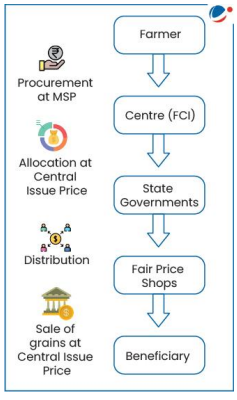
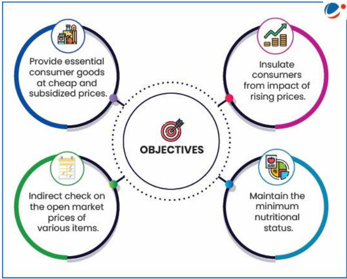

 Topic : Public Distribution System- objectives, functioning, limitations, revamping

### Intro : 

The Public Distribution System (PDS) is a food security initiative under the Ministry of Consumer Affairs, Food, and Public Distribution. It operates through about 5.37 lakh fair price shops (FPSs) that provide basic food and non-food items at low prices to those in need.

The PDS is managed by both the Central and State Governments:
- The Central Government, through the Food Corporation of India (FCI), handles procurement, storage, transportation, and bulk allocation of food grains to state government.
- State Governments are responsible for distribution, identifying eligible families, issuing Ration Cards, and overseeing FPS operations.

Currently, the PDS distributes commodities like wheat, rice, sugar, and kerosene. Some states also provide additional items like pulses, edible oils, iodized salt, and spices through PDS outlets.

--- 
**1.1 Objectives**

The Public Distribution System (PDS) was originally designed to manage scarcity by distributing food grains at affordable prices. Its key objectives include:

The PDS supply chain consists of three segments:
1. Procurement of food grains
2. Storage and transportation
3. Distribution of food grains

In addition to cereals, some states are encouraged to include other essential items like pulses, salt, candles, matchboxes, clothes, and school textbooks.

---

**1.2 Context and Evolution of PDS in India**

India’s Public Distribution System (PDS) is the largest distribution network of its kind globally. The government established the Agriculture Prices Commission (later renamed CACP) and the Food Corporation of India (FCI) for the procurement and storage of food grains.

- **1970s**: PDS became a universal scheme for distributing subsidized food.
- **1992**: The Revamped PDS (RPDS) was introduced in 1,775 blocks to improve food access, particularly in remote and hilly areas, and to reach poorer families. RPDS covered areas where
special programmes like Drought Prone Area Program (DPAP), Integrated tribal development
program (ITDP), Desert Development Program (DDP) were under operation and in certain
Designated Hill Areas (DHA)
- **1997**: The Targeted PDS (TPDS) was launched, focusing on the poor. It provided subsidized food and fuel to 6 crore poor families, with 7.2 million tonnes of food grains allocated annually.
  - An ‘additional allocation’ was provided to the Above Poverty Line (APL) population, but at higher prices than the Below Poverty Line (BPL) quota.
- **2000**: The Antyodaya Anna Yojana (AAY) was launched to assist the poorest families, providing 25kg of food grains per month at heavily subsidized rates. This was increased to 35kg in 2002, targeting 1 crore households.
- **2013**: The National Food Security Act (NFSA) was enacted, ensuring 5kg of food grains per person per month to around 82 crore people.

---