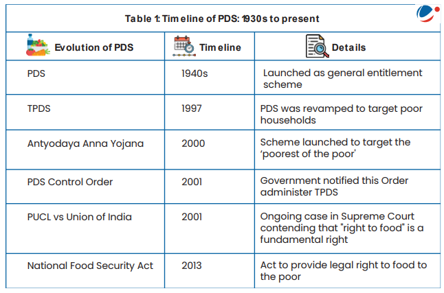

 Topic : Public Distribution System- objectives, functioning, limitations, revamping

### Intro : 

The Public Distribution System (PDS) is a food security initiative under the Ministry of Consumer Affairs, Food, and Public Distribution. It operates through about 5.37 lakh fair price shops (FPSs) that provide basic food and non-food items at low prices to those in need.

The PDS is managed by both the Central and State Governments:
- The Central Government, through the Food Corporation of India (FCI), handles procurement, storage, transportation, and bulk allocation of food grains to state government.
- State Governments are responsible for distribution, identifying eligible families, issuing Ration Cards, and overseeing FPS operations.

Currently, the PDS distributes commodities like wheat, rice, sugar, and kerosene. Some states also provide additional items like pulses, edible oils, iodized salt, and spices through PDS outlets.

--- 
**1.1 Objectives**

The Public Distribution System (PDS) was originally designed to manage scarcity by distributing food grains at affordable prices. Its key objectives include:

The PDS supply chain consists of three segments:
1. Procurement of food grains
2. Storage and transportation
3. Distribution of food grains

In addition to cereals, some states are encouraged to include other essential items like pulses, salt, candles, matchboxes, clothes, and school textbooks.

---

**1.2 Context and Evolution of PDS in India**

India’s Public Distribution System (PDS) is the largest distribution network of its kind globally. The government established the Agriculture Prices Commission (later renamed CACP) and the Food Corporation of India (FCI) for the procurement and storage of food grains.

- **1970s**: PDS became a universal scheme for distributing subsidized food.
- **1992**: The Revamped PDS (RPDS) was introduced in 1,775 blocks to improve food access, particularly in remote and hilly areas, and to reach poorer families. RPDS covered areas where
special programmes like Drought Prone Area Program (DPAP), Integrated tribal development
program (ITDP), Desert Development Program (DDP) were under operation and in certain
Designated Hill Areas (DHA)
- **1997**: The Targeted PDS (TPDS) was launched, focusing on the poor. It provided subsidized food and fuel to 6 crore poor families, with 7.2 million tonnes of food grains allocated annually.
  - An ‘additional allocation’ was provided to the Above Poverty Line (APL) population, but at higher prices than the Below Poverty Line (BPL) quota.
- **2000**: The Antyodaya Anna Yojana (AAY) was launched to assist the poorest families, providing 25kg of food grains per month at heavily subsidized rates. This was increased to 35kg in 2002, targeting 1 crore households.
- **2013**: The National Food Security Act (NFSA) was enacted, ensuring 5kg of food grains per person per month to around 82 crore people.

---

**1.3 Targeted Public Distribution System (TPDS)**

Launched in 1997, the Targeted Public Distribution System (TPDS) aims to provide food grains at highly subsidized rates to people Below Poverty Line (BPL) and at higher prices to those Above Poverty Line (APL). States are responsible for identifying the poor under this scheme. TPDS retains the universal nature of the PDS but focuses on BPL families.

- **Allocation**: BPL and Antyodaya Anna Yojana (AAY) families receive 35 kg of food grains per month, while APL families receive between 15 to 35 kg per month.

**Key Features of TPDS:**
1. **Targeting**: BPL includes families earning a maximum of Rs. 15,000 annually. Initially, 10 kg of food grains were allocated per household per month, later increased to 35 kg in 2002.
2. **Dual Prices**: 
   - In 2000, the price for BPL families was set at 50% of the economic cost, and for APL families, at 100%. 
   - In 2001, a third price was introduced for AAY beneficiaries (Rs 2/kg for wheat and Rs 3/kg for rice).
3. **Central-State Control**: The Central Government allocates food grains to states, while state governments manage the distribution. The Central Government also decides the BPL population size and their entitlement.

**Management of Food Grains for TPDS:**
- The **Central Government** procures food grains at a minimum support price (MSP) and sells them to states at the central issue price. It handles transportation to state godowns.
- The **State Governments** transport food grains from godowns to fair price shops, where beneficiaries purchase them at subsidized prices. Some states further subsidize the prices.
- **The Food Corporation of India (FCI)** is responsible for:
  - Procuring grains at MSP,
  - Maintaining buffer stocks for food security,
  - Allocating and transporting grains to states,
  - Selling grains to states at the central issue price for distribution.

**Issues related to TPDS**

1. **Targeting**: The income-based definition of BPL eligibility misses many vulnerable populations. Exclusion errors are high, with up to 63% of poor households not covered by the system (NSS-2007). Additionally, APL households sometimes receive large amounts of subsidized grains, leading to high inclusion errors. NCAER reports issues like ‘ghost’ cardholders.
   
2. **Storage Imbalances**: There is a shortage of storage in consuming states like Rajasthan and Maharashtra, while states with large procurement (e.g., Punjab, Haryana, Uttar Pradesh) have excess storage capacity.

3. **Leakages and Diversion**: Food grains are often diverted to open markets due to corruption. Transport losses and the issue of ghost beneficiaries further contribute to leakages.

4. **Late and Irregular Delivery**: The irregular arrival of grains at Fair Price Shops, combined with a lack of awareness among poor households, leads to issues with physical and economic access.

5. **No Variation in Purchases Across Income Groups**: A successful targeting system should show a decrease in PDS purchases as income increases, but this is not happening under the current system.

6. **Failure in Surplus-to-Deficit Grain Transfer**: The TPDS has hindered the objective of stabilizing grain prices across regions. With APL families priced out and BPL quotas low, the ability to stabilize prices has weakened, unlike in the universal PDS system.

7. **Increased Subsidy Burden**: The introduction of AAY and low prices for BPL families, along with the exclusion of APL households, has increased the subsidy burden. This has also led to higher stocks with the Food Corporation of India (FCI).

----

**1.4 Recent PDS Reforms**

1. **Digitization of Ration Cards**: This enables online entry and verification of beneficiary data, including monthly entitlements and food grain off-take. States like Andhra Pradesh, Gujarat, Tamil Nadu, and Madhya Pradesh have implemented this on a large scale.

2. **Linking with Aadhar**: 56% of digitized cards are now linked with Aadhar, improving beneficiary identification and targeting.

3. **Computerization of FPS Allocation**: This streamlines stock balance declarations, issuance of web-based truck challans, and allows efficient tracking of transactions. Many states have also implemented ePOS (electronic point of sale) systems to track real-time sales at Fair Price Shops.

4. **Use of GPS Technology**: States like Chhattisgarh and Tamil Nadu use GPS to track the movement of food grain trucks from state depots to FPS, significantly reducing leakages.

5. **One Nation One Ration Card (ONORC) Scheme**: This initiative allows beneficiaries to access their PDS entitlements from any FPS across the country, enhancing food security for migrants and mobile populations. The scheme has been implemented in all states and Union Territories as of mid-2023.

----