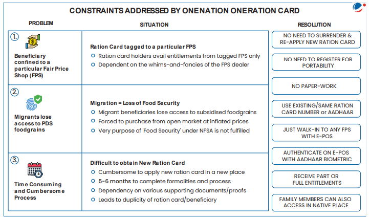
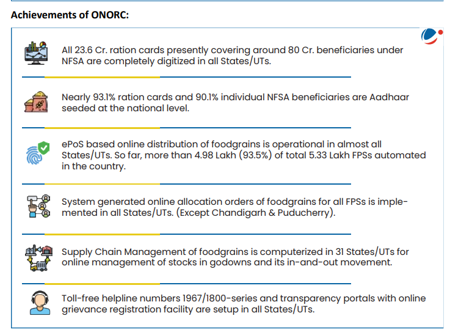
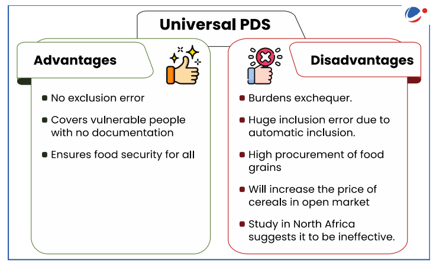

# Topic : Public Distribution System- objectives, functioning, limitations, revamping

### Intro : 

The Public Distribution System (PDS) is a food security initiative under the Ministry of Consumer Affairs, Food, and Public Distribution. It operates through about 5.37 lakh fair price shops (FPSs) that provide basic food and non-food items at low prices to those in need.

The PDS is managed by both the Central and State Governments:
- The Central Government, through the Food Corporation of India (FCI), handles procurement, storage, transportation, and bulk allocation of food grains to state government.
- State Governments are responsible for distribution, identifying eligible families, issuing Ration Cards, and overseeing FPS operations.

Currently, the PDS distributes commodities like wheat, rice, sugar, and kerosene. Some states also provide additional items like pulses, edible oils, iodized salt, and spices through PDS outlets.

--- 
**1.1 Objectives**

The Public Distribution System (PDS) was originally designed to manage scarcity by distributing food grains at affordable prices. Its key objectives include:

The PDS supply chain consists of three segments:
1. Procurement of food grains
2. Storage and transportation
3. Distribution of food grains

In addition to cereals, some states are encouraged to include other essential items like pulses, salt, candles, matchboxes, clothes, and school textbooks.

---

**1.2 Context and Evolution of PDS in India**

India’s Public Distribution System (PDS) is the largest distribution network of its kind globally. The government established the Agriculture Prices Commission (later renamed CACP) and the Food Corporation of India (FCI) for the procurement and storage of food grains.

- **1970s**: PDS became a universal scheme for distributing subsidized food.
- **1992**: The Revamped PDS (RPDS) was introduced in 1,775 blocks to improve food access, particularly in remote and hilly areas, and to reach poorer families. RPDS covered areas where
special programmes like Drought Prone Area Program (DPAP), Integrated tribal development
program (ITDP), Desert Development Program (DDP) were under operation and in certain
Designated Hill Areas (DHA)
- **1997**: The Targeted PDS (TPDS) was launched, focusing on the poor. It provided subsidized food and fuel to 6 crore poor families, with 7.2 million tonnes of food grains allocated annually.
  - An ‘additional allocation’ was provided to the Above Poverty Line (APL) population, but at higher prices than the Below Poverty Line (BPL) quota.
- **2000**: The Antyodaya Anna Yojana (AAY) was launched to assist the poorest families, providing 25kg of food grains per month at heavily subsidized rates. This was increased to 35kg in 2002, targeting 1 crore households.
- **2013**: The National Food Security Act (NFSA) was enacted, ensuring 5kg of food grains per person per month to around 82 crore people.

---

**1.3 Targeted Public Distribution System (TPDS)**

Launched in 1997, the Targeted Public Distribution System (TPDS) aims to provide food grains at highly subsidized rates to people Below Poverty Line (BPL) and at higher prices to those Above Poverty Line (APL). States are responsible for identifying the poor under this scheme. TPDS retains the universal nature of the PDS but focuses on BPL families.

- **Allocation**: BPL and Antyodaya Anna Yojana (AAY) families receive 35 kg of food grains per month, while APL families receive between 15 to 35 kg per month.

**Key Features of TPDS:**
1. **Targeting**: BPL includes families earning a maximum of Rs. 15,000 annually. Initially, 10 kg of food grains were allocated per household per month, later increased to 35 kg in 2002.
2. **Dual Prices**: 
   - In 2000, the price for BPL families was set at 50% of the economic cost, and for APL families, at 100%. 
   - In 2001, a third price was introduced for AAY beneficiaries (Rs 2/kg for wheat and Rs 3/kg for rice).
3. **Central-State Control**: The Central Government allocates food grains to states, while state governments manage the distribution. The Central Government also decides the BPL population size and their entitlement.

**Management of Food Grains for TPDS:**
- The **Central Government** procures food grains at a minimum support price (MSP) and sells them to states at the central issue price. It handles transportation to state godowns.
- The **State Governments** transport food grains from godowns to fair price shops, where beneficiaries purchase them at subsidized prices. Some states further subsidize the prices.
- **The Food Corporation of India (FCI)** is responsible for:
  - Procuring grains at MSP,
  - Maintaining buffer stocks for food security,
  - Allocating and transporting grains to states,
  - Selling grains to states at the central issue price for distribution.

**Issues related to TPDS**

1. **Targeting**: The income-based definition of BPL eligibility misses many vulnerable populations. Exclusion errors are high, with up to 63% of poor households not covered by the system (NSS-2007). Additionally, APL households sometimes receive large amounts of subsidized grains, leading to high inclusion errors. NCAER reports issues like ‘ghost’ cardholders.
   
2. **Storage Imbalances**: There is a shortage of storage in consuming states like Rajasthan and Maharashtra, while states with large procurement (e.g., Punjab, Haryana, Uttar Pradesh) have excess storage capacity.

3. **Leakages and Diversion**: Food grains are often diverted to open markets due to corruption. Transport losses and the issue of ghost beneficiaries further contribute to leakages.

4. **Late and Irregular Delivery**: The irregular arrival of grains at Fair Price Shops, combined with a lack of awareness among poor households, leads to issues with physical and economic access.

5. **No Variation in Purchases Across Income Groups**: A successful targeting system should show a decrease in PDS purchases as income increases, but this is not happening under the current system.

6. **Failure in Surplus-to-Deficit Grain Transfer**: The TPDS has hindered the objective of stabilizing grain prices across regions. With APL families priced out and BPL quotas low, the ability to stabilize prices has weakened, unlike in the universal PDS system.

7. **Increased Subsidy Burden**: The introduction of AAY and low prices for BPL families, along with the exclusion of APL households, has increased the subsidy burden. This has also led to higher stocks with the Food Corporation of India (FCI).

----

**1.4 Recent PDS Reforms**

1. **Digitization of Ration Cards**: This enables online entry and verification of beneficiary data, including monthly entitlements and food grain off-take. States like Andhra Pradesh, Gujarat, Tamil Nadu, and Madhya Pradesh have implemented this on a large scale.

2. **Linking with Aadhar**: 56% of digitized cards are now linked with Aadhar, improving beneficiary identification and targeting.

3. **Computerization of FPS Allocation**: This streamlines stock balance declarations, issuance of web-based truck challans, and allows efficient tracking of transactions. Many states have also implemented ePOS (electronic point of sale) systems to track real-time sales at Fair Price Shops.

4. **Use of GPS Technology**: States like Chhattisgarh and Tamil Nadu use GPS to track the movement of food grain trucks from state depots to FPS, significantly reducing leakages.

5. **One Nation One Ration Card (ONORC) Scheme**: This initiative allows beneficiaries to access their PDS entitlements from any FPS across the country, enhancing food security for migrants and mobile populations. The scheme has been implemented in all states and Union Territories as of mid-2023.

----

**1.5 Reforms Required for Revamping India’s PDS**

The Standing Committee on Food, Consumer Affairs, and Public Distribution (2021) made the following recommendations:

1. **Ensure Implementation of ONORC**: The Committee noted that State Vigilance Committees, which monitor ONORC and PDS, do not meet regularly. It recommended that the central government’s Department of Food and Public Distribution should oversee the implementation in states.

2. **Identification and Targeting of Beneficiaries**: The Committee observed that some states, like West Bengal, have not initiated biometric authentication of beneficiaries at FPSs. It suggested focusing on districts with high numbers of migrant workers to ensure better food grain distribution.

3. **Technical Difficulties and Compatibility**: The Committee highlighted that 13,000 FPSs face chronic internet connectivity issues. It recommended developing a device or mobile app for FPS dealers in such areas to record transactions offline and later upload them to a centralized ePoS server.

4. **Movement of Food Grains**: The FCI manages the movement of food grains from surplus to deficit regions, based on FPS dealers' demands. The Committee recommended issuing broad, uniform guidelines across states for timely communication of food grain requirements from FPS dealers.

5. **Direct Benefit Transfer (DBT)**: While DBT helps reduce administrative costs, the Committee noted that beneficiaries incur higher costs due to:
   - Multiple visits to ensure transfers,
   - Longer waiting times for cash withdrawal, and
   - Limited availability of food grains in the open market.
   It recommended using direct cash transfers in suitable cases while retaining PDS infrastructure, particularly for migrant beneficiaries.

----

**1.6 One Nation One Ration Card (ONORC) Scheme**

The One Nation, One Ration Card (ONORC) Scheme is a government initiative designed to improve the accessibility and portability of food security benefits under the Public Distribution System (PDS).

**Key Features of ONORC:**

1. **Portability of Ration Benefits**:
   - **Interstate Portability**: Beneficiaries can access their food grain entitlements from any Fair Price Shop (FPS) across India, making it easier for migrant workers and their families to collect rations, regardless of their location.
   - **Intrastate Portability**: Within a state, beneficiaries can choose any FPS to collect their rations, providing flexibility.

2. **Aadhaar-Based Identification**:
   - **Unified System**: Aadhaar, India's biometric identification system, is used to authenticate beneficiaries, reducing fraud and ensuring only eligible individuals receive benefits.
   - **ePOS Devices**: Electronic Point of Sale (ePOS) devices at FPS verify beneficiaries through Aadhaar authentication, streamlining the process.

3. **Digital Integration and Data Sharing**:
   - **Centralized Data**: A central repository connects the digital systems of all states and Union Territories, enabling real-time data sharing and transaction monitoring.
   - **Seamless Operations**: This integration ensures transparency and efficient tracking of food grain distribution and consumption.

**Objectives of ONORC:**

1. **Food Security for Migrants**: Ensures migrant workers and their families retain access to subsidized food grains, even when they move to different locations for work or other reasons.

2. **Reduction in Exclusion and Leakages**: Standardizing and digitizing PDS operations helps minimize the exclusion of eligible beneficiaries and prevents food grain diversion or leakage.

3. **Improved Efficiency and Accountability**: Digital tracking and monitoring systems enhance the efficiency of the PDS and increase accountability in the distribution process.

-----

**1.7 Alternatives to TPDS**

1. **Cash Transfers**: The 2015 Shanta Kumar Committee recommended introducing cash transfers in PDS, starting in cities with populations over 1 million and gradually extending to grain surplus states. Deficit states would have the option to choose between cash or physical grain distribution. Direct Benefit Transfer (DBT) through the PM Jan Dhan Yojana, linked with UIDAI, would help improve targeting and reduce leakages.

2. **Food Coupons**: Instead of receiving subsidized grains from PDS stores, beneficiaries could receive food coupons to buy food grains from any retailer. Retailers would redeem these coupons at local banks for reimbursement. This system aims to reduce administrative costs and address issues like procurement, diversion, and black marketing of food grains.

3. **Universal Basic Income (UBI)**: UBI is proposed as an alternative, providing beneficiaries with cash support. This approach gives individuals more freedom to make choices and reduces administrative costs.

----

**1.8 Universal PDS**

The Public Distribution System (PDS) was initially a universal entitlement scheme. In 1997, it was transformed into the Targeted PDS. However, Tamil Nadu continued to maintain the Universal PDS. This approach has both advantages and limitations:

**Advantages**:
- Ensures all citizens, regardless of income, have access to subsidized food grains.
- Reduces the chances of exclusion errors, ensuring no eligible person is left out.
- Simplifies implementation by avoiding the complexities of identifying beneficiaries.

**Limitations**:
- High fiscal burden on the government due to subsidies for all households, including non-poor families.
- Potential for inefficiency, as it provides subsidies to those who may not need them.

----

**Food Corporation of India (FCI)**

The Food Corporation of India (FCI), established in 1965 under the Food Corporation Act of 1964, is the primary agency for providing food grains to the Public Distribution System (PDS). Its key responsibilities include purchasing, storing, moving, transporting, distributing, and selling food grains and other foodstuffs. FCI has three main objectives:

1. **Price Support for Farmers**: Ensures farmers receive remunerative prices and consumers pay uniform prices for food grains.
2. **Procure and Supply Grains for PDS**: Supplies subsidized food grains to economically vulnerable sections.
3. **Maintain Strategic Reserves**: Keeps reserves to stabilize the market for basic food grains.

### Recommendations of the High-Level Committee on FCI Restructuring (2015)
The Committee, chaired by Shanta Kumar, made several recommendations:

1. **Procurement Issues**:
   - FCI should transfer procurement responsibilities to experienced states like Punjab and Haryana, focusing on states with distress sales.
   - Revise the Minimum Support Price (MSP) policy to promote crop diversification.
   - Ensure MSP coordination with trade policy to prevent imported crops from being cheaper than MSP.

2. **PDS and NFSA**:
   - Delay NFSA implementation in states lacking full computerization and vigilance committees.
   - Reduce the current NFSA coverage from 67% to 40% to ease fiscal burden.
   - Gradual introduction of cash transfers in PDS, starting with large cities, with an option for deficit states to choose between cash or physical grain distribution.

3. **Stocking and Movement**:
   - Outsource stocking operations to the private sector.

4. **Buffer Stocking and Liquidation**:
   - Establish a transparent and automatic liquidation policy for surplus stocks.

5. **Labor Issues**:
   - Increase mechanization to reduce manual labor needs and hire private sector executives for top-level positions.
   - Promote daily wage or contractual labor and outsourcing where possible.

6. **Direct Subsidy to Farmers**:
   - Provide direct cash subsidies to farmers (Rs. 7,000 per hectare), deregulating the fertilizer sector.
   - This would reduce fertilizer diversion, improve efficiency, and ease farmer distress by reducing dependence on high-interest loans for inputs.

-----