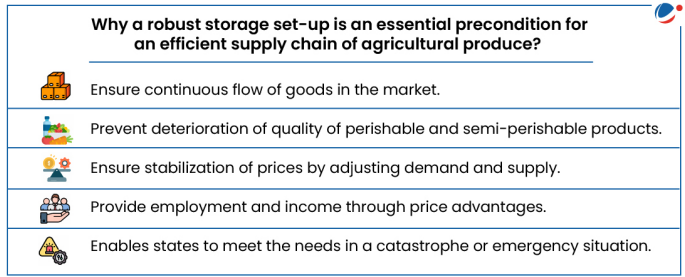
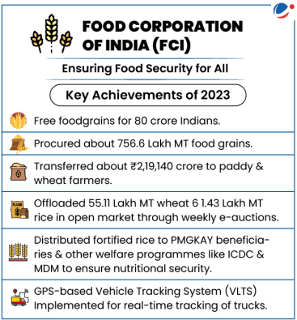
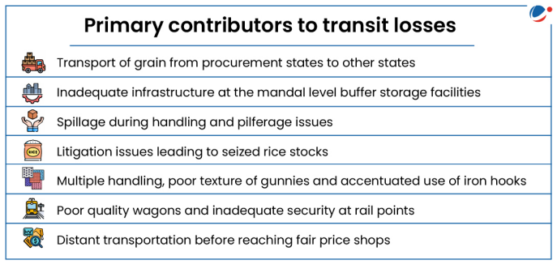

# Topic : Storage, transport and marketing of agricultural produce and issues and related constraints

### 1. Storage :

---

**1. Storage and Warehousing in Agriculture**

Storage and warehousing play a crucial role in preserving agricultural produce from harvest to consumption, ensuring food security and a consistent food supply year-round.

**Need for Storage and Warehousing:**

1. **Increasing Production but High Losses:**  
   Despite advances in production technologies and high-yielding varieties, improper storage practices lead to significant losses of agricultural products before they reach consumers.

2. **Food Security and Consistent Supply:**  
   Proper storage ensures food security by extending the shelf life of produce, enabling year-round availability and maintaining food quality.

3. **Global Food Waste:**  
   According to the World Bank, improper storage of food grains and perishables results in wastage that could feed one-third of the world’s poor population. Addressing storage issues could help tackle global food insecurity.

**Conclusion:**

Efficient storage and warehousing systems are essential to reduce post-harvest losses, ensure food availability throughout the year, and support food security. Developing such infrastructure is key to improving the agricultural supply chain and reducing waste.

--- 

**1.1. Warehousing in Agriculture**

Warehouses are designed to protect the quantity and quality of stored agricultural products.

**Role of Warehousing:**

- **Scientific Storage:** Protects products from losses using proper preservation methods.
- **Financing:** Banks offer credit (75-80% of product value) against warehouse receipts.
- **Price Stabilization:** Helps stabilize commodity prices by preventing immediate post-harvest sales.
- **Market Intelligence:** Provides market information to those storing their produce.

------

### 1.1.1. Warehousing in India

**Key Institutions:**
- **Central Warehousing Corporation (CWC)**
- **State Warehousing Corporations (SWCs)**
- **Food Corporation of India (FCI)**

These institutions are responsible for creating and managing storage facilities in India.

#### **Food Corporation of India (FCI)**
The FCI was established under the Food Corporations Act of 1964 to achieve three main objectives:
- **Price Support**: Safeguard the interests of farmers by supporting prices.
- **Food Grain Distribution**: Ensure smooth distribution of food grains for the Public Distribution System (PDS).
- **National Food Security**: Maintain satisfactory levels of operational and buffer stocks of food grains.

Since its establishment, FCI has played a significant role in transforming India from a food-deficit country to one that is self-sufficient in food grains.

#### **Standing Committee on Food, Consumer Affairs, and Public Distribution Report (2021)**

The Standing Committee on Food, Consumer Affairs, and Public Distribution submitted a report in 2021 on FCI’s operations. Some of the key observations and recommendations include:

1. **Procurement**:
   - **State Agencies** handle most procurement operations, with FCI's share being less than 5%. 
   - The committee recommended that the central government and FCI assist state governments in building adequate infrastructure for more efficient procurement.

2. **Decentralized Procurement**:
   - The **decentralized procurement scheme** allows states to use locally procured food grains for distribution under various schemes. This:
     - Reduces transportation costs,
     - Encourages procurement in non-traditional states,
     - Helps procure local grains suited to regional preferences.
   - However, the scheme is underutilized: only 8 states for wheat and 15 for rice have implemented it. The committee suggested encouraging more states to adopt it.

3. **Refusing Procurement at Centers**:
   - Procurement centers sometimes refuse to buy crops on non-substantial technical grounds (e.g., moisture content), leading to distress sales. The committee recommended that food grains meeting Fair Average Quality norms should not be rejected arbitrarily.

4. **Storage Capacity**:
   - **Mismatch between production and storage**: India’s food grain production is 311 MMT, but the storage capacity is only 145 MMT, creating a gap of 166 MMT.
   - The committee highlighted that, despite audits to optimize storage, FCI-owned storage facilities remain underutilized while hired storage facilities are used excessively. The committee recommended maximizing the use of FCI-owned facilities and only hiring when necessary.
   - To address this, the government has approved the creation of the world’s largest grain storage plan in the cooperative sector, involving over 1 lakh Primary Agricultural Credit Societies (PACS).

5. **Storage and Management Issues**:
   - FCI faces challenges in **unscientific storage** practices. Long-term storage without proper management makes grains vulnerable to damage from pests, moisture, and rodents.
   - **Manual handling** is still common in about 80% of warehouses, which slows down the process and increases inefficiency.

6. **Open-Ended Procurement**:
   - FCI's policy of **open-ended procurement** leads to unsustainable stock accumulation. It strains storage facilities and distorts the food grains market, resulting in mounting debts. As of April 2023, FCI’s total external debt stood at Rs 44,203 crore.

7. **Excess Stock**:
   - FCI often carries **excess stock** beyond the buffer stock norms due to factors like export bans, open-ended procurement, and a lack of a proactive liquidation policy. This results in increased storage costs, and FCI sometimes sells excess grains at a loss, causing significant financial losses.

-------

**1.2.Cold Storage in India: Summary**

**Importance**:  
Cold chain infrastructure is vital for preserving perishable products like fruits, vegetables, dairy, and meat. It ensures temperature-controlled storage, transportation, and distribution to extend shelf life and reduce spoilage, helping reduce food waste and support exports. Proper cold storage also supports achieving the Sustainable Development Goal of zero hunger by reducing loss and improving farmers' income.

**Market Growth**:  
The Indian cold chain market was valued at INR 1.8 lakh Cr in 2022 and is expected to reach INR 3.8 lakh Cr by 2028, with a CAGR of 12.3%.

**Need for Cold Storage**:  
- Extends the shelf life of perishable goods, preventing spoilage.
- Reduces waste and helps in surplus production for exports.
- Supports farmers’ income and contributes to food security.

**Challenges in Cold Chain Infrastructure**:
1. **Under-utilisation**: India has 8,653 cold stores with a capacity of 394.17 lakh MT, but only 60% is used.
2. **Geographical and Logistical Issues**: High summer temperatures (up to 50°C) cause damage to products due to insufficient cold chain systems.
3. **Lack of Awareness**: Farmers, food processors, and logistics experts are unaware of cold storage's benefits.
4. **High Costs**: Building and running cold storage is expensive, with fuel costs making up 45% of operating expenses, much higher than in the West.
5. **Weak Support Ecosystem**: Issues include inadequate equipment, power shortages, poor packaging, vehicle breakdowns, and a lack of skilled labor.
6. **Fragmented Setup**: Cold storage is unevenly distributed, with only a few states (UP, Gujarat, West Bengal, Punjab) holding 60% of the capacity.
7. **Tech Lag**: India lags in adopting technologies like AI, ML, and IoT, leading to inefficient cold chains and losses.

In summary, while cold storage is crucial for the agriculture sector, challenges like underutilization, high costs, logistical issues, and lack of technology hinder the efficiency of the cold chain in India.

------

**1.3.Storage-Related Schemes in India: Summary**

1. **National Policy on Handling and Storage of Food Grains**:  
   Aims to reduce storage and transit losses and promote bulk handling, storage, and transportation of food grains procured by the Food Corporation of India (FCI).

2. **Gramin Bhandaran Yojana**:  
   Focuses on building storage facilities in rural areas to meet farmers' needs, promoting grading, standardization, and quality assurance to increase marketability of agricultural produce.

3. **Warehouse Infrastructure Fund**:  
   Provides loans to public and private sectors for building cold chain infrastructure, including silos, storage, and warehouses.

4. **Negotiable Warehouse Receipt (NWR) / Electronic NWR (e-NWR)**:  
   The Warehousing Development and Regulatory Authority (WDRA) introduced NWR and e-NWR systems to allow farmers to store produce in WDRA-approved warehouses. Farmers can use these receipts as collateral to secure financing from banks.

5. **Private Entrepreneurs Guarantee (PEG) Scheme**:  
   Supports the construction of storage godowns through Public-Private Partnerships (PPP) involving private entrepreneurs, the Central Warehousing Corporation (CWC), and State Warehousing Corporations (SWCs) to address storage shortages.

6. **Central Sector Scheme for Construction of Godowns**:  
   Aims to increase storage capacity, particularly in the North Eastern Region and other select states. 

In summary, these schemes focus on improving storage infrastructure, enhancing storage capacity, and providing financial support for better handling and preservation of agricultural produce in India.

-----

**1.4.Schemes Targeting Cold Storage in India: Summary**

1. **PM Kisan Sampada Yojana (PMKSY)**:  
   Supports the development of cold storage, packaging units, and warehousing.  
   - The Integrated Cold Chain and Value Addition Infrastructure scheme promotes uninterrupted cold chain facilities from farm to consumer, reducing losses and improving efficiency.  
   - Both horticultural and non-horticultural produce are eligible.  
   - As of December 2022, 8.38 lakh MT of cold storage capacity has been created.

2. **Mission for Integrated Development of Horticulture (MIDH)**:  
   Provides financial assistance for constructing, expanding, or modernizing cold storage facilities (up to 5000 MT capacity) to support horticulture.

3. **Capital Investment Subsidy Scheme for Cold Storage**:  
   Offers a 35% subsidy on capital costs for cold storage projects (and 50% in North East, hilly, and scheduled areas) for facilities with a capacity between 5000 MT and 10,000 MT.

4. **Pradhan Mantri Matsya Sampada Yojana**:  
   Focuses on improving fish production, productivity, and cold chain infrastructure.  
   - Aims to boost fish production to 22 million MT, increase exports to INR 1 lakh Cr, and create 55 lakh jobs by 2024-25.

5. **Priority Sector Lending**:  
   Provides loans for building cold storage units and cold storage chains for agricultural products, regardless of location.

6. **Integrated Cold Chain Availability Platform**:  
   A national database to link cold chain assets and promote collaboration between cold chain owners.  
   - A joint initiative involving multiple organizations such as the National Horticulture Board and Ministry of Food Processing Industries.

In summary, these schemes focus on enhancing cold storage infrastructure, improving efficiency in the agricultural and fishery sectors, and reducing post-harvest losses across India.

------

### 2. Transport :

**2.1 Food Grain Transport in India: Summary**

Ensuring food accessibility across India is a challenging task due to its vast size. The Food Corporation of India (FCI) manages the transportation of food grains from surplus to deficit regions for various purposes, including:

- **Evacuating stocks** from surplus areas.
- **Meeting requirements** of deficit regions for National Food Security Act (NFSA), Targeted Public Distribution System (TPDS), and other schemes.
- **Creating buffer stocks** in deficit areas.

**Transportation Process**:  
- Surplus food grains are mainly concentrated in Northern States and need to be transported over long distances to deficit regions.
- Stocks are collected in local depots and dispatched to recipient States within a set timeframe.

**Logistics**:  
- FCI transports approximately 40 million tonnes of food grains annually.
- Over 85% of this movement is by **rail**, with **road** transport used in areas not connected by rail.
- **Waterways** are used for transporting food grains to Lakshadweep, Andaman & Nicobar Islands, and coastal regions like Kerala and Agartala (Tripura).

In summary, FCI coordinates extensive transport operations to ensure food grains reach deficit areas, using a mix of rail, road, and waterways.

----------

**2.2 Transit Losses in Food Grain Transportation: Summary**

Transit losses during food grain distribution remain a significant issue, costing the Food Corporation of India (FCI) nearly **₹300 crore** annually. 

**Key Points**:
- **Distance and Loss**: The distance covered during transportation plays a key role in transit losses. For example, in Bihar, a 1% increase in distance from the mandi results in a 1.4% increase in paddy loss. This is less of an issue in Punjab and Madhya Pradesh due to higher market density.
- **Current Loss Rate**: Transit losses stand at **0.22%** in 2021-22, a significant improvement from **0.47%** in 2012-13, thanks to operational improvements and innovations. FCI saved about **10.75 lakh tonnes** of wheat and rice (worth ₹3,500 crore) from transit loss.

**Factors Behind Improvement**:
- Senior officer inspections of warehouses.
- Increased covered storage capacity to avoid open storage.
- Enhanced security with CCTV and periodic checks.
- Improved loading and unloading processes, making officials more accountable.
- Use of plastic sheets in wagons to collect spilled grains.
- Collaboration with Railways for better-quality wagons and use of electronic seals to prevent theft.

**Challenges**:
- Development of transport units (freezer trucks, reefer vans, etc.) is necessary but may increase costs. Small farmers may struggle with the expense, potentially leading to distress sales.

In summary, transit losses have decreased significantly due to improved processes and strategies, but challenges in transport infrastructure and costs remain.

--------

**2.3. Solutions to Address Transit Losses in Food Grain Transportation:**

1. **Increase Coverage and Infrastructure Investment**:
   - **Problem**: Small farmers may struggle with high transportation costs due to lack of access to proper equipment and infrastructure.
   - **Solution**: 
     - Expand the development of specialized transport units like **reefer vans, freezer trucks, and refrigerated containers** for better preservation during transit.
     - Government and private sector investment in **modern cold chain logistics** can significantly reduce spoilage and enhance the transportation of perishable goods.
     - Subsidies or low-interest loans for farmers to access efficient transportation equipment could be introduced, especially in remote areas.
   - **Data/Fact**: Transport units like **freezer trucks** and **reefer containers** are essential for keeping perishable goods fresh, but their high cost limits accessibility. The cost of such equipment could be mitigated with financial support to small-scale farmers, which would reduce distress sales and prevent loss during transportation.

2. **Enhanced Technology and Automation**:
   - **Problem**: Pilferage(thieft), inefficiency in loading/unloading, and the lack of coordination between stakeholders lead to transit losses.
   - **Solution**: 
     - **AI-driven tracking systems**: Implement AI-based monitoring systems to track the real-time status of shipments, preventing pilferage and ensuring safe delivery.
     - Automated loading and unloading systems can also reduce human error, improve efficiency, and make the process more accountable.
   - **Data/Fact**: FCI has already adopted **CCTV** and **electronic seals** for enhanced security. Expanding the use of **AI and IoT** for real-time tracking will help further reduce losses. AI could be used to predict optimal routes and monitor storage conditions, reducing delays and spoilage.

3. **Better Collaboration with Railways and Transport Providers**:
   - **Problem**: Poor-quality wagons and uncoordinated transport logistics contribute to losses during transportation.
   - **Solution**:
     - **Upgrading transport infrastructure** by working closely with railways to ensure better-quality wagons.
     - **Invest in dedicated food grain transport corridors** to facilitate faster, safer, and more efficient movement across long distances, particularly for surplus states.
   - **Data/Fact**: FCI has coordinated with Railways for **good quality wagons** and **electronic seals**. However, expanding this collaboration and introducing food grain-specific transport infrastructure will further reduce losses.

4. **Improved Storage Solutions**:
   - **Problem**: Open storage of wheat and other grains in some parts of the country leads to spoilage and losses due to exposure to weather and pests.
   - **Solution**: 
     - Increase the **covered storage capacity** to avoid reliance on open storage, especially during the peak harvest season.
     - Promote **climate-controlled storage facilities** to store grains at optimal conditions, preventing degradation during transportation.
   - **Data/Fact**: The **augmentation of covered storage** and better warehousing practices have already shown positive results. FCI’s recent improvement, such as saving **10.75 lakh tonnes** of wheat and rice, is a testament to the effectiveness of these measures.

5. **Public Awareness and Training**:
   - **Problem**: Farmers and transporters may not fully understand the importance of proper handling, leading to avoidable losses.
   - **Solution**:
     - Conduct **training programs** for farmers and transporters on proper storage, packaging, and handling to reduce losses during transit.
     - Increase **awareness campaigns** about new technologies and available subsidies to encourage the adoption of better practices.
   - **Data/Fact**: Surveys indicate that **61.5%** of farmers in Bihar use tractors for transportation, which could be inefficient compared to other regions with better transport infrastructure. Providing training and improving access to modern equipment could bridge this gap.

---

**Way Forward**:

- **Focus on Infrastructure**: A long-term plan to invest in dedicated food grain transport corridors, refrigerated warehouses, and specialized vehicles is crucial to reduce transit losses.
- **Adoption of Technology**: Leverage AI, IoT, and automation to optimize the entire food grain transport process, from storage to delivery.
- **Financial Support**: Government policies should focus on providing affordable financing options to farmers for upgrading their transport and storage infrastructure.
- **Stronger Public-Private Partnerships**: Collaboration between the government, private sector, and logistics providers is key to enhancing the efficiency and reach of the cold chain and transport infrastructure.

---

**Conclusion**:

Transit losses in food grain transportation have significantly reduced due to improved storage and logistics practices. However, challenges such as high transport costs, inadequate infrastructure, and logistical inefficiencies remain. By investing in better transport infrastructure, leveraging technology, providing financial support to farmers, and promoting public-private partnerships, India can continue to reduce transit losses. The government's proactive measures and ongoing initiatives like FCI's standardization and innovation efforts have already saved substantial quantities of food grains, but a more focused, multi-pronged approach is needed to address the remaining gaps.

------

### 3. Marketing :

**3.1. Agricultural Marketing Overview**

Agricultural marketing involves the buying, selling, and movement of farm products from farms to consumers. It includes activities, agencies, and policies related to the procurement of farm inputs and the distribution of produce. The Indian Council of Agricultural Research identifies three main functions in agricultural marketing:

- Assembling (concentration)
- Preparation for consumption (processing)
- Distribution

A 2019 report by the National Sample Survey Office (NSSO) revealed that, out of 93 million agricultural households in India, 63% sold crops. Of these, 76% sold locally, while only 7.2% used Agricultural Produce Marketing Committee (APMC) markets. Additionally, only 5.4% sold to private processors, and 0.37% to contract farming companies. This highlights the need for better marketing systems to ensure better prices. The survey also found that 60% of agricultural households were satisfied with their sales, but 36% were dissatisfied due to receiving lower prices.

------

**3.2. Types	of	Agricultural	Marketing	in	India**

**Types of Agricultural Marketing in India**

1. **Traditional Marketing**:  
   In this method, farmers sell their produce directly, often involving multiple intermediaries. Around 50% of agricultural produce in India is sold through these channels.

2. **Cooperative Marketing**:  
   In this method, agricultural products are directly purchased from farmers through networks like NAFED, which eliminates middlemen.

3. **Emerging Models**:
   - **National Agriculture Market (eNAM)**
   - **Farmer Producer Organizations**
   - **Contract Farming**
   - **Commodity and Future Markets**

------

**3.3. Emerging Models of Agricultural Marketing**

1. **National Agriculture Market (eNAM)**:  
   An online platform for trading agricultural commodities, eNAM connects farmers, traders, and buyers, aiding in better price discovery and smooth marketing of produce.

2. **Farmer Producer Organizations (FPO)**:  
   A legal entity formed by farmers, milk producers, and other primary producers. It can be a cooperative or producer company, where profits and benefits are shared among members.

3. **Contract Farming**:  
   An agreement between farmers and buyers that sets conditions for the production and marketing of farm products.

4. **Commodity and Future Markets**:  
   Future trading helps protect market participants from risks caused by price fluctuations.

------

**3.4. Significance of Agricultural Marketing**

1. **Monetizing the Produce**:  
   Marketing improves the sale of agricultural products, with their value influenced by supply and demand. A developed marketing system enhances competitive trade and better price realization for farmers.

2. **Market Information and Price Signals**:  
   Marketing provides crucial information about demand, quality standards, and specifications, helping producers manage marketable surplus. It also highlights supply chain inefficiencies like post-harvest losses.

3. **Reducing Intermediaries**:  
   Efficient marketing reduces the number of intermediaries in the trade process, replacing them with institutional mechanisms or market structures, improving both economic and product quality outcomes.

4. **Capital Formation and Technology Investment**:  
   Effective agricultural marketing highlights the sector's growth potential, attracting investments and fostering technological advancements.

5. **Value Addition in Agriculture**:  
   Strong marketing systems enable access to downstream industries, driving value addition. For instance, the Makhana snack industry in Bihar grew due to targeted marketing initiatives.

Overall, well-functioning agricultural markets promote growth, food security, employment, and economic prosperity in rural areas.

------