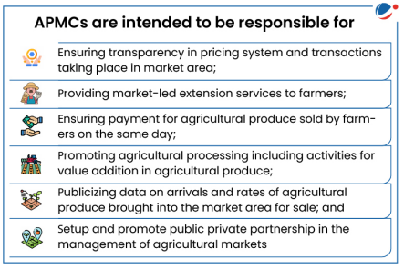
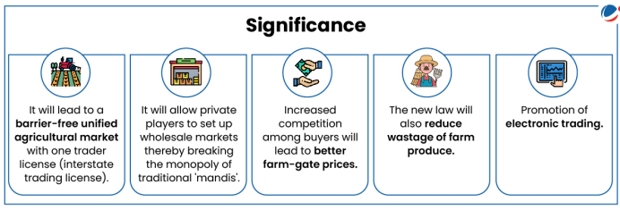
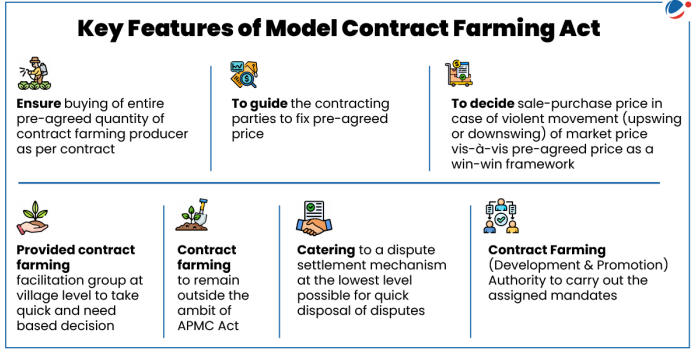
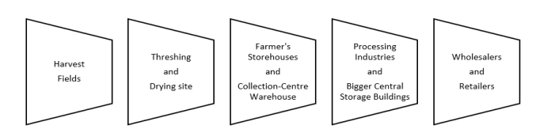
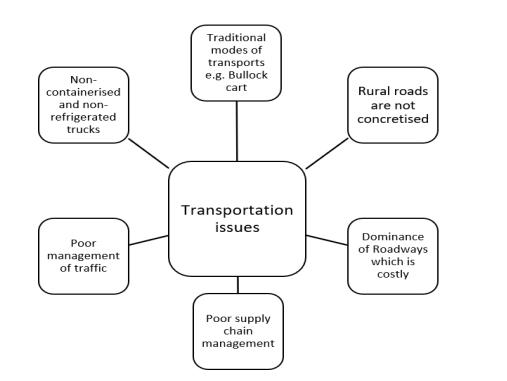

# Topic : Storage, transport and marketing of agricultural produce and issues and related constraints

### 1. Storage :

---

**1. Storage and Warehousing in Agriculture**

Storage and warehousing play a crucial role in preserving agricultural produce from harvest to consumption, ensuring food security and a consistent food supply year-round.

**Need for Storage and Warehousing:**

1. **Increasing Production but High Losses:**  
   Despite advances in production technologies and high-yielding varieties, improper storage practices lead to significant losses of agricultural products before they reach consumers.

2. **Food Security and Consistent Supply:**  
   Proper storage ensures food security by extending the shelf life of produce, enabling year-round availability and maintaining food quality.

3. **Global Food Waste:**  
   According to the World Bank, improper storage of food grains and perishables results in wastage that could feed one-third of the world’s poor population. Addressing storage issues could help tackle global food insecurity.

**Conclusion:**

Efficient storage and warehousing systems are essential to reduce post-harvest losses, ensure food availability throughout the year, and support food security. Developing such infrastructure is key to improving the agricultural supply chain and reducing waste.

--- 

**1.1. Warehousing in Agriculture**

Warehouses are designed to protect the quantity and quality of stored agricultural products.

**Role of Warehousing:**

- **Scientific Storage:** Protects products from losses using proper preservation methods.
- **Financing:** Banks offer credit (75-80% of product value) against warehouse receipts.
- **Price Stabilization:** Helps stabilize commodity prices by preventing immediate post-harvest sales.
- **Market Intelligence:** Provides market information to those storing their produce.

------

### 1.1.1. Warehousing in India

**Key Institutions:**
- **Central Warehousing Corporation (CWC)**
- **State Warehousing Corporations (SWCs)**
- **Food Corporation of India (FCI)**

These institutions are responsible for creating and managing storage facilities in India.

#### **Food Corporation of India (FCI)**
The FCI was established under the Food Corporations Act of 1964 to achieve three main objectives:
- **Price Support**: Safeguard the interests of farmers by supporting prices.
- **Food Grain Distribution**: Ensure smooth distribution of food grains for the Public Distribution System (PDS).
- **National Food Security**: Maintain satisfactory levels of operational and buffer stocks of food grains.

Since its establishment, FCI has played a significant role in transforming India from a food-deficit country to one that is self-sufficient in food grains.

#### **Standing Committee on Food, Consumer Affairs, and Public Distribution Report (2021)**

The Standing Committee on Food, Consumer Affairs, and Public Distribution submitted a report in 2021 on FCI’s operations. Some of the key observations and recommendations include:

1. **Procurement**:
   - **State Agencies** handle most procurement operations, with FCI's share being less than 5%. 
   - The committee recommended that the central government and FCI assist state governments in building adequate infrastructure for more efficient procurement.

2. **Decentralized Procurement**:
   - The **decentralized procurement scheme** allows states to use locally procured food grains for distribution under various schemes. This:
     - Reduces transportation costs,
     - Encourages procurement in non-traditional states,
     - Helps procure local grains suited to regional preferences.
   - However, the scheme is underutilized: only 8 states for wheat and 15 for rice have implemented it. The committee suggested encouraging more states to adopt it.

3. **Refusing Procurement at Centers**:
   - Procurement centers sometimes refuse to buy crops on non-substantial technical grounds (e.g., moisture content), leading to distress sales. The committee recommended that food grains meeting Fair Average Quality norms should not be rejected arbitrarily.

4. **Storage Capacity**:
   - **Mismatch between production and storage**: India’s food grain production is 311 MMT, but the storage capacity is only 145 MMT, creating a gap of 166 MMT.
   - The committee highlighted that, despite audits to optimize storage, FCI-owned storage facilities remain underutilized while hired storage facilities are used excessively. The committee recommended maximizing the use of FCI-owned facilities and only hiring when necessary.
   - To address this, the government has approved the creation of the world’s largest grain storage plan in the cooperative sector, involving over 1 lakh Primary Agricultural Credit Societies (PACS).

5. **Storage and Management Issues**:
   - FCI faces challenges in **unscientific storage** practices. Long-term storage without proper management makes grains vulnerable to damage from pests, moisture, and rodents.
   - **Manual handling** is still common in about 80% of warehouses, which slows down the process and increases inefficiency.

6. **Open-Ended Procurement**:
   - FCI's policy of **open-ended procurement** leads to unsustainable stock accumulation. It strains storage facilities and distorts the food grains market, resulting in mounting debts. As of April 2023, FCI’s total external debt stood at Rs 44,203 crore.

7. **Excess Stock**:
   - FCI often carries **excess stock** beyond the buffer stock norms due to factors like export bans, open-ended procurement, and a lack of a proactive liquidation policy. This results in increased storage costs, and FCI sometimes sells excess grains at a loss, causing significant financial losses.

-------

**1.2.Cold Storage in India: Summary**

**Importance**:  
Cold chain infrastructure is vital for preserving perishable products like fruits, vegetables, dairy, and meat. It ensures temperature-controlled storage, transportation, and distribution to extend shelf life and reduce spoilage, helping reduce food waste and support exports. Proper cold storage also supports achieving the Sustainable Development Goal of zero hunger by reducing loss and improving farmers' income.

**Market Growth**:  
The Indian cold chain market was valued at INR 1.8 lakh Cr in 2022 and is expected to reach INR 3.8 lakh Cr by 2028, with a CAGR of 12.3%.

**Need for Cold Storage**:  
- Extends the shelf life of perishable goods, preventing spoilage.
- Reduces waste and helps in surplus production for exports.
- Supports farmers’ income and contributes to food security.

**Challenges in Cold Chain Infrastructure**:
1. **Under-utilisation**: India has 8,653 cold stores with a capacity of 394.17 lakh MT, but only 60% is used.
2. **Geographical and Logistical Issues**: High summer temperatures (up to 50°C) cause damage to products due to insufficient cold chain systems.
3. **Lack of Awareness**: Farmers, food processors, and logistics experts are unaware of cold storage's benefits.
4. **High Costs**: Building and running cold storage is expensive, with fuel costs making up 45% of operating expenses, much higher than in the West.
5. **Weak Support Ecosystem**: Issues include inadequate equipment, power shortages, poor packaging, vehicle breakdowns, and a lack of skilled labor.
6. **Fragmented Setup**: Cold storage is unevenly distributed, with only a few states (UP, Gujarat, West Bengal, Punjab) holding 60% of the capacity.
7. **Tech Lag**: India lags in adopting technologies like AI, ML, and IoT, leading to inefficient cold chains and losses.

In summary, while cold storage is crucial for the agriculture sector, challenges like underutilization, high costs, logistical issues, and lack of technology hinder the efficiency of the cold chain in India.

------

**1.3.Storage-Related Schemes in India: Summary**

1. **National Policy on Handling and Storage of Food Grains**:  
   Aims to reduce storage and transit losses and promote bulk handling, storage, and transportation of food grains procured by the Food Corporation of India (FCI).

2. **Gramin Bhandaran Yojana**:  
   Focuses on building storage facilities in rural areas to meet farmers' needs, promoting grading, standardization, and quality assurance to increase marketability of agricultural produce.

3. **Warehouse Infrastructure Fund**:  
   Provides loans to public and private sectors for building cold chain infrastructure, including silos, storage, and warehouses.

4. **Negotiable Warehouse Receipt (NWR) / Electronic NWR (e-NWR)**:  
   The Warehousing Development and Regulatory Authority (WDRA) introduced NWR and e-NWR systems to allow farmers to store produce in WDRA-approved warehouses. Farmers can use these receipts as collateral to secure financing from banks.

5. **Private Entrepreneurs Guarantee (PEG) Scheme**:  
   Supports the construction of storage godowns through Public-Private Partnerships (PPP) involving private entrepreneurs, the Central Warehousing Corporation (CWC), and State Warehousing Corporations (SWCs) to address storage shortages.

6. **Central Sector Scheme for Construction of Godowns**:  
   Aims to increase storage capacity, particularly in the North Eastern Region and other select states. 

In summary, these schemes focus on improving storage infrastructure, enhancing storage capacity, and providing financial support for better handling and preservation of agricultural produce in India.

-----

**1.4.Schemes Targeting Cold Storage in India: Summary**

1. **PM Kisan Sampada Yojana (PMKSY)**:  
   Supports the development of cold storage, packaging units, and warehousing.  
   - The Integrated Cold Chain and Value Addition Infrastructure scheme promotes uninterrupted cold chain facilities from farm to consumer, reducing losses and improving efficiency.  
   - Both horticultural and non-horticultural produce are eligible.  
   - As of December 2022, 8.38 lakh MT of cold storage capacity has been created.

2. **Mission for Integrated Development of Horticulture (MIDH)**:  
   Provides financial assistance for constructing, expanding, or modernizing cold storage facilities (up to 5000 MT capacity) to support horticulture.

3. **Capital Investment Subsidy Scheme for Cold Storage**:  
   Offers a 35% subsidy on capital costs for cold storage projects (and 50% in North East, hilly, and scheduled areas) for facilities with a capacity between 5000 MT and 10,000 MT.

4. **Pradhan Mantri Matsya Sampada Yojana**:  
   Focuses on improving fish production, productivity, and cold chain infrastructure.  
   - Aims to boost fish production to 22 million MT, increase exports to INR 1 lakh Cr, and create 55 lakh jobs by 2024-25.

5. **Priority Sector Lending**:  
   Provides loans for building cold storage units and cold storage chains for agricultural products, regardless of location.

6. **Integrated Cold Chain Availability Platform**:  
   A national database to link cold chain assets and promote collaboration between cold chain owners.  
   - A joint initiative involving multiple organizations such as the National Horticulture Board and Ministry of Food Processing Industries.

In summary, these schemes focus on enhancing cold storage infrastructure, improving efficiency in the agricultural and fishery sectors, and reducing post-harvest losses across India.

------

### 2. Transport :

**2.1 Food Grain Transport in India: Summary**

Ensuring food accessibility across India is a challenging task due to its vast size. The Food Corporation of India (FCI) manages the transportation of food grains from surplus to deficit regions for various purposes, including:

- **Evacuating stocks** from surplus areas.
- **Meeting requirements** of deficit regions for National Food Security Act (NFSA), Targeted Public Distribution System (TPDS), and other schemes.
- **Creating buffer stocks** in deficit areas.

**Transportation Process**:  
- Surplus food grains are mainly concentrated in Northern States and need to be transported over long distances to deficit regions.
- Stocks are collected in local depots and dispatched to recipient States within a set timeframe.

**Logistics**:  
- FCI transports approximately 40 million tonnes of food grains annually.
- Over 85% of this movement is by **rail**, with **road** transport used in areas not connected by rail.
- **Waterways** are used for transporting food grains to Lakshadweep, Andaman & Nicobar Islands, and coastal regions like Kerala and Agartala (Tripura).

In summary, FCI coordinates extensive transport operations to ensure food grains reach deficit areas, using a mix of rail, road, and waterways.

----------

**2.2 Transit Losses in Food Grain Transportation: Summary**

Transit losses during food grain distribution remain a significant issue, costing the Food Corporation of India (FCI) nearly **₹300 crore** annually. 

**Key Points**:
- **Distance and Loss**: The distance covered during transportation plays a key role in transit losses. For example, in Bihar, a 1% increase in distance from the mandi results in a 1.4% increase in paddy loss. This is less of an issue in Punjab and Madhya Pradesh due to higher market density.
- **Current Loss Rate**: Transit losses stand at **0.22%** in 2021-22, a significant improvement from **0.47%** in 2012-13, thanks to operational improvements and innovations. FCI saved about **10.75 lakh tonnes** of wheat and rice (worth ₹3,500 crore) from transit loss.

**Factors Behind Improvement**:
- Senior officer inspections of warehouses.
- Increased covered storage capacity to avoid open storage.
- Enhanced security with CCTV and periodic checks.
- Improved loading and unloading processes, making officials more accountable.
- Use of plastic sheets in wagons to collect spilled grains.
- Collaboration with Railways for better-quality wagons and use of electronic seals to prevent theft.

**Challenges**:
- Development of transport units (freezer trucks, reefer vans, etc.) is necessary but may increase costs. Small farmers may struggle with the expense, potentially leading to distress sales.

In summary, transit losses have decreased significantly due to improved processes and strategies, but challenges in transport infrastructure and costs remain.

--------

**2.3. Solutions to Address Transit Losses in Food Grain Transportation:**

1. **Increase Coverage and Infrastructure Investment**:
   - **Problem**: Small farmers may struggle with high transportation costs due to lack of access to proper equipment and infrastructure.
   - **Solution**: 
     - Expand the development of specialized transport units like **reefer vans, freezer trucks, and refrigerated containers** for better preservation during transit.
     - Government and private sector investment in **modern cold chain logistics** can significantly reduce spoilage and enhance the transportation of perishable goods.
     - Subsidies or low-interest loans for farmers to access efficient transportation equipment could be introduced, especially in remote areas.
   - **Data/Fact**: Transport units like **freezer trucks** and **reefer containers** are essential for keeping perishable goods fresh, but their high cost limits accessibility. The cost of such equipment could be mitigated with financial support to small-scale farmers, which would reduce distress sales and prevent loss during transportation.

2. **Enhanced Technology and Automation**:
   - **Problem**: Pilferage(thieft), inefficiency in loading/unloading, and the lack of coordination between stakeholders lead to transit losses.
   - **Solution**: 
     - **AI-driven tracking systems**: Implement AI-based monitoring systems to track the real-time status of shipments, preventing pilferage and ensuring safe delivery.
     - Automated loading and unloading systems can also reduce human error, improve efficiency, and make the process more accountable.
   - **Data/Fact**: FCI has already adopted **CCTV** and **electronic seals** for enhanced security. Expanding the use of **AI and IoT** for real-time tracking will help further reduce losses. AI could be used to predict optimal routes and monitor storage conditions, reducing delays and spoilage.

3. **Better Collaboration with Railways and Transport Providers**:
   - **Problem**: Poor-quality wagons and uncoordinated transport logistics contribute to losses during transportation.
   - **Solution**:
     - **Upgrading transport infrastructure** by working closely with railways to ensure better-quality wagons.
     - **Invest in dedicated food grain transport corridors** to facilitate faster, safer, and more efficient movement across long distances, particularly for surplus states.
   - **Data/Fact**: FCI has coordinated with Railways for **good quality wagons** and **electronic seals**. However, expanding this collaboration and introducing food grain-specific transport infrastructure will further reduce losses.

4. **Improved Storage Solutions**:
   - **Problem**: Open storage of wheat and other grains in some parts of the country leads to spoilage and losses due to exposure to weather and pests.
   - **Solution**: 
     - Increase the **covered storage capacity** to avoid reliance on open storage, especially during the peak harvest season.
     - Promote **climate-controlled storage facilities** to store grains at optimal conditions, preventing degradation during transportation.
   - **Data/Fact**: The **augmentation of covered storage** and better warehousing practices have already shown positive results. FCI’s recent improvement, such as saving **10.75 lakh tonnes** of wheat and rice, is a testament to the effectiveness of these measures.

5. **Public Awareness and Training**:
   - **Problem**: Farmers and transporters may not fully understand the importance of proper handling, leading to avoidable losses.
   - **Solution**:
     - Conduct **training programs** for farmers and transporters on proper storage, packaging, and handling to reduce losses during transit.
     - Increase **awareness campaigns** about new technologies and available subsidies to encourage the adoption of better practices.
   - **Data/Fact**: Surveys indicate that **61.5%** of farmers in Bihar use tractors for transportation, which could be inefficient compared to other regions with better transport infrastructure. Providing training and improving access to modern equipment could bridge this gap.

---

**Way Forward**:

- **Focus on Infrastructure**: A long-term plan to invest in dedicated food grain transport corridors, refrigerated warehouses, and specialized vehicles is crucial to reduce transit losses.
- **Adoption of Technology**: Leverage AI, IoT, and automation to optimize the entire food grain transport process, from storage to delivery.
- **Financial Support**: Government policies should focus on providing affordable financing options to farmers for upgrading their transport and storage infrastructure.
- **Stronger Public-Private Partnerships**: Collaboration between the government, private sector, and logistics providers is key to enhancing the efficiency and reach of the cold chain and transport infrastructure.

---

**Conclusion**:

Transit losses in food grain transportation have significantly reduced due to improved storage and logistics practices. However, challenges such as high transport costs, inadequate infrastructure, and logistical inefficiencies remain. By investing in better transport infrastructure, leveraging technology, providing financial support to farmers, and promoting public-private partnerships, India can continue to reduce transit losses. The government's proactive measures and ongoing initiatives like FCI's standardization and innovation efforts have already saved substantial quantities of food grains, but a more focused, multi-pronged approach is needed to address the remaining gaps.

------

### 3. Marketing :

**3.1. Agricultural Marketing Overview**

Agricultural marketing involves the buying, selling, and movement of farm products from farms to consumers. It includes activities, agencies, and policies related to the procurement of farm inputs and the distribution of produce. The Indian Council of Agricultural Research identifies three main functions in agricultural marketing:

- Assembling (concentration)
- Preparation for consumption (processing)
- Distribution

A 2019 report by the National Sample Survey Office (NSSO) revealed that, out of 93 million agricultural households in India, 63% sold crops. Of these, 76% sold locally, while only 7.2% used Agricultural Produce Marketing Committee (APMC) markets. Additionally, only 5.4% sold to private processors, and 0.37% to contract farming companies. This highlights the need for better marketing systems to ensure better prices. The survey also found that 60% of agricultural households were satisfied with their sales, but 36% were dissatisfied due to receiving lower prices.

------

**3.2. Types	of	Agricultural	Marketing	in	India**

**Types of Agricultural Marketing in India**

1. **Traditional Marketing**:  
   In this method, farmers sell their produce directly, often involving multiple intermediaries. Around 50% of agricultural produce in India is sold through these channels.

2. **Cooperative Marketing**:  
   In this method, agricultural products are directly purchased from farmers through networks like NAFED, which eliminates middlemen.

3. **Emerging Models**:
   - **National Agriculture Market (eNAM)**
   - **Farmer Producer Organizations**
   - **Contract Farming**
   - **Commodity and Future Markets**

------

**3.3. Emerging Models of Agricultural Marketing**

1. **National Agriculture Market (eNAM)**:  
   An online platform for trading agricultural commodities, eNAM connects farmers, traders, and buyers, aiding in better price discovery and smooth marketing of produce.

2. **Farmer Producer Organizations (FPO)**:  
   A legal entity formed by farmers, milk producers, and other primary producers. It can be a cooperative or producer company, where profits and benefits are shared among members.

3. **Contract Farming**:  
   An agreement between farmers and buyers that sets conditions for the production and marketing of farm products.

4. **Commodity and Future Markets**:  
   Future trading helps protect market participants from risks caused by price fluctuations.

------

**3.4. Significance of Agricultural Marketing**

1. **Monetizing the Produce**:  
   Marketing improves the sale of agricultural products, with their value influenced by supply and demand. A developed marketing system enhances competitive trade and better price realization for farmers.

2. **Market Information and Price Signals**:  
   Marketing provides crucial information about demand, quality standards, and specifications, helping producers manage marketable surplus. It also highlights supply chain inefficiencies like post-harvest losses.

3. **Reducing Intermediaries**:  
   Efficient marketing reduces the number of intermediaries in the trade process, replacing them with institutional mechanisms or market structures, improving both economic and product quality outcomes.

4. **Capital Formation and Technology Investment**:  
   Effective agricultural marketing highlights the sector's growth potential, attracting investments and fostering technological advancements.

5. **Value Addition in Agriculture**:  
   Strong marketing systems enable access to downstream industries, driving value addition. For instance, the Makhana snack industry in Bihar grew due to targeted marketing initiatives.

Overall, well-functioning agricultural markets promote growth, food security, employment, and economic prosperity in rural areas.

------

**3.5. Issues in Agricultural Markets in India**

1. **Institutional Issues**:
   - **Licensing Barriers**: The requirement for commission agents/traders to own a shop or godown limits entry, creating monopolies and hindering competition in APMCs.
   - **High Market Charges**: APMCs impose market fees ranging from 0.5% to 2% of produce sales, with additional charges such as purchase tax and weighment fees. In some states, total charges can reach up to 15%.
   - **Lack of Standardized Grading**: The absence of a standardized grading system prevents farmers from receiving fair prices based on produce quality.

2. **Infrastructural Issues**:
   - **Poor Infrastructure**: Only two-thirds of regulated markets have auction platforms, one-fourth have drying yards, and less than 10% have cold storage units or grading facilities.
   - **Economic Viability of Projects**: The long gestation period and seasonality of agricultural surpluses make infrastructure projects economically unviable, deterring investment.

3. **Market Information System Issues**:
   - **Lag in Demand Signals**: The lack of real-time information causes delays in market signals, with farmers relying on past price trends, which may not be accurate for future seasons.
   - **Limited Information Channels**: Current systems (e.g., newspapers, APMC boards) mainly provide price information, are often distant from farmers, and are not in local languages.
   - **Low Awareness of Information Channels**: Few farmers use accessible systems like SMS-based advisories or voice interaction systems.

4. **Other Issues**:
   - **Absence of National Integrated Market**: There is no nationwide regulation for APMCs, and existing regulations fail to create a barrier-free market.
   - **Limited Public Investment**: Public spending on agricultural marketing is low, with less than 1% dedicated to infrastructure development.

These issues result in low price realization for farmers, food insecurity, and high supply chain wastages.

----

**3.6. Regulation of Agricultural Marketing**

Agriculture is a state subject under the Indian Constitution, and agricultural marketing is primarily regulated by APMCs (Agricultural Produce Market Committees) established by state governments through respective APMC Acts. APMCs, also known as mandis, are physical market infrastructures found in most states (except Jammu and Kashmir, Bihar, Kerala, and Manipur). These mandis regulate key market practices such as weighing, sales methods, grading, and payment procedures. Currently, India has 7,246 functioning mandis.

-----

**3.6.1. Agricultural Produce Marketing Committee (APMC)**

The Agricultural Produce Marketing Committee (APMC) is a statutory body formed by state governments to regulate trade in certain agricultural, horticultural, or livestock products, under the APMC Act of the respective state.

-----

**3.6.2. Major Issues in the Functioning of APMCs**:
- **Monopsony**: The APMC regulations prevent exporters and processors from buying directly from farmers, creating a market with only one buyer, leading to manipulated pricing and discouraging processing and exports.
- **Price Manipulation**: This monopsony results in farmers selling produce at lower prices, while intermediaries sell at higher prices, defeating the purpose of APMCs.
- **Over-Regulation**: Excessive regulation leads to corruption and farmer exploitation.
- **Market Fragmentation**: Issues like multiple license fees, limited licenses, late payments, and lack of facilities (e.g., grading, storage) hinder farmers rather than help them.
- **Restricted Private Sector Involvement**: Only state governments can set up markets, limiting private sector investment in marketing infrastructure.
- **Conflicted Role**: APMCs often act as both regulators and market operators, which undermines their regulatory role due to vested interests in trade. Members and chairmen are often elected from among market agents, leading to conflicts of interest.

-----

**3.6.3. Model APMC Act, 2003**

To address inefficiencies in APMC functioning, the Ministry of Agriculture introduced the **Model Agricultural Produce Marketing (Development and Regulation) Act, 2003**. This act aimed to deregulate the agricultural marketing system, promote investment in infrastructure, encourage direct marketing by the corporate sector, and create a national market.

The **Model APMC Act, 2003**:
- Provides farmers the freedom to sell produce directly to contract sponsors or in markets set up by private individuals, consumers, or producers.
- Enhances market competitiveness by allowing common registration of market intermediaries.

**Criticisms of the Model APMC Act**:
- It does not fully establish a national or state-level common market for agricultural commodities.
- It still requires buyers to pay APMC charges, even if the produce is sold outside APMC areas.
- While it allows private sector markets, it fails to foster competition, as private market owners must collect APMC fees along with their own charges.

-----

**3.6.4. Model Agricultural Produce and Livestock Marketing (Promotion & Facilitation) Act, 2017**

The Government of India introduced the **Agricultural Produce and Livestock Marketing (Promotion & Facilitation) Act, 2017** to replace the **Agriculture Produce Markets Committee Act, 2003**.

**Objectives**:
- Create a unified agri-market for trading both agricultural produce and livestock with a single license.
- Ensure better price realization for farmers.
- Aim to double farmers' income by 2022.

**Major Provisions**:
- A single fee for intra-state trade.
- Traders can sell perishable goods like fruits and vegetables outside existing mandis.
- The law proposes a cap on market fees and commission charges:
  - 2% for fruits and vegetables
  - 1% for food grains
- Warehouses and cold storage facilities will be regulated as markets.
- Regulatory powers will be transferred to the Director of Agricultural Marketing in the state, who will issue licenses to traders and private players.
- Farmers can directly sell their produce to bulk buyers.

-----

**3.6.5. Model Contract Farming Act, 2017**

**Contract farming** involves a pre-harvest agreement between buyers (e.g., food processors, exporters) and producers (farmers or farmer organizations) for agricultural production, including livestock and poultry.

**Benefits**:
- Producers reduce the risk of fluctuating market prices and demand.
- Buyers secure a steady supply of quality produce.

**Issues**:
- Existing laws only apply to a few farm commodities and focus primarily on marketing.

**Challenges with Contract Farming**:
- **State Reluctance**: States hesitate to implement reforms due to concerns over loss of revenue.
- **Stockholding Limits**: Restrictions under the Essential Commodities Act, 1955 discourage buyers from entering contracts.
- **Lack of Uniformity**: Inconsistent laws across states regarding the types of produce and conditions hinder contract farming.
- **Regional Inequality**: Contract farming is mostly practiced in agriculturally developed states (e.g., Punjab, Tamil Nadu), while small and marginal farmers in other states miss out.
- **Supply-Side Issues**: Small and marginal farmers (with an average landholding of 1.15 hectares) face high transaction costs, deterring buyers from engaging with them.
- **Capital-Intensive and Unsustainable**: It promotes the heavy use of fertilizers and pesticides, negatively impacting the environment and human health.
- **Monoculture Farming**: Encourages monoculture, harming soil health and increasing food security risks.
- **Increased Dependency**: Farmers become dependent on corporations for inputs, making them vulnerable.
- **Predetermined Prices**: Fixed prices may prevent farmers from benefiting from higher market prices.

------

**3.6.6. Other Government Measures to Improve Agricultural Marketing in India**

1. **e-NAM (National Agriculture Market)**:
   - Launched in 2016 to enable farmers to sell produce to a wide range of buyers across multiple markets electronically.
   - Aims to create a "One Nation, One Market" for agricultural commodities.
   - 1361 APMC mandis have registered, with 365 actively trading online.
   - Provides transparency, better price discovery, access to more markets, real-time price information, and faster payments.

2. **AGMARKNET**:
   - A G2C e-governance portal providing agricultural marketing-related information to stakeholders, including farmers, industries, policymakers, and academic institutions.

3. **Gramin Agricultural Markets (GrAMs)**:
   - Efforts to upgrade 22,000 rural haats into GrAMs, linking them to e-NAM while keeping them outside the APMC Act.

4. **Scheme for Formation and Promotion of Farmer Produce Organizations (FPOs)**:
   - Aims to create 10,000 FPOs between 2019-2024, providing support and handholding to each FPO.

5. **Agriculture Infrastructure Fund (AIF)**:
   - A Rs. 1,00,000 crore scheme to provide loans for investments in post-harvest infrastructure like warehousing and community farming assets, with interest subvention and financial support.

6. **Agricultural Marketing Infrastructure (AMI)**:
   - Part of the Integrated Scheme for Agricultural Marketing (ISAM), this scheme provides subsidies for constructing warehouses in rural areas to enhance storage capacity for agricultural produce. 
   - Government offers 25%-33.33% subsidy based on beneficiary categories.

----

Here is a simplified and organized summary based on the content extracted from the image:

---

**3.6.7 Way Forward for Holistic Market Reformation** 

1. **APMC Reforms**  
   - Introduce independent regulators.  
   - Encourage private sector participation (e.g., private wholesale markets, unified registration).

2. **National Integrated Market**  
   - Strengthen e-NAM (electronic National Agriculture Market).  
   - Include third-party certifications and support farmer groups/intermediaries.

3. **Investment in Infrastructure**  
   - Develop a long-term national policy for storage and movement of produce.  
   - Promote infrastructure investment through RKVY and PPP models.

4. **Improved Information Systems**  
   - Use mobile and accessible tools for better information dissemination.  
   - Provide farmers with tailored and diverse market insights.

5. **Rationalize Market Fees**  
   - Cap market fees/commissions at 2% of the product value.

6. **Market Yards of National Importance (MNI)**  
   - Foster inter-state trade via mandis as per expert committee recommendations.

------------------

### Extra : 

----

**1. How Far Can Public-Private Partnerships (PPPs) Help in Improving the Storage, Transportation, and Marketing of Agricultural Produce in India?**

**Introduction to PPPs in Agriculture:**
Public-Private Partnerships (PPPs) are collaborative efforts between the public and private sectors aimed at leveraging private investment, technology, and expertise to improve public services and infrastructure. In India, these partnerships are crucial in the agricultural sector, especially in enhancing the storage, transportation, and marketing of agricultural produce.

**Significance of PPP in Improving Agricultural Infrastructure:**
1. **Modern Technology:**
   - PPPs can introduce advanced technologies for handling perishable agricultural produce, reducing waste and improving storage systems. Innovations like cold storage, mechanized handling, and efficient transportation systems can significantly reduce post-harvest losses.

2. **Investments:**
   - PPPs bring private capital into agriculture, supplementing public investment. This helps in building infrastructure such as cold storage facilities, warehouses, and quality certification systems. For instance, private investments can help develop large-scale storage systems, which farmers often lack access to.

3. **Optimizing Risk Allocation:**
   - The high post-harvest losses (ranging from 10% to 25%) can be reduced through the "hub and spoke" model in PPPs. This model connects farm collection points to primary processing centers, optimizing the supply chain and minimizing losses in transportation and storage.

4. **Infrastructure Development:**
   - The private sector can contribute to building essential infrastructure for bulk handling, storage, and transportation of agricultural goods through models like Build-Own-Operate-Transfer (BOOT), Build-Own-Lease-Transfer (BOLT), and joint ventures. This helps in scaling up the capacity of storage and logistics across the country.

5. **Better Market Access:**
   - PPPs can help integrate farmers with both domestic and international markets by creating better access to infrastructure, such as processing units and transportation networks. This also helps unlock the potential of agro-climatic regions and their diverse agricultural produce.

6. **Knowledge Management:**
   - The sharing of knowledge between public and private sectors enhances the effectiveness of agricultural marketing systems. Private entities bring expertise in logistics and technology, while the public sector offers regulatory support and policies that improve the overall system.

**Challenges in Implementing PPPs in Agricultural Marketing:**
1. **Role Ambiguity:**
   - If the roles of public and private entities are not clearly defined, it may lead to market distortion. Public funding could end up subsidizing private benefits, which can undermine the efficiency of the model.

2. **Lack of Government Capacity:**
   - Inadequate public institutions or legislative arrangements may hinder the ability of PPPs to function effectively. Without strong government institutions to support the partnership, PPPs may not be able to deliver their intended benefits.

3. **Differences in Work Culture:**
   - Public and private sectors have different goals. The public sector often focuses on broader social outcomes, while the private sector is driven by profit motives. These differences can lead to challenges in collaboration and long-term sustainability of PPP initiatives.

4. **Fragmented Resources:**
   - Public sector resources, such as research and scientific expertise, are often fragmented across various ministries. This lack of coordination can hinder the efficient implementation of agricultural marketing initiatives under PPPs.

**Conclusion:**
While PPPs have the potential to significantly improve the storage, transportation, and marketing of agricultural produce in India, their success depends on clear role definition, transparency, and effective governance. Both public and private partners must be held accountable, with the public sector playing a key role in regulation and ensuring that private sector participation benefits farmers and the broader agricultural ecosystem. By addressing the challenges, PPPs can drive transformative change in the agricultural marketing landscape.

-----

**2.  A Reliable and Efficient Transport System is the Key to Agricultural Marketing. Discuss. Also, Highlight the Significance of Kisan Rail Scheme and Krishi Udan Scheme in This Context.**

**Introduction:**
Transport plays a vital role in agricultural marketing by ensuring the smooth movement of agricultural produce from farms to markets. An efficient transportation system is essential for enhancing market access, reducing post-harvest losses, and improving the overall profitability of agriculture. A reliable transport network connects remote rural areas with urban and international markets, facilitating better distribution and price discovery.

**Importance of Efficient Transport in Agricultural Marketing:**

1. **Wider Market Access:**
   - A good transport system enables agricultural produce to reach domestic and international markets from remote areas. This opens up new economic opportunities for farmers and enhances the overall marketability of agricultural products.

2. **Better Price for Farmers:**
   - Improved transportation enhances the farmers' bargaining power by providing access to larger and more competitive markets. This can lead to higher prices for their produce.

3. **Reduction in Post-Harvest Losses:**
   - Timely and efficient transportation ensures that perishable goods such as fruits, vegetables, and dairy products reach markets before they spoil. This significantly reduces post-harvest losses, which are a major issue in agricultural supply chains.

4. **Reduced Damage During Transit:**
   - A reliable transport system, especially one that includes refrigerated transportation for perishable goods, ensures that agricultural products are handled carefully during transit, minimizing damage and maintaining quality.

5. **Boosting Agricultural Exports:**
   - Efficient transport systems reduce the cost of production and make agricultural products more competitive in international markets, thereby enhancing India's agricultural export potential.

6. **Affordable Food for Consumers:**
   - An efficient supply chain reduces transportation costs, which can lower the prices of agricultural goods for consumers, making food more affordable for the public.

**Challenges in Agricultural Transportation:**

While the importance of an efficient transport system is clear, there are several challenges in the existing agricultural transportation network:
- **Poor Infrastructure:** Rural areas often lack sufficient road and rail infrastructure to transport goods efficiently.
- **High Post-Harvest Losses:** Inefficient and delayed transport can result in significant wastage, especially for perishable products.
- **Costly and Time-Consuming:** Road transport is often slow, expensive, and prone to delays, further adding to the burden on farmers.
- **Inadequate Cold Storage:** A lack of cold storage and refrigerated transport systems for perishable items leads to spoilage and reduced quality of produce.

**Role of Kisan Rail and Krishi Udan Schemes in Agricultural Marketing:**

1. **Kisan Rail Scheme:**
   - Launched by Indian Railways in a public-private partnership (PPP) mode, the Kisan Rail aims to provide a dedicated cold supply chain for transporting perishable agricultural goods like fruits, vegetables, and dairy products.
   - **Key Benefits:**
     - **Cold Supply Chain:** Ensures safe and damage-free transportation of perishable goods through refrigerated parcel vans on select mail express and freight trains.
     - **Faster Transportation:** Reduces the time it takes to move agricultural produce to distant markets, minimizing spoilage and wastage.
     - **Cost and Time Efficiency:** The Kisan Rail offers both cost and time advantages over road transport, especially for long-distance transportation.

2. **Krishi Udan Scheme:**
   - The Krishi Udan Scheme, launched by the Ministry of Civil Aviation, aims to transport agricultural products via air cargo, both within India and to international destinations.
   - **Key Benefits:**
     - **Efficient Transportation:** Facilitates the speedy transportation of agricultural goods to national and international markets, especially for high-value perishable goods.
     - **Boosting Exports:** The scheme promotes the export of agricultural produce, particularly fruits, vegetables, and flowers, by making air transport more accessible.
     - **Faster Delivery:** Reduces the time taken to transport agricultural goods compared to road and rail options, ensuring better quality and higher prices for farmers.

**Significance of Kisan Rail and Krishi Udan Schemes:**
- **Doubling Farmers' Income:** By providing better market access and ensuring timely transportation, both Kisan Rail and Krishi Udan contribute to improving farmers' incomes through better prices and reduced post-harvest losses.
- **Increased Export Potential:** The Krishi Udan scheme plays a significant role in enhancing agricultural exports, particularly by airlifting high-value perishables to international markets.
- **Improved Cold Chain Infrastructure:** The Kisan Rail scheme enhances the cold supply chain infrastructure, allowing even small-scale farmers to access larger markets with their produce in optimal condition.
- **Reduced Wastage and Costs:** Both schemes aim to reduce transportation costs and post-harvest losses, ensuring that farmers’ produce reaches markets efficiently and in good condition.

**Conclusion:**
A reliable and efficient transportation system is fundamental to the success of agricultural marketing. The Kisan Rail and Krishi Udan schemes represent significant steps toward modernizing and enhancing India’s agricultural supply chain. These initiatives not only help in reducing post-harvest losses but also improve farmers' incomes, boost exports, and provide consumers with better-quality products. By addressing the transportation challenges in the agricultural sector, these schemes contribute to the overall growth and development of India's agricultural economy.

----

**3. India has an Opportunity to Become a Leading Global Food Supplier Provided it has an Efficient Supply Chain and the Right Marketing Strategies. Elucidate.**

**Introduction:**
India’s agricultural sector holds immense potential to become a leading global food supplier, thanks to its vast natural resources. With 60.43% of its land under cultivation, India benefits from a wide range of climates, soil types, and agro-climatic regions, which make it one of the most diverse agricultural countries in the world. India is the largest producer of pulses globally, with the world’s largest livestock population and being the second-largest producer of fish through aquaculture. Despite these advantages, India ranks outside the top 10 in food exports due to challenges in its supply chain and marketing strategies.

**India’s Potential and the Need for the Right Marketing Strategies:**

1. **Exploiting Agricultural Diversity:**
   - India's agricultural diversity, shaped by varied cultures, religions, and food habits, offers a unique opportunity. The country can market itself as a hub for organic food, vegetarian products, seafood, and meat, targeting specific consumer groups in both domestic and global markets. By highlighting such niche products, India can cater to growing demand for specialized foods, such as organic or vegetarian products in countries like the EU and the US.

2. **Food Packaging, Branding, and Traceability:**
   - Packaging, branding, and traceability are essential for creating competitive advantages in the global market. Developed nations, especially in Europe, place high value on authentic, high-quality food products. India has a significant opportunity to enhance its exports by focusing on packaging that reflects quality, and leveraging branding to promote its food products. Additionally, establishing traceability systems, such as tracking the origin and journey of products, can instill confidence among consumers, particularly in markets with high standards like the EU.

3. **Production Standards:**
   - Beyond quality, modern consumers in developed countries also seek food products that are sustainable and cruelty-free. Establishing production standards that ensure sustainable practices and fair labor conditions will make Indian food products more attractive to global markets. Certifications indicating sustainable practices, such as organic and fair-trade certifications, will increase India's appeal to conscious consumers.

4. **Food Safety and Hygiene:**
   - As global demand for safe and hygienic food grows, India must strengthen its food safety and hygiene practices. Ensuring food safety through stringent regulations and consistent quality control is vital in building trust among international consumers. This includes aligning with global food safety standards and ensuring that Indian food products meet the highest quality benchmarks.

**Enhancing the Supply Chain for Global Competitiveness:**

1. **Channel Masters for Supply Chain Management:**
   - In developed countries, major retailers such as Wal-Mart and Tesco have become the “Channel Masters” of the food supply chain, overseeing logistics and managing global supply and demand. India must develop similar entities capable of managing the global food supply chain, coordinating the logistics activities, and responding to the dynamics of global markets.

2. **Efficient Cold Chain Infrastructure:**
   - A robust and well-organized cold chain, which preserves the quality of perishable goods from the farm to the consumer, is crucial. In India, the cold chain is fragmented and underdeveloped, leading to significant wastage and loss of quality. Strengthening cold storage facilities and ensuring an efficient supply chain infrastructure that covers all stages of the food supply chain—especially for perishable products like fruits, vegetables, and dairy—is essential for reducing spoilage and improving competitiveness.

3. **Efficient Consumer Response (ECR):**
   - India needs to embrace the concept of Efficient Consumer Response (ECR), which involves aligning the entire supply chain—from manufacturers to retailers—to work collaboratively in serving consumers more effectively and at lower costs. This strategy is key to improving the efficiency of India’s food supply chain and ensuring that products reach consumers in the best possible condition while minimizing waste and cost.

4. **Technology and Automation in the Supply Chain:**
   - To remain competitive in the global market, India must adopt modern technologies that improve efficiency and reduce costs. Technologies such as Radio Frequency Identification (RFID) for tracking goods in transit, barcodes for product traceability, and food irradiation to extend shelf life can significantly enhance India’s supply chain capabilities. Automation in sorting, packaging, and transportation can reduce labor costs, improve productivity, and enable timely deliveries, thus making Indian food products more competitive in global markets.

**Way Forward:**

To become the leading global food supplier, India must focus on the following actions:

- **Improved Supply Chain Infrastructure:** Strengthen cold chains, logistics, and transportation networks to ensure the timely and safe delivery of agricultural products.
- **Quality Standards and Certifications:** India should invest in setting global standards for food safety, sustainability, and organic production to enhance the international marketability of its products.
- **Technological Innovation:** Adoption of technology, including automation, traceability, and food preservation methods, is necessary to enhance the competitiveness of Indian agricultural products.
- **Market Diversification and Branding:** India should explore niche markets and create strong brand identities for its diverse agricultural produce, such as organic or fair-trade products, to differentiate itself in the global food market.

**Conclusion:**
India’s agricultural potential is immense, but to fully capitalize on this opportunity, it needs an efficient and modern supply chain along with the right marketing strategies. By focusing on quality standards, food safety, cold chain infrastructure, and embracing technological advancements, India can position itself as a leading global food supplier. With the right investments and strategic planning, India has the potential to not only meet its domestic food needs but also become a major player in the global food supply chain.

-----

**4. Discuss the Impact of Inadequate Marketing Infrastructure on Small and Marginal Farmers. How Can Farmer Producer Organisations (FPOs) Assist in Improving Marketing Efficiency for the Benefit of Such Farmers?**

**Introduction:**
India’s agricultural marketing infrastructure is highly fragmented and underdeveloped. This inadequacy results in inefficient marketing channels, high transaction costs, and low procurement by state agencies. As a result, small and marginal farmers, who make up about 85% of the total farming population, face significant challenges in effectively marketing their produce. The lack of access to proper infrastructure and fair pricing severely affects their income and overall livelihood.

**Impact of Inadequate Marketing Infrastructure on Small and Marginal Farmers:**

1. **Limited Market Access:**
   - A major consequence of inadequate marketing infrastructure is limited access to distant markets. Small farmers often depend on local and unorganized markets that offer lower prices. According to the National Institute of Agricultural Marketing (NIAM), many farmers cannot access better markets due to geographical and logistical barriers. As a result, they are forced to sell their produce at lower prices in local markets, depriving them of the opportunity to earn fair returns.

2. **Post-Harvest Losses:**
   - India faces significant post-harvest losses, particularly in horticultural products. The Agricultural and Processed Food Products Export Development Authority (APEDA) reports that about 30% of India’s horticultural produce is lost annually due to inadequate storage, transportation, and processing infrastructure. This directly affects small farmers, who cannot afford advanced storage and preservation technologies, leading to wastage of a significant portion of their produce.

3. **Information Asymmetry:**
   - Small farmers often lack access to real-time market information, including price trends and demand forecasts. This information gap hinders their ability to make informed decisions regarding when and where to sell their produce. As a result, they may sell at unfavorable times or to intermediaries who offer lower prices, reducing their profits.

4. **Exploitation by Middlemen:**
   - The absence of direct market access forces farmers to sell their produce through middlemen, who often charge high commissions and exploit farmers. These middlemen, by controlling access to markets, reduce the bargaining power of farmers, leading to a significant reduction in the amount farmers earn from their produce.

**Role of Farmer Producer Organisations (FPOs) in Improving Marketing Efficiency:**

1. **Collective Bargaining Power:**
   - FPOs offer small farmers an institutional platform that enables collective bargaining. By pooling their produce, farmers can negotiate better prices and terms with buyers. For instance, the cooperative model of Amul empowers dairy farmers to negotiate higher prices for milk, increasing their incomes. This collective approach allows small farmers to overcome the challenge of their small-scale production and enhances their market competitiveness.

2. **Infrastructure Development:**
   - FPOs can help in the development of essential marketing infrastructure such as sorting, grading, packaging, and storage. For example, LEAF (Lawrencedale Agro Processing India Pvt. Ltd.) has set up infrastructure for small farmers to process their produce, which not only adds value to their products but also reduces post-harvest losses. The availability of such facilities within FPOs ensures that farmers' produce maintains its quality, thus fetching higher market prices.

3. **Value Addition and Branding:**
   - FPOs also play a key role in value addition and branding, which significantly increases the marketability of agricultural produce. The 'Himalaya' brand, developed by the Sikkim State Cooperative Supply & Marketing Federation Ltd. (SIMFED), is an example of how farmers, especially those growing organic produce, can sell under a common brand. This branding helps farmers fetch better prices for their organic produce, which is increasingly in demand globally.

4. **Market Linkages:**
   - FPOs facilitate direct market linkages, bypassing intermediaries and ensuring that farmers can sell their products directly to consumers or institutional buyers. The Uralungal Labour Contract Co-operative Society (ULCCS) in Kerala has developed such market linkages, allowing its members to sell directly to buyers, thereby improving farmers' profits. These linkages help small farmers reach larger markets without the burden of middlemen.

**Conclusion:**
While Farmer Producer Organisations (FPOs) can help improve the marketing efficiency of small and marginal farmers, addressing the inadequacies in India's agricultural marketing infrastructure is crucial. The benefits of FPOs, including collective bargaining, infrastructure development, and direct market linkages, can help enhance farmers’ incomes and reduce exploitation by intermediaries. However, the larger issue of infrastructure gaps, such as inadequate storage facilities, inefficient transportation, and the lack of market access, needs to be addressed to ensure that farmers can achieve remunerative prices for their produce. For India to achieve its goal of doubling farmers' incomes, a comprehensive approach that includes both institutional support through FPOs and infrastructure improvements is necessary.

-----------

**5. Discuss the Factors Hindering the Uptake of Integrated Cold Chain Infrastructure in India.**

**Introduction:**
Integrated cold chain infrastructure (CCI) is crucial for the agricultural sector, especially in handling perishable goods like fruits, vegetables, dairy, and meat. It ensures that these products maintain their quality, safety, and shelf life, which is essential for both domestic consumption and export. An efficient CCI can reduce post-harvest losses, create employment opportunities, boost food processing, and enhance the competitiveness of Indian agricultural products in global markets. However, despite its importance, less than 10% of India’s agricultural produce currently passes through an integrated cold chain.

**Factors Hindering the Uptake of Integrated Cold Chain Infrastructure:**

1. **Investment Barriers:**
   - **High Initial Capital and Long Payback Periods:** Establishing integrated cold chain infrastructure requires significant upfront investment in facilities like cold storage, refrigerated transport, and pack houses. However, the payback periods for such investments can be long, deterring potential investors. Additionally, the risk of technology becoming outdated before the investment is recouped further discourages capital infusion into the sector.
   
2. **Lack of Awareness:**
   - Many stakeholders, particularly small farmers, lack awareness about the benefits of cold chain infrastructure. Often, cold chain facilities are perceived as a luxury rather than a necessity for maintaining the quality, safety, and longevity of perishable goods. This perception hinders their adoption, especially in rural areas where the need for such infrastructure is high.

3. **Limited Technological Integration:**
   - Many cold chain facilities still rely on manual processes for temperature monitoring, inventory management, and data recording. The lack of technological integration results in inefficiencies such as data inaccuracies, delays in decision-making, and an increased risk of spoilage. The absence of advanced technologies like IoT-based temperature tracking and automated systems adds to the operational costs and risks.

4. **High Operating Costs:**
   - Operating an integrated cold chain system incurs significant ongoing expenses, particularly due to the high fuel costs involved in refrigerated transport and maintaining constant temperatures in storage units. In India, fuel costs account for around 45% of the operating expenses for cold storage, making it economically unfeasible for many operators and increasing the cost of accessing cold chain facilities for farmers.

5. **Lack of a Holistic Approach:**
   - The Indian government's approach to cold chain infrastructure development has been piecemeal. A disproportionate amount of subsidies has been directed towards cold storage facilities, while other critical components such as refrigerated transport, pack houses, and pre-cooling units receive far less support. This lack of a comprehensive approach leads to gaps in the cold chain system, limiting its overall effectiveness.

6. **Inefficient Infrastructure:**
   - India’s cold chain infrastructure suffers from various inefficiencies, such as inconsistent power supply, poor last-mile connectivity, and inadequate refrigerated transportation networks. These inefficiencies undermine the effectiveness of cold chain systems, leading to losses and increased operational costs. The absence of a seamless, integrated system reduces the reliability of cold chain infrastructure, making it less attractive for investment.

7. **Accessibility Issues:**
   - Most cold chain infrastructure is concentrated in urban areas, leaving rural regions underserved. This uneven distribution of infrastructure leads to low demand aggregation in rural areas, resulting in underutilized facilities and making cold chain services more expensive for farmers in remote regions. Farmers in these areas often cannot afford to transport their produce to distant cold storage facilities, leading to post-harvest losses and lower-quality products.

**Conclusion:**
The lack of adequate and efficient integrated cold chain infrastructure in India contributes to massive post-harvest losses, estimated at ₹92,561 crores annually. To overcome these challenges, a system-wide approach is needed. This includes educating farmers about the importance of cold chain infrastructure, adopting innovative business models like "pay-as-you-store" to make cold chain services more affordable, and integrating technology to improve operational efficiency. By addressing investment barriers, improving infrastructure, and ensuring a more even distribution of cold chain facilities, India can harness the full potential of its agricultural sector and reduce post-harvest losses, benefiting both farmers and consumers.

-------