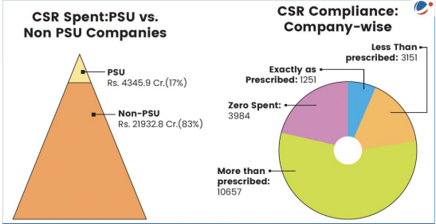
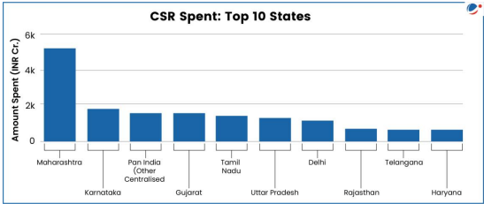

# Topic :  Inclusive growth and issues arising from it.

----

**1. Inclusive Growth: Definition and Key Points**

Inclusive growth refers to economic growth that benefits all segments of society, ensuring fair distribution of prosperity, both in monetary and non-monetary terms. The OECD defines it as growth that creates opportunities for everyone and distributes its benefits equitably.

It supports the idea that wealth creation, economic freedom, and equal opportunity can coexist. Inclusive growth allows for long-term economic growth and well-being while ensuring freedom and equality.

While there is no universal definition globally, the UNDP sees it as a process where everyone can participate in growth and share its benefits. Though the UN's Sustainable Development Goals (SDGs) don't explicitly mention inclusive growth, several goals promote its principles, including:

- **Goal 1**: End poverty by 2030.
- **Goal 2**: Achieve zero hunger by 2030.
- **Goal 3**: Reduce maternal and infant mortality rates by set targets.
- **Goal 4**: Ensure free, equitable, quality primary and secondary education for all by 2030.
- **Goal 4**: Equal access to affordable, quality education for all by 2030.
- **Goal 8**: Promote sustained per capita economic growth and reduce youth unemployment.
- **Goal 9**: Develop resilient infrastructure and promote inclusive industrialization.

Thus, inclusive growth is viewed in different ways depending on the agency, but all emphasize equitable participation and benefits.

-----

**2. Dimensions of Inclusive Growth**

Inclusive growth is a pro-poor growth strategy where the poor not only benefit from economic growth but also actively participate in it. Key dimensions include:

- **Interdependence**: It acknowledges the connections between growth, gender, poverty, and the environment. These factors are integral to achieving inclusive growth.

----

**3. Need for Inclusive Growth in India**

Inclusive growth is crucial for India to address key challenges, particularly poverty. 

**3.1 Poverty :** 

- **Poverty Reduction**: According to NITI Aayog, India has made significant progress in reducing multidimensional poverty, from 29.17% in 2013-14 to 11.28% in 2022-23, lifting 24.82 crore people out of poverty. India is likely to meet its SDG target of halving poverty before 2030. However, economic growth alone hasn't guaranteed inclusive growth, highlighting the need for policies beyond growth promotion.

- **Impact of Economic Reforms on Poverty**: 
  - **Growth-Oriented Approach**: Economic growth was expected to spread benefits across society, trickling down to the poor.
  - **Poverty Alleviation Programs**: These were introduced during the Third Five-Year Plan (1961-66) and expanded over time.
  - **Post-1990 Reforms**: Economic reforms and self-help groups have contributed to poverty reduction.
  
  - **Trends in Poverty**: Poverty declined faster after 1991, particularly in urban areas. The Tendulkar and Rangarajan Committees reported significant poverty reduction, with 138 million people lifted out of poverty between 2004-2009.

- **Global Multidimensional Poverty Index (MPI) 2023**: 
  - The Global MPI measures poverty based on deprivations in health, education, and living standards, tracking both the incidence and intensity of poverty.
  - NITI Aayog plans to use this index for monitoring India’s performance and driving reforms to improve social and economic conditions, ensuring more effective implementation of government policies.

----

**3.2. Inequality**

**Inequality in India**

Inequality in India has worsened since the 1980s, particularly accelerating after the early 2000s. Between 2014-15 and 2022-23, wealth concentration at the top end increased significantly.

- **Income and Wealth Inequality**: 
  - India’s income and wealth inequality is among the highest globally. In 2022-23, the top 1% held 22.6% of the income and 40.1% of the wealth, while the bottom 50% earned only 15% of the national income, down from 20.6% in 1951.
  
- **Social Inequality**: 
  - Gender and caste-based inequities are prominent. For instance, male workers earn significantly more than female workers across different employment types. 
  - **Periodic Labour Force Survey (2019-2023)**: In 2023, male self-employed workers earned 2.8 times more than women, and male casual workers earned 48% more.

- **Emerging Inequalities**: 
  - Inequalities are deepening due to the climate crisis and technological advancements. For example, countries with high human development are seeing faster growth in tertiary education compared to low human development nations.

**Consequences of Inequality**:

- **Low Social Mobility**: Extreme inequality limits social mobility, making it harder for children from poor families to escape poverty due to lack of education, skills, and assets.
- **Democratic Undermining**: High inequality fosters corruption, cronyism, and social unrest, and may fuel authoritarianism.
- **Climate Crisis Impact**: Poorer communities are less equipped to handle climate change, and income inequality can hinder the spread of eco-friendly technologies.
- **Political Inequality**: Economic inequality often translates into political power imbalances, weakening institutional effectiveness and policy implementation.

To reduce inequality, there is a need for better access to health, education, financial inclusion, and equal opportunities for all.

----

**3.3. Unemployment :**

**Unemployment in India**

Unemployment and underemployment rates in India rose until 2018 but have since declined. The overall unemployment rate dropped from 6% in 2018 to 3.2% in 2023, with youth unemployment also decreasing from 17.8% to 10% in the same period.

- **Youth Unemployment**: Despite overall improvements, youth unemployment remains a key challenge. Increasing educational attainment has led to a rise in unemployment among educated youth, who now make up two-thirds of total unemployment. For example, in 2023, the unemployment rate for graduates and above was 28%, down from 35.4% in 2019, with women facing higher rates.

- **Jobless Growth**: While some claim India’s growth is "jobless," data from the Periodic Labour Force Survey (PLFS) shows decreasing unemployment rates in the past five years.

**Youth Underemployment**: Despite the decline in unemployment, underemployment remains a serious issue due to several factors:
- **Social Pressure**: Overpopulation and societal expectations push people to take jobs below their skill levels.
- **Technological Advances**: Machines and technology replace entry-level jobs, rendering existing skills obsolete.
- **Underutilization of Human Capital**: The lack of high-productivity jobs results in the underuse of the workforce's potential.
- **Skills Gap**: Insufficient on-the-job training and outdated skills development lead to inefficiencies.
- **Mediocrity**: Limited access to quality jobs discourages skill development, contributing to unemployment.
- **Other Issues**: Brain drain, low self-esteem, lack of motivation, and emotional challenges like stress, depression, and hypertension exacerbate the problem.

**Conclusion**: To address these challenges, India needs to create high-productivity, high-wage jobs that fully utilize the workforce’s skills.

-----

**4.  Challenges to Inclusive Growth in India**

Despite efforts to address poverty, inequality, and unemployment, India faces several structural and socio-economic challenges hindering progress towards inclusive growth:

- **Poverty**: While 24.82 crore people have escaped multidimensional poverty in the last nine years, about 11% of the population remains multidimensionally poor.

- **Unequal Distribution of Resources**: Wealth, land, and education are concentrated among a few, limiting opportunities for the rest. In 2022-23, the top 1% held 22.6% of the income and 40.1% of the wealth.

- **Social and Cultural Barriers**: Discrimination based on caste, gender, religion, and other factors restricts access to education, employment, and healthcare for many.

- **Regional Disparities**: Economic growth is uneven, with some states thriving while others lag behind.

- **Agriculture Struggles**: Agriculture employs many but contributes less to GDP, facing low productivity, limited irrigation, and climate vulnerability.

- **Informal Sector Reliance**: A large part of India’s workforce is in the informal sector, which offers lower wages and limited social safety nets.

- **Skill Gaps**: The education system often fails to equip people with the skills needed for the modern job market.

- **Automation**: Technological advancements, such as robotics, could render many jobs obsolete, with up to 800 million people worldwide expected to be displaced by 2030.

- **Corruption**: Corruption, red tape, and lack of transparency remain significant obstacles, as reflected in India's rank of 93 out of 180 countries in the 2023 Corruption Perceptions Index.

Addressing these challenges is crucial for fostering inclusive growth and improving human capital in India, yielding long-term benefits.

-----

**5. Inclusive Growth and Human Capital Formation in India**

Human capital refers to the economic value of a worker's skills and abilities, emphasizing that not all labor is equal. It can be improved through investments in education, job training, health, and awareness. Human capital is essential for a country's growth, development, and competitiveness, but it can depreciate due to long unemployment, mental decline, or failure to adapt to new innovations. It is also mobile, potentially causing brain drain.

**Role of Human Capital in Economic Development:**
- **Increases Productivity**: Promotes innovation, creativity, and the ability to absorb new technologies.
- **Reduces Inequality**: Higher human capital leads to better employment opportunities, increased income, and reduced inequality.
- **Positive Societal Impact**: Helps overcome regressive thinking and increases workforce participation, including promoting gender-inclusive employment.

**Challenges to Human Capital Formation in India:**
- **Education Gap**: Poorer households struggle to invest in education, leading to a cycle of poverty.
- **Health Disparities**: Unequal access to healthcare hampers productivity and worsens inequality.
- **Limited Financial Services**: Lack of access to credit restricts investment in education and personal development.
- **Low Public Expenditure**: Insufficient spending on health, education, and skills development.
- **Population Growth**: A rising population reduces the availability of resources per capita.
- **Regional Inequality**: Economic disparities limit access to basic services.
- **Gender Inequality**: The gender gap reduces labor productivity and limits opportunities for women.
- **Brain Drain**: The migration of skilled workers hinders human capital formation.
- **Slow Skill Formation**: Skill development takes time and on-the-job training is often insufficient to cope with emerging technologies.

**Opportunities for Human Capital Formation in India:**
- **Demographic Dividend**: 65% of India's population is under 35, and over 25% are of working age.
- **English-Speaking Population**: A large number of English speakers and a strong IT base can be harnessed for skill development.
- **Technological Integration**: Global interconnectedness offers broad opportunities for training and development.
- **Legal and Constitutional Support**: Rights-based frameworks support improvements in health and social status.
- **Government Initiatives**: Programs like the SATH-E Roadmaps and the SWAYAM platform for e-learning can help improve education outcomes.

India currently ranks 116 out of 174 in the Global Human Capital Index (2020). To harness its demographic dividend, India needs to focus on skill development, healthcare, education, and social security. Initiatives like the National Institutional Ranking Framework (NIRF) and skill-focused portals like Takshashila can enhance human capital development in India.

-----

**6. Sectoral Steps Taken for Inclusive Growth**

1. **Education and Skill Development**: The government has implemented several initiatives to improve education and skills, including the **New Educational Policy** and the **Pradhan Mantri Kaushal Vikas Yojana**. These programs aim to enhance the skills of the workforce, focusing on vocational training and improving access to quality education.

2. **Health**: **Ayushman Bharat**, launched in the Union Budget 2018-19, is a National Health Protection Scheme aimed at covering over 10 crore poor and vulnerable families. The scheme provides coverage of up to ₹5 lakh per family per year for secondary and tertiary care hospitalization, making healthcare more accessible for marginalized sections of society.

3. **Social Security**: The government has expanded the social security net through several initiatives aimed at protecting the poor and vulnerable:
   - **Pradhan Mantri Suraksha Bima Yojana**: Provides accident insurance.
   - **Atal Pension Yojana**: Focuses on providing pensions for workers in the unorganized sector.
   - **Pradhan Mantri Jeevan Jyoti Yojana**: Offers life insurance.
   - **MUDRA Bank**: Provides microfinance to rural entrepreneurs.
   - **National Hub for SC/ST Entrepreneurs**: Supports marginalized communities by fostering entrepreneurship.

4. **Financial Inclusion**: The **Pradhan Mantri Jan Dhan Yojana** focuses on ensuring that economically weaker sections have access to bank accounts, aiming to provide financial services to the underprivileged and promote financial inclusion.

5. **Employment Generation**: Several government schemes focus on creating employment opportunities, particularly in rural and urban areas:
   - **Mahatma Gandhi National Rural Employment Guarantee Act (MGNREGA)**: Ensures employment to rural households.
   - **Prime Minister’s Employment Generation Programme (PMEGP)**: Promotes entrepreneurship.
   - **Pradhan Mantri Rojgar Protsahan Yojana**: Encourages the creation of new jobs.
   - **Pt. Deen Dayal Upadhyaya Grameen Kaushalya Yojana (DDU-GKY)**: Focuses on skill development in rural areas.
   - **Deendayal Antyodaya Yojana - National Urban Livelihoods Mission (DAY-NULM)**: Aims to create sustainable livelihoods in urban areas.

6. **Agriculture**: The government has reoriented the agricultural sector to focus on income generation, organic farming, irrigation infrastructure, and technology adoption. Key schemes include:
   - **Soil Health Card (SHC) Scheme**: Ensures soil health and sustainable agriculture.
   - **Pradhan Mantri Krishi Sinchayee Yojana (PMKSY)**: Focuses on expanding irrigation.
   - **Paramparagat Krishi Vikas Yojana (PKVY)**: Promotes organic farming.
   - **Kisan Credit Card**: Provides farmers with easy access to credit.

7. **Rural Empowerment**: To enhance rural infrastructure and development, the government has launched various initiatives:
   - **Pradhan Mantri Awas Yojana - Gramin**: Focuses on affordable housing in rural areas.
   - **Bharat Net**: Ensures internet connectivity in rural areas.
   - **DDU Gram Jyoti Yojana**: Aims to provide power connectivity to rural areas.
   - **Aadhaar**: The biometric-based unique identification system ensures that the poor are not excluded from government schemes, facilitating financial inclusion and social security.

These initiatives collectively contribute to inclusive growth by addressing poverty, inequality, and unemployment, while fostering human capital development across sectors.

----

**7.  Strategies to Achieve Inclusive Growth**

**7.1. Universal Basic Income (UBI)**  
Universal Basic Income (UBI) is a proposed strategy to ensure inclusive growth by providing regular, unconditional cash payments to all individuals, regardless of their income or employment status. It aims to alleviate poverty, reduce inequality, and promote social welfare. The key characteristics of UBI are:

1. **Periodic Payments**: UBI is provided at regular intervals (e.g., monthly or annually), ensuring a stable and predictable source of income for individuals.
2. **Cash Payment**: The benefit is delivered in cash, not in-kind or vouchers. This allows recipients the flexibility to spend the money according to their needs, empowering them to make their own economic choices.
3. **Individual Focus**: Payments are made to individuals rather than households or families, ensuring that each person receives the benefit directly.
4. **Universal Access**: UBI is available to all individuals within the economy, irrespective of their socio-economic status, thus promoting equity and inclusion.
5. **Unconditional**: The cash payment is unconditional, meaning it is provided without any requirement for employment status, income level, or other conditions. This ensures that even marginalized or unemployed individuals can benefit.

UBI is seen as a way to reduce poverty, enhance social security, and address inequality, making it a potential tool for promoting inclusive growth in India.

----

Pros (favor) and Cons (against) of Universal Basic Income (UBI):

### Favor (Pros of UBI)
1. **Poverty and Vulnerability Reduction**: Provides immediate relief from poverty.
2. **Choice and Autonomy**: Empowers individuals to make spending decisions that suit their needs.
3. **Better Targeting of the Poor**: Reduces exclusion errors by reaching everyone, minimizing missed beneficiaries.
4. **Insurance Against Shocks**: Acts as a safety net for health, income, and unexpected crises.
5. **Improved Financial Inclusion**: Encourages banking use and access to credit for low-income groups.
6. **Psychological Benefits**: Alleviates stress of securing basic needs daily.
7. **Administrative Efficiency**: Simplifies welfare delivery, reducing bureaucracy.

### Against (Cons of UBI)
1. **Risk of Wasteful Spending**: Funds may be spent on non-essential or harmful activities.
2. **Reduced Work Incentive (Moral Hazard)**: May discourage labor participation.
3. **Gender Disparities in Control**: Cash distribution within households may lead to unequal spending control.
4. **Implementation Challenges**: Strain on financial systems and logistics.
5. **High Fiscal Costs**: Difficulty in rolling back UBI if unsuccessful.
6. **Political Issues**: Resistance due to perceived inequity or lack of targeted benefits.
7. **Market Risks**: Cash value may erode due to inflation or market fluctuations.

----

### Universal Basic Income (UBI) vs. Targeted Transfer Schemes  

**Targeted Schemes**  
Targeted transfer schemes focus on providing welfare benefits to specific groups, such as the poor or marginalized, using methods to identify those most in need.  

- **Advantages**:  
  - Evidence from countries like Indonesia and Peru shows significant welfare improvements for the poorest.  
  - Higher per-beneficiary benefits compared to universal programs by concentrating resources on those most in need.  

- **Challenges**:  
  - **Exclusion Error**: Imperfect targeting can leave out eligible poor households, reducing program effectiveness.  

**Improving Targeted Schemes**  
1. **Community-Based Targeting**:  
   - Communities decide who is most in need through participatory meetings.  
   - Enhances transparency, inclusion, and fairness.  
   - Strengthens local governance with tools like social audits.  

2. **Technology Integration**:  
   - Platforms like Aadhaar, Jan-Dhan, and mobile networks improve targeting efficiency and speed of cash transfers.  
   - Reduces administrative costs and allows resources to focus on growth-oriented initiatives.  

3. **Conditional Transfers**:  
   - Benefits tied to conditions like school attendance or healthcare compliance.  
   - Improves education and health outcomes in targeted areas.  

**Conclusion**  
- **Universal Basic Income (UBI)**: Eliminates exclusion errors by providing benefits to all but may dilute resources for the poorest.  
- **Targeted Schemes**: Maximize benefits for the neediest but face challenges in accurate targeting.  

Ultimately, refining targeting methods and improving implementation can enhance welfare programs' impact, regardless of whether a UBI or targeted approach is adopted.

----

**7.2 Skill Development Summary**

The National Policy for Skill Development and Entrepreneurship (2015) highlights that only 5.4% of India's workforce has formal skill training, compared to much higher percentages in countries like the UK, Germany, and South Korea. The 2020-21 Periodic Labour Force Survey (PLFS) revealed that 84.4% of Indians did not receive vocational training, with women disproportionately affected.

**Why Skill Development is Crucial for India:**
1. **Economic Growth:** Skilled workers are essential for programs like Make in India, Digital India, and Smart Cities.
2. **Demographic Dividend:** India has a young population, which could help avoid a demographic disaster if adequately skilled.
3. **Opportunity from China’s Slowdown:** As China’s manufacturing sector declines, India has the chance to become the world's manufacturing hub.
4. **Sectoral Shift:** Increased productivity in agriculture will push workers toward secondary and tertiary sectors.
5. **Global Competitiveness:** To compete globally, India needs a skilled workforce aligned with international standards.
6. **Employment:** Skill development will improve job prospects for young people in India’s growing economy.

**Issues with Skill Development:**
1. **Poor Accreditation:** Quality standards for training centers are often compromised.
2. **Lack of Coordination:** Skill development policies are spread across multiple ministries, leading to inefficiency.
3. **Rapid Technological Change:** The evolving technology landscape makes it hard to predict future skill requirements.
4. **Limited Career Progression:** Vocational training lacks pathways for advancing to higher qualifications.
5. **Infrastructure and Course Quality:** Many centers have outdated equipment and unqualified trainers, affecting training quality.
6. **Industry Disconnect:** Small businesses often don’t invest in formal training, hiring unskilled workers instead.
7. **Gender Bias:** Skill programs often favor male-dominated trades, limiting women’s participation.
8. **Lack of Recognition for Informal Skills:** Skilled workers with informal experience (e.g., diamond cutters) lack formal recognition and job opportunities.
9. **Social Security:** Many workers, especially salaried employees, lack social security benefits.

**Way Forward:**
1. **Online Learning:** Utilize digital platforms to provide accessible skill training, especially in rural areas.
2. **Mobile Training Units:** Adopt initiatives like "Skills on Wheels" to take training to remote locations.
3. **Vertical and Lateral Mobility:** Create pathways for advancing from certificates to diplomas and degrees, while allowing lateral mobility to further education.
4. **Industry Involvement:** Engage industries in training processes, including providing machinery, trainers, and assessments.
5. **Standardization:** Develop uniform curricula and certification standards across agencies.
6. **Vocationalizing Education:** Integrate skill development with the current education system to ensure alignment with industry needs.
7. **Job Creation:** Skill development alone isn’t enough; job opportunities must also be created to absorb the skilled workforce.
8. **Rural Focus:** Skill programs must address the needs of rural populations, particularly in agriculture, to improve livelihoods and reduce migration.
9. **Child Labour and Marginalized Groups:** Address issues of child labour and provide targeted training for marginalized groups, including women and tribals.
10. **Recognition of Informal Skills:** Formalize the recognition of informal skills to help workers access better job opportunities and social security.

In conclusion, improving India's skill development infrastructure is essential for tapping into the potential of its young population, increasing global competitiveness, and addressing socio-economic disparities.

----

**7.3 Increasing Insurance Coverage Summary**

The Indian insurance industry has grown significantly over the past two decades, driven by private sector involvement, better distribution, and improved operational efficiencies. 

**Current Status of Insurance in India:**
- **Penetration Growth:** Insurance penetration has increased from 2.7% in 2000 to 4.2% in 2021. Life insurance penetration was 3.2% in 2021, surpassing emerging markets and nearing the global average.
- **Insurance Gap:** The gap has widened from $19.7 billion in 2012 to $27 billion in 2018, with non-life insurance slightly improving from 0.7% to 0.9% of GDP between 2012 and 2018.
- **Market Share:** India accounted for 3.23% of the global life insurance market in 2021. The life insurance sector grew by 10.2% in FY22, with new businesses contributing 45.5% of total premiums. India is the second-largest market in emerging economies, with premiums expected to grow at 9% annually over the next decade.
- **FDI Increase:** The government raised the Foreign Direct Investment (FDI) limit in the insurance sector from 26% to 49% to attract more investment.

**Role of Insurance:**
- **Risk Management:** Insurance helps spread financial risks and provides security in business and life.
- **Financial Resource Generation:** It collects premiums, which are invested in government securities and stocks, supporting capital formation and employment.
- **Economic Growth:** Insurance mobilizes domestic savings, provides capital for long-term investments, mitigates losses, and promotes economic stability.
- **Rural Outreach:** Regulations ensure insurance reaches rural and socially disadvantaged populations.

**Challenges in the Insurance Sector:**
1. **Low Awareness:** Many people view health insurance as unnecessary and avoid purchasing it.
2. **Poor Distribution:** Insurance access is limited in small towns due to distribution challenges.
3. **Lack of Product Innovation:** There are gaps in the insurance product range, leaving significant risks uninsured.
4. **Pricing Issues:** Insurers focus on sales growth, sometimes leading to pricing distortions.
5. **Negative Perception:** Media and influencers often portray the life insurance industry negatively, making consumers skeptical.

**Government Initiatives:**
1. **Ayushman Bharat:** Provides health coverage of up to Rs 500,000 for 100 million vulnerable families for hospitalization.
2. **PMJJBY & PMSBY:** Life and accident insurance schemes for economically weaker sections.
3. **PMJDY:** Provides micro-insurance and pension schemes to low-income groups through basic accounts.
4. **PMFBY:** Crop insurance for farmers against losses.

**Way Forward:**
1. **Promote Awareness:** Increase public awareness about insurance benefits through media campaigns, social media, and advertisements.
2. **Multiple Distribution Channels:** Link insurance to financial products like housing loans, mutual funds, and credit cards for wider reach.
3. **Tap Untapped Markets:** Tailor insurance offerings to target diverse demographics and align with government programs.
4. **Better Regulation:** Ensure insurers focus more on fulfilling insurance goals rather than prioritizing profitability.
5. **Technology Use:** Leverage technology to provide integrated services, facilitating cross-selling and customer retention.

In conclusion, increasing insurance coverage in India requires improving awareness, expanding distribution, and leveraging technology, while addressing challenges in product innovation, pricing, and public perception.

-----

**7.4 Transformation of Aspirational Districts (TAD) Summary**

The Transformation of Aspirational Districts (TAD) program aims to quickly transform 112 districts across India, with at least one district from each state (excluding Goa). The program is led by NITI Aayog, in collaboration with state governments.

**Key Features of the Program:**
- **Convergence:** Integration of Central and State schemes.
- **Collaboration:** Involvement of Central and State officers (Prabhari officers) and district collectors.
- **Competition:** Districts are ranked based on real-time data, encouraging competition and progress.

**Focus Areas:**
- The program identifies each district’s strengths and targets immediate improvements by focusing on achievable goals.
- Key Performance Indicators (KPIs) are district-specific, monitored and ranked annually.
- **District Teams:** Each district forms a team to prepare a baseline report and set year-wise targets based on available resources.
- **Regular Monitoring:** Central officers visit districts every two months to prepare reports for NITI Aayog, which reviews and submits findings to the Empowered Committee of Secretaries.

**Sankalp Saptaah & Aspirational Blocks Programme (ABP):**
- **Sankalp Saptaah:** Launched on January 7, 2023, to improve governance at the block level, enhancing the quality of life in 500 Aspirational Blocks across 329 districts.
- **Chintan Shivirs:** Organized at village and block levels to develop block-level strategies.
- **Themes of the Week:** The first six days focus on health, family nutrition, cleanliness, agriculture, education, and prosperity.
- **Celebration:** The final day of the week, October 9, 2023, celebrates the progress made, marking the conclusion of the ‘Sankalp Saptaah.’

In summary, the TAD program focuses on improving districts by leveraging convergence, collaboration, and competition, with ongoing monitoring and targeted interventions, while the Sankalp Saptaah aims to enhance block-level governance and quality of life.

-----

**7.5 Strategy on Resource Efficiency (RE) Summary**

NITI Aayog, in collaboration with the European Union delegation to India, released the Strategy on Resource Efficiency (RE) to enhance sustainable resource use in India, inspired by international programs like Germany's ProgRess and the European Commission's Roadmap.

**Key Developments:**
- **Indian Resource Efficiency Programme (IREP):** Launched in April 2017 by MoEFCC and the Indian Resource Panel (InRP) to make resource use economically and environmentally sustainable.
- **IREP Recommendations:** It calls for a strategy to improve resource-use efficiency in the economy and industries, focusing on material consumption in key sectors like construction and mobility.
- **Measurement Indicator:** The strategy suggests using GDP per Domestic Material Consumption (DMC) to track RE progress in the early phase.

**Focus Areas:**
- **Strategic Sectors:** The strategy emphasizes sectors like construction and mobility, which are significant material consumers, contribute to GDP, and provide substantial employment.
- **Global Resource Consumption:** India is the third-largest consumer of raw materials globally and is projected to consume 15 billion tonnes of material by 2030.

**Challenges:**
- **Consumption Patterns:** There is a significant disparity in resource access across India, with the upper and middle classes having an oversupply of resources, while the poor face severe undersupply.
- **Environmental and Economic Concerns:** Issues like resource depletion, price shocks, and degradation of the natural resource base highlight the need for urgent, judicious resource use.

**SDG 12 Alignment:**
- The strategy aligns with SDG 12, which focuses on responsible consumption and production, balancing growth and environmental sustainability for long-term human security.

In summary, the Strategy on Resource Efficiency aims to improve material consumption efficiency in key sectors, addressing disparities in resource access, and contributing to sustainable growth aligned with global and national goals.

----

**7.6 Hill Area Development Program (HADP) Summary**

The Hill Area Development Program (HADP) was launched as a pilot in Manipur's hilly districts, with plans to expand to other Northeast states. The districts were selected based on the Composite District Infrastructure Index, focusing on areas lagging in development.

**Key Objectives:**
- **Equitable Development:** Ensuring balanced development for all regions, sections of society, and tribes in the Northeast.
- **Bridging Development Gaps:** Bringing the eight Northeast states to the same development level as more advanced states in India.

**Historical Context:**
- The focus on hill areas dates back to the Fifth Five-Year Plan, when HADP and the Western Development Program were first introduced. Since then, similar initiatives have been implemented in various forms.

In essence, HADP aims to address the unique challenges of Northeast hill areas, promoting equitable and targeted development.

----

**7.7 Island Development Authority (IDA) Summary**

The Island Development Authority (IDA) was established in June 2017 for the holistic development of India's islands. Chaired by the Union Home Minister, it includes secretaries from various ministries.

**Key Points:**
- **Targeted Islands:** IDA identified 10 islands for development, including five in the Andaman and Nicobar Islands (Smith, Ross, Long, Avis, Little Andaman) and five in Lakshadweep (Minicoy, Bangaram, Thinnakara, Cheriyam, Suheli).
- **Development Focus:** Projects will consider the islands' unique maritime and biodiversity characteristics.
- **Livelihood & Economy:** The initiative aims to promote the tuna fishing industry, community-based tourism, and a sustainable maritime economy.

In summary, IDA focuses on environmentally sensitive, sustainable development for selected islands, enhancing livelihoods and promoting long-term economic growth.

----

**7.8 Social Stock Exchange (SSE) Summary**

The Social Stock Exchange (SSE) is a regulated platform for for-profit social enterprises (FPEs) and not-for-profit organizations (NPOs) with a social purpose to raise funds. SEBI has approved the creation of SSE, and is working with NABARD, SIDBI, and stock exchanges to establish a Rs 100 crore capacity-building fund.

**Key Points:**
- **Target Entities:** SSE will allow NPOs and FPEs with explicit social intent to list and raise funds through equity, zero-coupon bonds, mutual funds, social impact funds, and development impact bonds.
- **Market Access:** SSE facilitates connections between social enterprises and investors, improving visibility for both.
- **Synergy & Transparency:** The exchange encourages synergy between investors and social enterprises, ensuring transparency with rigorous due diligence and performance metrics.
- **Performance-Based Philanthropy:** Regular monitoring will ensure better project implementation and efficiency in raising funds for social causes.
- **Reduced Government Burden:** Private sector involvement through SSE will ease government pressure in achieving development goals.

**Need for SSE:**
- The SSE provides a platform for more effective interaction between social sector entities and investors, ensuring better accountability, transparency, and performance.
  
**Challenges:**
- **High Transaction Costs:** The complexity of due diligence and monitoring may increase costs.
- **Lack of Common Standards:** There is a need for standardized methods of measuring social impact.
- **Experience of Microfinance Institutions:** Past challenges with commercial capital in the social sector suggest caution in similar investments.
- **Investor Screening:** Identifying and screening suitable investors remains a challenge.
- **Tax and Regulatory Clarity:** Clear financial instruments and tax regulations are needed to ensure the smooth functioning of the SSE.

In conclusion, the SSE aims to create a thriving ecosystem for social enterprises to raise funds while ensuring transparency, accountability, and long-term development. However, building this ecosystem requires addressing several challenges, including regulatory clarity and capacity-building for social enterprises.

-----

**7.9 Corporate Social Responsibility (CSR) Summary**

Corporate Social Responsibility (CSR) refers to the responsibility of corporations to contribute towards economic, social, and environmental development that benefits society at large. The primary objective of CSR is to promote sustainable business practices and encourage companies to implement innovative and responsible management systems.

**Key Points:**
- **Companies Act, 2013:** India became the first country to mandate CSR expenditure through legislation, requiring companies with a net worth of Rs 500 crore, a turnover of Rs 1,000 crore, or a net profit of Rs 5 crore to spend at least 2% of their average net profit over the preceding three financial years on CSR activities.
- **Schedule VII of the Act:** Specifies 17 activities under which CSR funds should be used, ensuring that these activities go beyond the company’s normal business operations.
  
**CSR Expenditure:**
- **Growth in CSR Spending:** The total CSR expenditure by companies increased by 30%, from Rs. 26,278 crore in 2018-19 to 2021-22.
- **Challenges in CSR Compliance:** Some companies struggle to meet CSR requirements due to difficulties in identifying suitable projects or selecting appropriate implementing agencies, especially for multi-year projects.
  
**CSR Funding Areas:**
- **Health and Sanitation:** These sectors have received the most significant share of CSR funds.
- **Government Funds:** CSR contributions can be made to various central government funds, such as the PM National Relief Fund, Swachh Bharat Kosh, and Clean Ganga Fund.

**Geographical Disparities:**
- **Regional Imbalance in CSR Funding:** A significant portion of CSR funds is concentrated in states where large companies are located, leading to geographical disparities in the distribution of CSR benefits.

**Conclusion:**
CSR has become a critical tool for businesses to contribute to national development. The regulatory framework set by the Companies Act ensures a structured approach to CSR, although challenges related to compliance and equitable distribution of funds remain. The growing focus on health and sanitation highlights the positive social impact of CSR activities, while the geographical disparities point to the need for more inclusive CSR practices across all regions.

-----

**7.10 Reforms in MGNREGA Summary**

The Mahatma Gandhi National Rural Employment Guarantee Act (MGNREGA) is a flagship rural employment program aimed at providing employment opportunities to rural households. Recent reforms in the MGNREGA scheme have focused on improving wage payments, creating durable assets, and addressing challenges such as low wages and underemployment.

### **Key Reforms and Benefits:**

1. **Linking Wages to Inflation (CPI-Rural):**
   - The government plans to link MGNREGA wages to an updated inflation index (CPI-Rural), which will be revised annually to adjust wages in line with inflation.

2. **Transparency and Payment Reforms:**
   - 100% geo-tagging of assets, AADHAAR linking of bank accounts, IT/DBT transfers for wages, and material payments.
   - Geographic Information System (GIS)-based planning for better project monitoring.

3. **Durable Asset Creation:**
   - **60:40 Wage-Material Ratio Shift:** The wage-material ratio was previously set at the Gram Panchayat level, often leading to the creation of non-productive assets. It has now been shifted to the district level, allowing flexibility for more productive assets.
   - Focus on creating community and individual beneficiary assets like farm ponds, dairy sheds, Anganwadi Centers (AWCs), and solid waste management infrastructure. These assets have improved livelihoods and infrastructure in rural areas.

4. **Water Conservation Mission:**
   - Special focus on areas with falling groundwater levels through the Mission Water Conservation Guidelines (2015-16).
   - Collaboration with the Central Ground Water Board for technical support and the rollout of the Barefoot Technicians program to enhance technical supervision of water conservation projects.

### **Challenges Associated with MGNREGA:**

1. **Low Wages:**
   - The national average wage for MGNREGA workers is ₹178.44 per day, which is below the national minimum wage (₹375 per day).
   - Wage disparity exists across states, with some paying higher wages (₹375/day) and others paying much lower (e.g., Uttar Pradesh at ₹182/day).

2. **Wage Revision Method:**
   - MGNREGA wages are linked to the Consumer Price Index for Agriculture Labour (CPI-AL), which is considered problematic and not aligned with broader inflation trends.

3. **Underemployment:**
   - The average number of days of employment provided per household is relatively low (around 50 days per year), indicating underemployment.

4. **Administrative Challenges:**
   - Workers are penalized for administrative lapses, such as delayed submission of fund statements or other documents, which leads to withheld wages.

5. **Centralization Weakening Local Governance:**
   - The shift to a centralized payment and real-time monitoring system has reduced the role of Panchayati Raj Institutions in implementation, monitoring, and grievance redressal.

### **Initiatives to Streamline MGNREGA:**

1. **NREGAsoft:**
   - An e-Governance system that enables rural workers to access essential documents like muster rolls and job cards in local languages, improving transparency and efficiency.

2. **GeoMGNREGA:**
   - Uses space technology for geo-tagging assets created under MGNREGA, enabling online tracking and monitoring of project progress.

3. **Mobile Apps for Increased Accountability:**
   - Apps like Gram Samvaad and JanMnREGA provide rural citizens with direct access to information, improving accountability and enabling citizens to track assets and report issues.

4. **Project LIFE-MGNREGA:**
   - The "Livelihood In Full Employment" project aims to enhance the skill base of MGNREGA workers, helping them transition from partial to full employment and increasing self-reliance.

### **Conclusion:**
MGNREGA reforms focus on improving transparency, accountability, and the creation of durable, income-generating assets. However, challenges like low wages, underemployment, and centralization persist. Initiatives like digital platforms, skill-building projects, and revised wage structures are steps toward improving the program's effectiveness in providing meaningful rural employment.

-----

**7.11 Circular Economy Summary**

A **Circular Economy (CE)** is a sustainable model of production and consumption that focuses on extending the lifecycle of products through practices like sharing, leasing, reusing, repairing, refurbishing, and recycling. This model aims to minimize waste and make the most of existing resources by creating systems that are restorative and regenerative by design.

### **Need for a Circular Economy:**

1. **Rise in Consumerism:**
   - Increased consumer spending has led to faster replacement of products, driving the need for more sustainable use of resources.

2. **High Resource Demand:**
   - India’s resource needs are projected to reach nearly 15 billion tonnes by 2030, emphasizing the urgent need to decouple economic growth from resource consumption. A circular economy can address this by maximizing the use of resources.

3. **Import Dependence:**
   - India’s reliance on foreign markets for critical resources, such as rare earth minerals, requires a shift towards recycling and local sourcing to reduce dependency on shrinking resources.

4. **Waste Generation:**
   - Traditional linear economic models lead to excessive waste at every stage of the product lifecycle, highlighting the need for a circular model that reduces waste generation.

### **Benefits of a Circular Economy:**

1. **Fewer Greenhouse Gas Emissions:**
   - By utilizing renewable energy, a circular economy could reduce carbon dioxide emissions by half by 2030, compared to current levels.

2. **Fewer Negative Externalities:**
   - The circular economy can help better manage negative environmental impacts, such as land use, pollution, and the emission of toxic substances, thus mitigating climate change.

3. **Increased Economic Growth Potential:**
   - Circular activities like recycling, reusing materials, and creating more functional products can boost GDP. Efficient production models also reduce costs, contributing to economic growth.

4. **Employment Growth:**
   - The circular economy can create jobs in various sectors, especially in entry-level and semi-skilled positions. New job opportunities would arise from:
     - Increased recycling and repair practices.
     - The rise of businesses driven by innovation and circular business models.

5. **Volatility Reduction & Safeguarded Supplies:**
   - By using more recycled materials, companies become less reliant on fluctuating raw material prices, helping stabilize production costs.

### **Way Ahead for Circular Economy in India:**

1. **Need for Legislation:**
   - Legislation is crucial to promote and integrate circular economy practices into India's economic framework. Many countries have already recognized circularity as a key element of sustainable development.

2. **Policy Integration:**
   - Policies such as **Zero Effect, Zero Defect** manufacturing, the **National Electric Mobility Mission Plan**, and waste management rules can be adjusted to promote circular economy principles.

3. **Collaborative Efforts:**
   - The transition to a circular economy will require extensive collaboration among regulators, policymakers, businesses, and financial institutions. These stakeholders must work together to adopt and scale circular business models.

4. **Financing Innovation:**
   - Adequate financing will be crucial to realizing circular economy opportunities. New financial instruments, like **green bonds**, **municipal bonds**, and **SDG-aligned bonds**, could be instrumental in supporting circular economy initiatives.

### **Conclusion:**
A circular economy offers a pathway to sustainable growth by reducing waste, lowering emissions, and fostering innovation. Through policy reforms, financial instruments, and collaborative efforts, India can transition towards a more resource-efficient and environmentally sustainable economy. This shift will not only help mitigate the adverse effects of consumerism and resource depletion but also create new economic opportunities and jobs.

----

**8. Towards Inclusive Growth Summary**

Inclusive growth requires a focus on promoting sectors that are not only productive but also generate substantial employment. In India, inclusive growth is essential to ensure broad-based economic development, where all sections of society benefit from the country’s growth trajectory.

### **Key Focus Areas for Inclusive Growth:**

1. **Service Sector:**
   - The **service sector** is India’s largest employer, contributing over 50% of GDP and employing 30% of the workforce. Continued growth in both domestic and export services is essential, especially as the manufacturing sector faces challenges.
   
2. **Manufacturing Sector:**
   - Automation in manufacturing demands that workers adapt to new technologies and changing demands. India needs a **skills development framework** that is accessible, demand-driven, linked to employment opportunities, and allows for quick upskilling and reskilling to match the evolving job market.

3. **Micro, Small, and Medium Enterprises (MSMEs):**
   - Digital technologies and platforms, such as in **e-commerce** and **digital finance**, are enhancing the viability of microenterprises. To foster inclusive growth, improving **financial connectivity** for small businesses is critical.

4. **Digital Economy:**
   - Increased **digitization** will create new types of jobs, including **contract work** and **self-employment**. However, challenges like **depressed wages**, **low productivity**, and **economic insecurity** must be addressed through new policies. Social benefits should be directly linked to employment to ensure inclusivity.

5. **Formal Labor Market:**
   - **Digital technologies** can play a crucial role in integrating informal workers into the formal labor force, ensuring access to **social protection systems** and helping workers adapt to the changing employment ecosystem.

### **Interventions for Achieving Inclusive Growth:**

1. **Non-Farm Jobs:**
   - Agriculture accounts for 15% of GDP and absorbs 45% of the workforce. To reduce over-dependence on agriculture, India must create more employment opportunities in **manufacturing** and **services**.

2. **Shift to Formal Sector:**
   - India needs to incentivize the shift to the **formal sector** by creating favorable conditions such as regulatory changes, tax reductions, and updated labor laws.

3. **Reforming Export Strategy:**
   - India can increase exports and create employment by focusing on exporting **simple consumer goods**, leveraging its strengths in this sector.

4. **Strengthening SMEs:**
   - **Small and medium enterprises (SMEs)** are significant employment generators compared to large, capital-intensive companies. Strengthening SMEs will be key to creating more jobs.

5. **International Agreements:**
   - India should advocate for the inclusion of a **Free Trade in Services Agreement** in ongoing trade negotiations, which would create more employment opportunities in the services sector.

6. **Improving Competitiveness:**
   - **Competitiveness** can be enhanced through measures like reducing **corporate tax rates**, improving **public infrastructure**, ensuring **affordable power supply**, and increasing **access to finance**.

7. **Increasing Public Sector Investment:**
   - Public sector investment can help crowd in private sector investment and stimulate economic growth, leading to more job creation.

8. **Retraining Workforce:**
   - As automation impacts jobs not only in IT and BPO but also in sectors like **automobiles** and **engineering**, **retraining** programs are necessary to equip the existing workforce with new skills.

9. **Encouraging Entrepreneurship:**
   - India should promote **entrepreneurship** among the youth, encouraging them to create their own jobs instead of seeking secure wage employment.

### **Ensuring Inclusive Growth:**

- To effectively address **unemployment** and harness the country’s **demographic dividend**, India needs to prioritize investments in employment-intensive sectors and ensure equal participation across regions, genders, and social groups.
  
- The success of India's inclusive growth agenda hinges on **universal access to quality education** and **universal quality healthcare**, as these are foundational to creating a more equitable society where all individuals have the opportunity to thrive.

### **Conclusion:**
Inclusive growth in India requires strategic investment in sectors that generate employment, along with ensuring equal opportunities for all social groups. With the right focus on skill development, digital economy, and support for MSMEs, India can promote more inclusive economic growth. By addressing challenges like unemployment, underemployment, and inequality, India can ensure that the benefits of growth are shared widely across its population.

-----

### Extra : 

**1. A resilient and prosperous MSME sector is essential for making a big impact on India’s inclusive growth story. Discuss in context of the issues faced by the sector.**

The MSME sector is vital for India's inclusive growth, contributing significantly to the economy. It accounts for 45% of manufacturing output, 40% of exports, about one-third of GDP, and employs around 11.1 crore people, making it the backbone of the economy.

**MSMEs and Inclusive Growth:**
- **Employment Generation**: MSMEs are the second-largest employment providers in India after agriculture, with a labor intensity four times higher than large industries.
- **Regional Dispersal**: MSMEs are spread across the country, including rural areas, contributing to regional economic growth and reducing dependence on agriculture.
- **Entrepreneurship**: Many MSMEs are owned by vulnerable sections, fostering inclusive entrepreneurship.

**Challenges Faced by MSMEs:**
1. **Infrastructure Bottlenecks**: Poor infrastructure limits business operations and growth.
2. **Access to Credit**: Most MSMEs are informal, making credit access difficult and hindering growth.
3. **Delayed Payments**: MSMEs often face delayed payments from larger industries, affecting cash flow and operations. Despite legal protections, they hesitate to enforce penalties due to power imbalances.
4. **Competition**: Lack of innovation and use of outdated technologies reduce the sector's competitiveness.

**Government Initiatives**:
The government has introduced schemes like SFURTI, ASPIRE, Credit Guarantee Fund, and CLCSS to support MSMEs. However, further reforms, including the implementation of recommendations from the U.K. Sinha committee, are needed to strengthen the MSME sector.

-----

**2. Access to land and effective control over it are crucial for inclusive growth and poverty eradication in India. Elaborate. Also, discuss the land reform measures adopted in India in recent times to ensure inclusive growth.**

In India, landlessness remains a significant issue. According to the 2011 Socio-Economic Caste Census, 56.41% of rural households were landless. The 2013 Draft National Land Reforms Policy also noted that 31% of households have no land. 

**Importance of Access to Land for Inclusive Growth:**
- **Poverty Reduction**: With 54.6% of India’s workforce in agriculture, secure land rights incentivize investment, provide better credit access, and offer a safety net during shocks. Land ownership can also break the cycle of inter-generational poverty by enabling investments in children's development.
- **Inclusive Growth**: Land ownership creates income-generating opportunities, empowering women and marginalized groups by providing security, a stronger voice, and protection against economic and environmental risks.

**Recent Land Reforms in India:**
India has introduced several measures to improve land access:
- **Digital India Land Record Modernisation Program (DILRMP)** (2016): Aimed at updating land records, digitizing surveys, and resolving disputes.
- **Unique Land Parcel Identification Number (ULPIN)** (2021): Provides a 14-digit ID for each land parcel to ensure accurate land records.
- **SVAMITVA Scheme** (2020): Uses modern tech to map rural residential land and issue property cards to recognized owners.
- **LARR Act** (2013): Ensures fair compensation, transparency, and rehabilitation for those displaced by land acquisition.
- **Model Agricultural Land Leasing Act** (2016): Recognizes tenant farmers and improves their access to institutional credit.
- **Model Contract Farming Act** (2018): Protects farmers’ rights and limits land rights transfer in contract farming.

The NITI Aayog's Draft Model Act on Conclusive Land Titling (2019) is also under discussion. As land reforms are a state subject, their success depends on state-level implementation, with Karnataka’s Bhoomi project serving as a successful example for wider adoption.

------

**3. Do you agree that high economic growth in the post-reform period has not resulted in growth trickling down to the marginalised sections, rendering inclusive growth a major concern? Justify your answer.**

Since the 1991 economic reforms, India has experienced impressive growth. The GDP surged from $270 billion in 1991 to $3.2 trillion in 2021, and per capita income grew at an 11.2% annual rate between 1991 and 2019. Despite this growth, poor inclusive growth remains a significant issue:

**Concerns about Inclusive Growth:**
- **Economic Inequality**: India is one of the fastest-growing economies, but also one of the most unequal. The top 10% of the population holds 77% of the nation's wealth (Oxfam report).
- **Jobless Growth**: Despite economic growth, job creation has been minimal. Employment grew by only 1.04% annually from 1991 to 2017, with many still in low-income jobs in agriculture and the informal sector.
- **Low Human Development**: India ranked 132nd on the UNDP's Human Development Index (HDI) in 2021, with an average score of 0.633, below the global average of 0.732.
- **Multidimensional Poverty**: Around 16.4% of the population lives in multidimensional poverty, with 18.7% at risk, highlighting ongoing economic exclusion.
- **Limited Upward Mobility**: Despite liberalization, opportunities for upward mobility remain limited for disadvantaged groups based on gender, caste, and religion.
- **Children’s Well-being**: The National Family Health Survey (NFHS-5) found that 35.5% of children are stunted, 19.3% are wasted, and 32.1% are underweight.
- **Gender Inequality**: Women's household responsibilities reduce their participation in the labor market. India ranked 135th out of 146 countries in the 2022 Global Gender Gap Index.

**Recommendation**: To foster inclusive growth, India must prioritize investments in primary and vocational education, health infrastructure, job creation, and financial services. In agricultural states, establishing local industries, processing units, and improving infrastructure like storage and transportation can also promote inclusive growth.

-----

**4. Examine the relation between health and poverty. Discuss how inclusive healthcare can ensure inclusive growth for India.**

In recent years, India has reduced its multidimensional poverty from 24.85% in 2015-16 to 14.96% in 2019-2021. It has also decreased out-of-pocket expenditure (OOPE) from 62.6% in 2014-15 to 47.1% in 2019-20. However, India still has one of the highest poverty rates in the world.

**The Relationship Between Health and Poverty:**
- **Ill Health and Poverty**: Poor health reduces productivity and limits economic opportunities, which perpetuates poverty. With only 2.1% of GDP spent on public health, many households face catastrophic health expenses, impoverishing over 55 million people annually.
- **Poverty and Ill Health**: Poverty often limits access to clean water, sanitation, and nutritious food, increasing the risk of diseases and chronic health issues, which further entrench poverty.

**Inclusive Healthcare for Inclusive Growth:**
- **Reduction of Inequality**: Affordable healthcare helps reduce inequality, especially for marginalized groups like Dalits and Tribals, by lowering OOPE and stabilizing long-term consumption.
  - Example: The Affordable Care Act in the USA reduced income inequality between racial/ethnic groups.
- **Empowering Women**: Access to maternal and reproductive healthcare enhances women’s workforce participation and decision-making power.
  - Example: In the Nordic region, comprehensive healthcare services for women have helped achieve a high employment rate of 73.5%.
- **Balanced Regional Development**: Inclusive healthcare can bridge rural-urban disparities, fostering balanced development.
  - Example: Kerala’s emphasis on inclusive healthcare has contributed to its inclusive growth.
- **Children's Progress**: Addressing malnutrition and diseases improves children’s education and future earning potential. Stunted children earn 20% less as adults.
- **Reducing Employment Barriers**: Healthcare access can support individuals with disabilities, improving their employment prospects and contributing to inclusive growth.

To meet SDG 3, India is increasing its healthcare spending, particularly through the Ayushman Bharat Scheme, to promote inclusive growth.

------