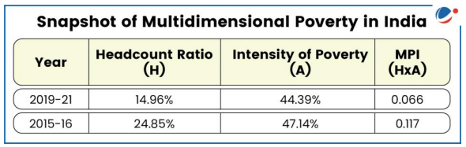
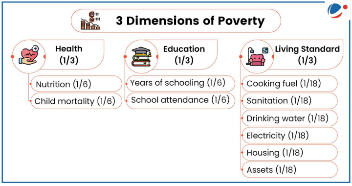
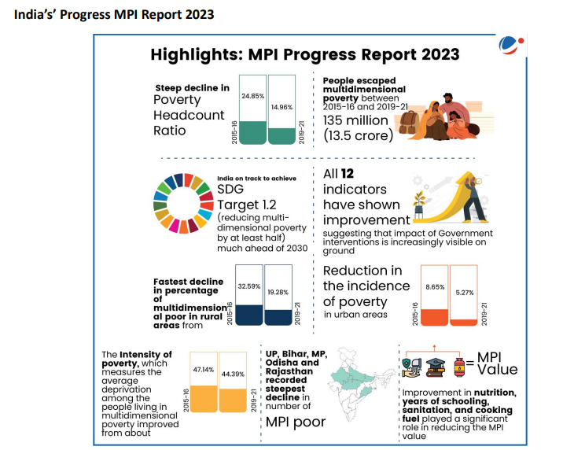

# Topic :  Inclusive growth and issues arising from it.

----

**1. Inclusive Growth: Definition and Key Points**

Inclusive growth refers to economic growth that benefits all segments of society, ensuring fair distribution of prosperity, both in monetary and non-monetary terms. The OECD defines it as growth that creates opportunities for everyone and distributes its benefits equitably.

It supports the idea that wealth creation, economic freedom, and equal opportunity can coexist. Inclusive growth allows for long-term economic growth and well-being while ensuring freedom and equality.

While there is no universal definition globally, the UNDP sees it as a process where everyone can participate in growth and share its benefits. Though the UN's Sustainable Development Goals (SDGs) don't explicitly mention inclusive growth, several goals promote its principles, including:

- **Goal 1**: End poverty by 2030.
- **Goal 2**: Achieve zero hunger by 2030.
- **Goal 3**: Reduce maternal and infant mortality rates by set targets.
- **Goal 4**: Ensure free, equitable, quality primary and secondary education for all by 2030.
- **Goal 4**: Equal access to affordable, quality education for all by 2030.
- **Goal 8**: Promote sustained per capita economic growth and reduce youth unemployment.
- **Goal 9**: Develop resilient infrastructure and promote inclusive industrialization.

Thus, inclusive growth is viewed in different ways depending on the agency, but all emphasize equitable participation and benefits.

-----

**2. Dimensions of Inclusive Growth**

Inclusive growth is a pro-poor growth strategy where the poor not only benefit from economic growth but also actively participate in it. Key dimensions include:

- **Interdependence**: It acknowledges the connections between growth, gender, poverty, and the environment. These factors are integral to achieving inclusive growth.

----

**3. Need for Inclusive Growth in India**

Inclusive growth is crucial for India to address key challenges, particularly poverty. 

**3.1 Poverty :** 

- **Poverty Reduction**: According to NITI Aayog, India has made significant progress in reducing multidimensional poverty, from 29.17% in 2013-14 to 11.28% in 2022-23, lifting 24.82 crore people out of poverty. India is likely to meet its SDG target of halving poverty before 2030. However, economic growth alone hasn't guaranteed inclusive growth, highlighting the need for policies beyond growth promotion.

- **Impact of Economic Reforms on Poverty**: 
  - **Growth-Oriented Approach**: Economic growth was expected to spread benefits across society, trickling down to the poor.
  - **Poverty Alleviation Programs**: These were introduced during the Third Five-Year Plan (1961-66) and expanded over time.
  - **Post-1990 Reforms**: Economic reforms and self-help groups have contributed to poverty reduction.
  
  - **Trends in Poverty**: Poverty declined faster after 1991, particularly in urban areas. The Tendulkar and Rangarajan Committees reported significant poverty reduction, with 138 million people lifted out of poverty between 2004-2009.

- **Global Multidimensional Poverty Index (MPI) 2023**: 
  - The Global MPI measures poverty based on deprivations in health, education, and living standards, tracking both the incidence and intensity of poverty.
  - NITI Aayog plans to use this index for monitoring India’s performance and driving reforms to improve social and economic conditions, ensuring more effective implementation of government policies.

----

**3.2. Inequality**

**Inequality in India**

Inequality in India has worsened since the 1980s, particularly accelerating after the early 2000s. Between 2014-15 and 2022-23, wealth concentration at the top end increased significantly.

- **Income and Wealth Inequality**: 
  - India’s income and wealth inequality is among the highest globally. In 2022-23, the top 1% held 22.6% of the income and 40.1% of the wealth, while the bottom 50% earned only 15% of the national income, down from 20.6% in 1951.
  
- **Social Inequality**: 
  - Gender and caste-based inequities are prominent. For instance, male workers earn significantly more than female workers across different employment types. 
  - **Periodic Labour Force Survey (2019-2023)**: In 2023, male self-employed workers earned 2.8 times more than women, and male casual workers earned 48% more.

- **Emerging Inequalities**: 
  - Inequalities are deepening due to the climate crisis and technological advancements. For example, countries with high human development are seeing faster growth in tertiary education compared to low human development nations.

**Consequences of Inequality**:

- **Low Social Mobility**: Extreme inequality limits social mobility, making it harder for children from poor families to escape poverty due to lack of education, skills, and assets.
- **Democratic Undermining**: High inequality fosters corruption, cronyism, and social unrest, and may fuel authoritarianism.
- **Climate Crisis Impact**: Poorer communities are less equipped to handle climate change, and income inequality can hinder the spread of eco-friendly technologies.
- **Political Inequality**: Economic inequality often translates into political power imbalances, weakening institutional effectiveness and policy implementation.

To reduce inequality, there is a need for better access to health, education, financial inclusion, and equal opportunities for all.

----

**3.3. Unemployment :**

**Unemployment in India**

Unemployment and underemployment rates in India rose until 2018 but have since declined. The overall unemployment rate dropped from 6% in 2018 to 3.2% in 2023, with youth unemployment also decreasing from 17.8% to 10% in the same period.

- **Youth Unemployment**: Despite overall improvements, youth unemployment remains a key challenge. Increasing educational attainment has led to a rise in unemployment among educated youth, who now make up two-thirds of total unemployment. For example, in 2023, the unemployment rate for graduates and above was 28%, down from 35.4% in 2019, with women facing higher rates.

- **Jobless Growth**: While some claim India’s growth is "jobless," data from the Periodic Labour Force Survey (PLFS) shows decreasing unemployment rates in the past five years.

**Youth Underemployment**: Despite the decline in unemployment, underemployment remains a serious issue due to several factors:
- **Social Pressure**: Overpopulation and societal expectations push people to take jobs below their skill levels.
- **Technological Advances**: Machines and technology replace entry-level jobs, rendering existing skills obsolete.
- **Underutilization of Human Capital**: The lack of high-productivity jobs results in the underuse of the workforce's potential.
- **Skills Gap**: Insufficient on-the-job training and outdated skills development lead to inefficiencies.
- **Mediocrity**: Limited access to quality jobs discourages skill development, contributing to unemployment.
- **Other Issues**: Brain drain, low self-esteem, lack of motivation, and emotional challenges like stress, depression, and hypertension exacerbate the problem.

**Conclusion**: To address these challenges, India needs to create high-productivity, high-wage jobs that fully utilize the workforce’s skills.

-----

**4.  Challenges to Inclusive Growth in India**

Despite efforts to address poverty, inequality, and unemployment, India faces several structural and socio-economic challenges hindering progress towards inclusive growth:

- **Poverty**: While 24.82 crore people have escaped multidimensional poverty in the last nine years, about 11% of the population remains multidimensionally poor.

- **Unequal Distribution of Resources**: Wealth, land, and education are concentrated among a few, limiting opportunities for the rest. In 2022-23, the top 1% held 22.6% of the income and 40.1% of the wealth.

- **Social and Cultural Barriers**: Discrimination based on caste, gender, religion, and other factors restricts access to education, employment, and healthcare for many.

- **Regional Disparities**: Economic growth is uneven, with some states thriving while others lag behind.

- **Agriculture Struggles**: Agriculture employs many but contributes less to GDP, facing low productivity, limited irrigation, and climate vulnerability.

- **Informal Sector Reliance**: A large part of India’s workforce is in the informal sector, which offers lower wages and limited social safety nets.

- **Skill Gaps**: The education system often fails to equip people with the skills needed for the modern job market.

- **Automation**: Technological advancements, such as robotics, could render many jobs obsolete, with up to 800 million people worldwide expected to be displaced by 2030.

- **Corruption**: Corruption, red tape, and lack of transparency remain significant obstacles, as reflected in India's rank of 93 out of 180 countries in the 2023 Corruption Perceptions Index.

Addressing these challenges is crucial for fostering inclusive growth and improving human capital in India, yielding long-term benefits.

-----