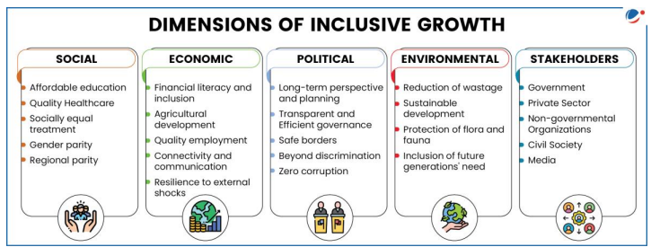

# Topic :  Inclusive growth and issues arising from it.

----

**1. Inclusive Growth: Definition and Key Points**

Inclusive growth refers to economic growth that benefits all segments of society, ensuring fair distribution of prosperity, both in monetary and non-monetary terms. The OECD defines it as growth that creates opportunities for everyone and distributes its benefits equitably.

It supports the idea that wealth creation, economic freedom, and equal opportunity can coexist. Inclusive growth allows for long-term economic growth and well-being while ensuring freedom and equality.

While there is no universal definition globally, the UNDP sees it as a process where everyone can participate in growth and share its benefits. Though the UN's Sustainable Development Goals (SDGs) don't explicitly mention inclusive growth, several goals promote its principles, including:

- **Goal 1**: End poverty by 2030.
- **Goal 2**: Achieve zero hunger by 2030.
- **Goal 3**: Reduce maternal and infant mortality rates by set targets.
- **Goal 4**: Ensure free, equitable, quality primary and secondary education for all by 2030.
- **Goal 4**: Equal access to affordable, quality education for all by 2030.
- **Goal 8**: Promote sustained per capita economic growth and reduce youth unemployment.
- **Goal 9**: Develop resilient infrastructure and promote inclusive industrialization.

Thus, inclusive growth is viewed in different ways depending on the agency, but all emphasize equitable participation and benefits.

-----

**2. Dimensions of Inclusive Growth**

Inclusive growth is a pro-poor growth strategy where the poor not only benefit from economic growth but also actively participate in it. Key dimensions include:

- **Interdependence**: It acknowledges the connections between growth, gender, poverty, and the environment. These factors are integral to achieving inclusive growth.

----