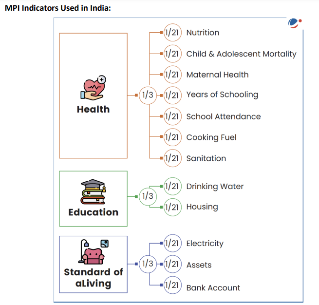

# Topic :  Inclusive growth and issues arising from it.

----

**1. Inclusive Growth: Definition and Key Points**

Inclusive growth refers to economic growth that benefits all segments of society, ensuring fair distribution of prosperity, both in monetary and non-monetary terms. The OECD defines it as growth that creates opportunities for everyone and distributes its benefits equitably.

It supports the idea that wealth creation, economic freedom, and equal opportunity can coexist. Inclusive growth allows for long-term economic growth and well-being while ensuring freedom and equality.

While there is no universal definition globally, the UNDP sees it as a process where everyone can participate in growth and share its benefits. Though the UN's Sustainable Development Goals (SDGs) don't explicitly mention inclusive growth, several goals promote its principles, including:

- **Goal 1**: End poverty by 2030.
- **Goal 2**: Achieve zero hunger by 2030.
- **Goal 3**: Reduce maternal and infant mortality rates by set targets.
- **Goal 4**: Ensure free, equitable, quality primary and secondary education for all by 2030.
- **Goal 4**: Equal access to affordable, quality education for all by 2030.
- **Goal 8**: Promote sustained per capita economic growth and reduce youth unemployment.
- **Goal 9**: Develop resilient infrastructure and promote inclusive industrialization.

Thus, inclusive growth is viewed in different ways depending on the agency, but all emphasize equitable participation and benefits.

-----

**2. Dimensions of Inclusive Growth**

Inclusive growth is a pro-poor growth strategy where the poor not only benefit from economic growth but also actively participate in it. Key dimensions include:

- **Interdependence**: It acknowledges the connections between growth, gender, poverty, and the environment. These factors are integral to achieving inclusive growth.

----

**3. Need for Inclusive Growth in India**

Inclusive growth is crucial for India to address key challenges, particularly poverty. 

**3.1 Poverty :** 

- **Poverty Reduction**: According to NITI Aayog, India has made significant progress in reducing multidimensional poverty, from 29.17% in 2013-14 to 11.28% in 2022-23, lifting 24.82 crore people out of poverty. India is likely to meet its SDG target of halving poverty before 2030. However, economic growth alone hasn't guaranteed inclusive growth, highlighting the need for policies beyond growth promotion.

- **Impact of Economic Reforms on Poverty**: 
  - **Growth-Oriented Approach**: Economic growth was expected to spread benefits across society, trickling down to the poor.
  - **Poverty Alleviation Programs**: These were introduced during the Third Five-Year Plan (1961-66) and expanded over time.
  - **Post-1990 Reforms**: Economic reforms and self-help groups have contributed to poverty reduction.
  
  - **Trends in Poverty**: Poverty declined faster after 1991, particularly in urban areas. The Tendulkar and Rangarajan Committees reported significant poverty reduction, with 138 million people lifted out of poverty between 2004-2009.

- **Global Multidimensional Poverty Index (MPI) 2023**: 
  - The Global MPI measures poverty based on deprivations in health, education, and living standards, tracking both the incidence and intensity of poverty.
  - NITI Aayog plans to use this index for monitoring India’s performance and driving reforms to improve social and economic conditions, ensuring more effective implementation of government policies.

----

**3.2. Inequality**

**Inequality in India**

Inequality in India has worsened since the 1980s, particularly accelerating after the early 2000s. Between 2014-15 and 2022-23, wealth concentration at the top end increased significantly.

- **Income and Wealth Inequality**: 
  - India’s income and wealth inequality is among the highest globally. In 2022-23, the top 1% held 22.6% of the income and 40.1% of the wealth, while the bottom 50% earned only 15% of the national income, down from 20.6% in 1951.
  
- **Social Inequality**: 
  - Gender and caste-based inequities are prominent. For instance, male workers earn significantly more than female workers across different employment types. 
  - **Periodic Labour Force Survey (2019-2023)**: In 2023, male self-employed workers earned 2.8 times more than women, and male casual workers earned 48% more.

- **Emerging Inequalities**: 
  - Inequalities are deepening due to the climate crisis and technological advancements. For example, countries with high human development are seeing faster growth in tertiary education compared to low human development nations.

**Consequences of Inequality**:

- **Low Social Mobility**: Extreme inequality limits social mobility, making it harder for children from poor families to escape poverty due to lack of education, skills, and assets.
- **Democratic Undermining**: High inequality fosters corruption, cronyism, and social unrest, and may fuel authoritarianism.
- **Climate Crisis Impact**: Poorer communities are less equipped to handle climate change, and income inequality can hinder the spread of eco-friendly technologies.
- **Political Inequality**: Economic inequality often translates into political power imbalances, weakening institutional effectiveness and policy implementation.

To reduce inequality, there is a need for better access to health, education, financial inclusion, and equal opportunities for all.

----

**3.3. Unemployment :**

**Unemployment in India**

Unemployment and underemployment rates in India rose until 2018 but have since declined. The overall unemployment rate dropped from 6% in 2018 to 3.2% in 2023, with youth unemployment also decreasing from 17.8% to 10% in the same period.

- **Youth Unemployment**: Despite overall improvements, youth unemployment remains a key challenge. Increasing educational attainment has led to a rise in unemployment among educated youth, who now make up two-thirds of total unemployment. For example, in 2023, the unemployment rate for graduates and above was 28%, down from 35.4% in 2019, with women facing higher rates.

- **Jobless Growth**: While some claim India’s growth is "jobless," data from the Periodic Labour Force Survey (PLFS) shows decreasing unemployment rates in the past five years.

**Youth Underemployment**: Despite the decline in unemployment, underemployment remains a serious issue due to several factors:
- **Social Pressure**: Overpopulation and societal expectations push people to take jobs below their skill levels.
- **Technological Advances**: Machines and technology replace entry-level jobs, rendering existing skills obsolete.
- **Underutilization of Human Capital**: The lack of high-productivity jobs results in the underuse of the workforce's potential.
- **Skills Gap**: Insufficient on-the-job training and outdated skills development lead to inefficiencies.
- **Mediocrity**: Limited access to quality jobs discourages skill development, contributing to unemployment.
- **Other Issues**: Brain drain, low self-esteem, lack of motivation, and emotional challenges like stress, depression, and hypertension exacerbate the problem.

**Conclusion**: To address these challenges, India needs to create high-productivity, high-wage jobs that fully utilize the workforce’s skills.

-----

**4.  Challenges to Inclusive Growth in India**

Despite efforts to address poverty, inequality, and unemployment, India faces several structural and socio-economic challenges hindering progress towards inclusive growth:

- **Poverty**: While 24.82 crore people have escaped multidimensional poverty in the last nine years, about 11% of the population remains multidimensionally poor.

- **Unequal Distribution of Resources**: Wealth, land, and education are concentrated among a few, limiting opportunities for the rest. In 2022-23, the top 1% held 22.6% of the income and 40.1% of the wealth.

- **Social and Cultural Barriers**: Discrimination based on caste, gender, religion, and other factors restricts access to education, employment, and healthcare for many.

- **Regional Disparities**: Economic growth is uneven, with some states thriving while others lag behind.

- **Agriculture Struggles**: Agriculture employs many but contributes less to GDP, facing low productivity, limited irrigation, and climate vulnerability.

- **Informal Sector Reliance**: A large part of India’s workforce is in the informal sector, which offers lower wages and limited social safety nets.

- **Skill Gaps**: The education system often fails to equip people with the skills needed for the modern job market.

- **Automation**: Technological advancements, such as robotics, could render many jobs obsolete, with up to 800 million people worldwide expected to be displaced by 2030.

- **Corruption**: Corruption, red tape, and lack of transparency remain significant obstacles, as reflected in India's rank of 93 out of 180 countries in the 2023 Corruption Perceptions Index.

Addressing these challenges is crucial for fostering inclusive growth and improving human capital in India, yielding long-term benefits.

-----

**5. Inclusive Growth and Human Capital Formation in India**

Human capital refers to the economic value of a worker's skills and abilities, emphasizing that not all labor is equal. It can be improved through investments in education, job training, health, and awareness. Human capital is essential for a country's growth, development, and competitiveness, but it can depreciate due to long unemployment, mental decline, or failure to adapt to new innovations. It is also mobile, potentially causing brain drain.

**Role of Human Capital in Economic Development:**
- **Increases Productivity**: Promotes innovation, creativity, and the ability to absorb new technologies.
- **Reduces Inequality**: Higher human capital leads to better employment opportunities, increased income, and reduced inequality.
- **Positive Societal Impact**: Helps overcome regressive thinking and increases workforce participation, including promoting gender-inclusive employment.

**Challenges to Human Capital Formation in India:**
- **Education Gap**: Poorer households struggle to invest in education, leading to a cycle of poverty.
- **Health Disparities**: Unequal access to healthcare hampers productivity and worsens inequality.
- **Limited Financial Services**: Lack of access to credit restricts investment in education and personal development.
- **Low Public Expenditure**: Insufficient spending on health, education, and skills development.
- **Population Growth**: A rising population reduces the availability of resources per capita.
- **Regional Inequality**: Economic disparities limit access to basic services.
- **Gender Inequality**: The gender gap reduces labor productivity and limits opportunities for women.
- **Brain Drain**: The migration of skilled workers hinders human capital formation.
- **Slow Skill Formation**: Skill development takes time and on-the-job training is often insufficient to cope with emerging technologies.

**Opportunities for Human Capital Formation in India:**
- **Demographic Dividend**: 65% of India's population is under 35, and over 25% are of working age.
- **English-Speaking Population**: A large number of English speakers and a strong IT base can be harnessed for skill development.
- **Technological Integration**: Global interconnectedness offers broad opportunities for training and development.
- **Legal and Constitutional Support**: Rights-based frameworks support improvements in health and social status.
- **Government Initiatives**: Programs like the SATH-E Roadmaps and the SWAYAM platform for e-learning can help improve education outcomes.

India currently ranks 116 out of 174 in the Global Human Capital Index (2020). To harness its demographic dividend, India needs to focus on skill development, healthcare, education, and social security. Initiatives like the National Institutional Ranking Framework (NIRF) and skill-focused portals like Takshashila can enhance human capital development in India.

-----

**6. Sectoral Steps Taken for Inclusive Growth**

1. **Education and Skill Development**: The government has implemented several initiatives to improve education and skills, including the **New Educational Policy** and the **Pradhan Mantri Kaushal Vikas Yojana**. These programs aim to enhance the skills of the workforce, focusing on vocational training and improving access to quality education.

2. **Health**: **Ayushman Bharat**, launched in the Union Budget 2018-19, is a National Health Protection Scheme aimed at covering over 10 crore poor and vulnerable families. The scheme provides coverage of up to ₹5 lakh per family per year for secondary and tertiary care hospitalization, making healthcare more accessible for marginalized sections of society.

3. **Social Security**: The government has expanded the social security net through several initiatives aimed at protecting the poor and vulnerable:
   - **Pradhan Mantri Suraksha Bima Yojana**: Provides accident insurance.
   - **Atal Pension Yojana**: Focuses on providing pensions for workers in the unorganized sector.
   - **Pradhan Mantri Jeevan Jyoti Yojana**: Offers life insurance.
   - **MUDRA Bank**: Provides microfinance to rural entrepreneurs.
   - **National Hub for SC/ST Entrepreneurs**: Supports marginalized communities by fostering entrepreneurship.

4. **Financial Inclusion**: The **Pradhan Mantri Jan Dhan Yojana** focuses on ensuring that economically weaker sections have access to bank accounts, aiming to provide financial services to the underprivileged and promote financial inclusion.

5. **Employment Generation**: Several government schemes focus on creating employment opportunities, particularly in rural and urban areas:
   - **Mahatma Gandhi National Rural Employment Guarantee Act (MGNREGA)**: Ensures employment to rural households.
   - **Prime Minister’s Employment Generation Programme (PMEGP)**: Promotes entrepreneurship.
   - **Pradhan Mantri Rojgar Protsahan Yojana**: Encourages the creation of new jobs.
   - **Pt. Deen Dayal Upadhyaya Grameen Kaushalya Yojana (DDU-GKY)**: Focuses on skill development in rural areas.
   - **Deendayal Antyodaya Yojana - National Urban Livelihoods Mission (DAY-NULM)**: Aims to create sustainable livelihoods in urban areas.

6. **Agriculture**: The government has reoriented the agricultural sector to focus on income generation, organic farming, irrigation infrastructure, and technology adoption. Key schemes include:
   - **Soil Health Card (SHC) Scheme**: Ensures soil health and sustainable agriculture.
   - **Pradhan Mantri Krishi Sinchayee Yojana (PMKSY)**: Focuses on expanding irrigation.
   - **Paramparagat Krishi Vikas Yojana (PKVY)**: Promotes organic farming.
   - **Kisan Credit Card**: Provides farmers with easy access to credit.

7. **Rural Empowerment**: To enhance rural infrastructure and development, the government has launched various initiatives:
   - **Pradhan Mantri Awas Yojana - Gramin**: Focuses on affordable housing in rural areas.
   - **Bharat Net**: Ensures internet connectivity in rural areas.
   - **DDU Gram Jyoti Yojana**: Aims to provide power connectivity to rural areas.
   - **Aadhaar**: The biometric-based unique identification system ensures that the poor are not excluded from government schemes, facilitating financial inclusion and social security.

These initiatives collectively contribute to inclusive growth by addressing poverty, inequality, and unemployment, while fostering human capital development across sectors.

----

**7.  Strategies to Achieve Inclusive Growth**

**7.1. Universal Basic Income (UBI)**  
Universal Basic Income (UBI) is a proposed strategy to ensure inclusive growth by providing regular, unconditional cash payments to all individuals, regardless of their income or employment status. It aims to alleviate poverty, reduce inequality, and promote social welfare. The key characteristics of UBI are:

1. **Periodic Payments**: UBI is provided at regular intervals (e.g., monthly or annually), ensuring a stable and predictable source of income for individuals.
2. **Cash Payment**: The benefit is delivered in cash, not in-kind or vouchers. This allows recipients the flexibility to spend the money according to their needs, empowering them to make their own economic choices.
3. **Individual Focus**: Payments are made to individuals rather than households or families, ensuring that each person receives the benefit directly.
4. **Universal Access**: UBI is available to all individuals within the economy, irrespective of their socio-economic status, thus promoting equity and inclusion.
5. **Unconditional**: The cash payment is unconditional, meaning it is provided without any requirement for employment status, income level, or other conditions. This ensures that even marginalized or unemployed individuals can benefit.

UBI is seen as a way to reduce poverty, enhance social security, and address inequality, making it a potential tool for promoting inclusive growth in India.

----

Pros (favor) and Cons (against) of Universal Basic Income (UBI):

### Favor (Pros of UBI)
1. **Poverty and Vulnerability Reduction**: Provides immediate relief from poverty.
2. **Choice and Autonomy**: Empowers individuals to make spending decisions that suit their needs.
3. **Better Targeting of the Poor**: Reduces exclusion errors by reaching everyone, minimizing missed beneficiaries.
4. **Insurance Against Shocks**: Acts as a safety net for health, income, and unexpected crises.
5. **Improved Financial Inclusion**: Encourages banking use and access to credit for low-income groups.
6. **Psychological Benefits**: Alleviates stress of securing basic needs daily.
7. **Administrative Efficiency**: Simplifies welfare delivery, reducing bureaucracy.

### Against (Cons of UBI)
1. **Risk of Wasteful Spending**: Funds may be spent on non-essential or harmful activities.
2. **Reduced Work Incentive (Moral Hazard)**: May discourage labor participation.
3. **Gender Disparities in Control**: Cash distribution within households may lead to unequal spending control.
4. **Implementation Challenges**: Strain on financial systems and logistics.
5. **High Fiscal Costs**: Difficulty in rolling back UBI if unsuccessful.
6. **Political Issues**: Resistance due to perceived inequity or lack of targeted benefits.
7. **Market Risks**: Cash value may erode due to inflation or market fluctuations.

----

### Universal Basic Income (UBI) vs. Targeted Transfer Schemes  

**Targeted Schemes**  
Targeted transfer schemes focus on providing welfare benefits to specific groups, such as the poor or marginalized, using methods to identify those most in need.  

- **Advantages**:  
  - Evidence from countries like Indonesia and Peru shows significant welfare improvements for the poorest.  
  - Higher per-beneficiary benefits compared to universal programs by concentrating resources on those most in need.  

- **Challenges**:  
  - **Exclusion Error**: Imperfect targeting can leave out eligible poor households, reducing program effectiveness.  

**Improving Targeted Schemes**  
1. **Community-Based Targeting**:  
   - Communities decide who is most in need through participatory meetings.  
   - Enhances transparency, inclusion, and fairness.  
   - Strengthens local governance with tools like social audits.  

2. **Technology Integration**:  
   - Platforms like Aadhaar, Jan-Dhan, and mobile networks improve targeting efficiency and speed of cash transfers.  
   - Reduces administrative costs and allows resources to focus on growth-oriented initiatives.  

3. **Conditional Transfers**:  
   - Benefits tied to conditions like school attendance or healthcare compliance.  
   - Improves education and health outcomes in targeted areas.  

**Conclusion**  
- **Universal Basic Income (UBI)**: Eliminates exclusion errors by providing benefits to all but may dilute resources for the poorest.  
- **Targeted Schemes**: Maximize benefits for the neediest but face challenges in accurate targeting.  

Ultimately, refining targeting methods and improving implementation can enhance welfare programs' impact, regardless of whether a UBI or targeted approach is adopted.

----

**7.2 Skill Development Summary**

The National Policy for Skill Development and Entrepreneurship (2015) highlights that only 5.4% of India's workforce has formal skill training, compared to much higher percentages in countries like the UK, Germany, and South Korea. The 2020-21 Periodic Labour Force Survey (PLFS) revealed that 84.4% of Indians did not receive vocational training, with women disproportionately affected.

**Why Skill Development is Crucial for India:**
1. **Economic Growth:** Skilled workers are essential for programs like Make in India, Digital India, and Smart Cities.
2. **Demographic Dividend:** India has a young population, which could help avoid a demographic disaster if adequately skilled.
3. **Opportunity from China’s Slowdown:** As China’s manufacturing sector declines, India has the chance to become the world's manufacturing hub.
4. **Sectoral Shift:** Increased productivity in agriculture will push workers toward secondary and tertiary sectors.
5. **Global Competitiveness:** To compete globally, India needs a skilled workforce aligned with international standards.
6. **Employment:** Skill development will improve job prospects for young people in India’s growing economy.

**Issues with Skill Development:**
1. **Poor Accreditation:** Quality standards for training centers are often compromised.
2. **Lack of Coordination:** Skill development policies are spread across multiple ministries, leading to inefficiency.
3. **Rapid Technological Change:** The evolving technology landscape makes it hard to predict future skill requirements.
4. **Limited Career Progression:** Vocational training lacks pathways for advancing to higher qualifications.
5. **Infrastructure and Course Quality:** Many centers have outdated equipment and unqualified trainers, affecting training quality.
6. **Industry Disconnect:** Small businesses often don’t invest in formal training, hiring unskilled workers instead.
7. **Gender Bias:** Skill programs often favor male-dominated trades, limiting women’s participation.
8. **Lack of Recognition for Informal Skills:** Skilled workers with informal experience (e.g., diamond cutters) lack formal recognition and job opportunities.
9. **Social Security:** Many workers, especially salaried employees, lack social security benefits.

**Way Forward:**
1. **Online Learning:** Utilize digital platforms to provide accessible skill training, especially in rural areas.
2. **Mobile Training Units:** Adopt initiatives like "Skills on Wheels" to take training to remote locations.
3. **Vertical and Lateral Mobility:** Create pathways for advancing from certificates to diplomas and degrees, while allowing lateral mobility to further education.
4. **Industry Involvement:** Engage industries in training processes, including providing machinery, trainers, and assessments.
5. **Standardization:** Develop uniform curricula and certification standards across agencies.
6. **Vocationalizing Education:** Integrate skill development with the current education system to ensure alignment with industry needs.
7. **Job Creation:** Skill development alone isn’t enough; job opportunities must also be created to absorb the skilled workforce.
8. **Rural Focus:** Skill programs must address the needs of rural populations, particularly in agriculture, to improve livelihoods and reduce migration.
9. **Child Labour and Marginalized Groups:** Address issues of child labour and provide targeted training for marginalized groups, including women and tribals.
10. **Recognition of Informal Skills:** Formalize the recognition of informal skills to help workers access better job opportunities and social security.

In conclusion, improving India's skill development infrastructure is essential for tapping into the potential of its young population, increasing global competitiveness, and addressing socio-economic disparities.

----

**7.3 Increasing Insurance Coverage Summary**

The Indian insurance industry has grown significantly over the past two decades, driven by private sector involvement, better distribution, and improved operational efficiencies. 

**Current Status of Insurance in India:**
- **Penetration Growth:** Insurance penetration has increased from 2.7% in 2000 to 4.2% in 2021. Life insurance penetration was 3.2% in 2021, surpassing emerging markets and nearing the global average.
- **Insurance Gap:** The gap has widened from $19.7 billion in 2012 to $27 billion in 2018, with non-life insurance slightly improving from 0.7% to 0.9% of GDP between 2012 and 2018.
- **Market Share:** India accounted for 3.23% of the global life insurance market in 2021. The life insurance sector grew by 10.2% in FY22, with new businesses contributing 45.5% of total premiums. India is the second-largest market in emerging economies, with premiums expected to grow at 9% annually over the next decade.
- **FDI Increase:** The government raised the Foreign Direct Investment (FDI) limit in the insurance sector from 26% to 49% to attract more investment.

**Role of Insurance:**
- **Risk Management:** Insurance helps spread financial risks and provides security in business and life.
- **Financial Resource Generation:** It collects premiums, which are invested in government securities and stocks, supporting capital formation and employment.
- **Economic Growth:** Insurance mobilizes domestic savings, provides capital for long-term investments, mitigates losses, and promotes economic stability.
- **Rural Outreach:** Regulations ensure insurance reaches rural and socially disadvantaged populations.

**Challenges in the Insurance Sector:**
1. **Low Awareness:** Many people view health insurance as unnecessary and avoid purchasing it.
2. **Poor Distribution:** Insurance access is limited in small towns due to distribution challenges.
3. **Lack of Product Innovation:** There are gaps in the insurance product range, leaving significant risks uninsured.
4. **Pricing Issues:** Insurers focus on sales growth, sometimes leading to pricing distortions.
5. **Negative Perception:** Media and influencers often portray the life insurance industry negatively, making consumers skeptical.

**Government Initiatives:**
1. **Ayushman Bharat:** Provides health coverage of up to Rs 500,000 for 100 million vulnerable families for hospitalization.
2. **PMJJBY & PMSBY:** Life and accident insurance schemes for economically weaker sections.
3. **PMJDY:** Provides micro-insurance and pension schemes to low-income groups through basic accounts.
4. **PMFBY:** Crop insurance for farmers against losses.

**Way Forward:**
1. **Promote Awareness:** Increase public awareness about insurance benefits through media campaigns, social media, and advertisements.
2. **Multiple Distribution Channels:** Link insurance to financial products like housing loans, mutual funds, and credit cards for wider reach.
3. **Tap Untapped Markets:** Tailor insurance offerings to target diverse demographics and align with government programs.
4. **Better Regulation:** Ensure insurers focus more on fulfilling insurance goals rather than prioritizing profitability.
5. **Technology Use:** Leverage technology to provide integrated services, facilitating cross-selling and customer retention.

In conclusion, increasing insurance coverage in India requires improving awareness, expanding distribution, and leveraging technology, while addressing challenges in product innovation, pricing, and public perception.

-----

