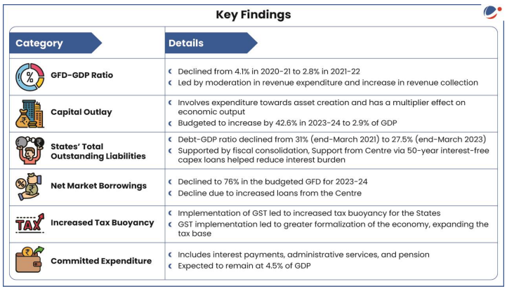
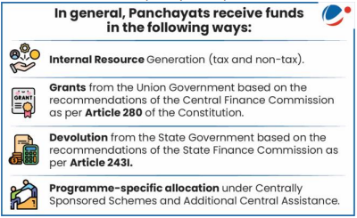
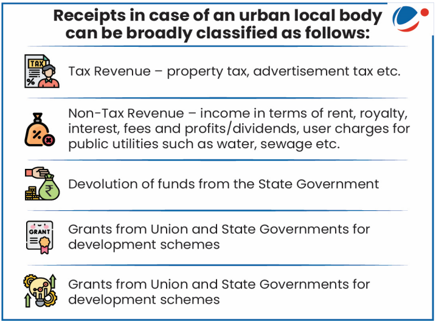

# Topic : Indian Economy and Mobilisation of Resources 

**1. Introduction:**

A resource is anything with utility or usability. The government needs human, physical, and economic resources to function. This document focuses on economic resources. Resource mobilization refers to the efficient collection and allocation of these resources to achieve a goal. Methods of mobilization include taxes, import/export duties, service fees, and borrowing.

---

 **2. Sources of Government’s Financial Resources**

 Mobilization of Resources:
Governments need human, physical, and economic resources to perform functions. In this context, mobilization refers to efficiently collecting and channeling financial resources.

 **2.1. Sources**  
1. **Tax Revenue**  
   - Direct taxes (e.g., income tax).  
   - Indirect taxes (e.g., GST, customs).  
2. **Non-Tax Revenue**  
   - Interest on bonds, loans.  
   - Dividends from PSUs.  
   - Grants and other non-tax income.  
3. **Capital Receipts**  
   - Borrowings (market loans, external borrowings, etc.).  
   - Loans from foreign governments and bodies.  
   - Proceeds from disinvestment.

---

 **2.2. Issues**  
1. **Distribution of Financial Resources**  
   - Imbalance between the center and states (horizontal and vertical).  
2. **Fiscal Consolidation**  
   - Difficulty in achieving FRBM targets (fiscal deficit and revenue deficit).  
3. **Low Tax-to-GDP Ratio**  
   - India’s tax-to-GDP ratio (11.6% for 2017–18) is significantly lower than other emerging markets and OECD nations.  
4. **Large Subsidy Burden**  
   - Subsidies on food, fertilizers, and fuel (major components).  
5. **Tax Avoidance and Evasion**  
   - Use of tax exemptions and evasion practices.  

---

 **2.3. Steps Taken**  
1. **Reforms in Expenditure**  
   - Discontinuation of plan vs. non-plan expenditure classification.  
   - Merging General Budget and Railway Budget.  
   - Rationalizing subsidies through DBT (Direct Benefit Transfer) and other mechanisms.  
2. **Restructuring and Policy Adjustments**  
   - Restructuring of Centrally Sponsored Schemes.  
   - Addressing tax evasion via renegotiation of Double Taxation Avoidance Agreements (DTAA).  
   - Long-term capital gains tax policy revision.  

-----

**3. Transfer of Resources from Center to States**

In the federal system of India, state and local bodies depend a lot on Center for meeting their financial requirements.

Mechanisms used to channel resources from the Central Government to the States in India. Here's a simplified and concise summary:

 **Mechanisms to Allocate Resources:**
1. **Finance Commission**:
   - Defines the principles for sharing taxes between the Union and the States.

2. **Goods and Services Tax (GST) Council**:
   - Recommends GST rates, exemptions, surcharges, rules, and special provisions (e.g., for North Eastern states).

3. **Grants-in-Aid** (Article 275 of the Constitution):
   - Provides financial assistance to states.

4. **Discretionary Grants** (Article 282):
   - Offers funds at the Union’s discretion for specific purposes. 

This structure ensures fair resource distribution based on constitutional provisions and fiscal recommendations.

----

**4. Issues in Mobilization of Resources:**

A. **Imbalance in Resource Distribution:** There is vertical imbalance (between the Centre and States) and horizontal imbalance (among states with varying fiscal capacities) in financial resource distribution.

B. **Fiscal Consolidation:** 
- From 2011-12 to 2019-20, the Union government's fiscal deficit stayed above the FRBM target, improving from 5.9% of GDP in 2011-12 to 3.4% in 2018-19, but rising again to 4.6% in 2019-20 and 9.22% in 2020-21 due to COVID-19-induced revenue declines.
- States performed better in meeting fiscal targets, maintaining deficits below 3% of GDP (except during 2015-17). However, state deficits rose to 4.53% in 2020-21 (RE).

C. **Low Tax-to-GDP Ratio:** India's tax-to-GDP ratio for 2023-24 is 11.6%, much lower than the OECD and emerging market averages. Reasons for this include:
- Low per capita income and rapid growth of tax exemptions.
- Lack of policy initiatives and tax exemptions for certain sectors.
- A small proportion of the population are taxpayers (2.2% in India vs. 50% in the US).
- Inefficient tax administration, corporate tax issues, and legal disputes reduce revenue.

D. **Inefficient Subsidy System:** India's subsidy system, especially for food, fertilizers, and fuel, is highly inefficient, and many needy people do not receive their due subsidies.

E. **Rising Tax Arrears:** The income tax department has Rs 11.1 lakh crore in arrears (as of 2017-18), hindered by issues like litigation, liquidation, and untraceable taxpayers.

F. **Corporate Tax Exemptions:** Despite a competitive corporate tax rate, India's effective tax rate is low due to numerous exemptions, which need rationalization.

NOTE : 

**NITI Aayog on Rationalizing Subsidies:**

- Social subsidies should focus on making people economically independent rather than creating dependency.
- Subsidies have crowded out critical spending on education and health within revenue expenditure.
- Subsidy targeting should improve by using socio-economic and caste census data.
- Production subsidies, such as cheap land and other benefits to companies, should be eliminated.
- Direct Benefit Transfer (DBT) should be used in all social welfare schemes for more efficient distribution.

----

**5. Steps Taken by the Government:**

- Abolished plan and non-plan expenditure categories.
- Merged the General and Railways Budgets.
- Restructured Centrally Sponsored Schemes (CSS).
- Formed the N.K. Singh panel to review the Fiscal Responsibility and Budget Management Act (FRBMA) for fiscal consolidation.
- Rationalized subsidies through initiatives such as:
  - Direct Benefit Transfer (DBT) via the Jan Dhan-Mobile-Aadhar trinity.
  - Switching to a nutrient-based subsidy scheme for fertilizers.
  - Eliminating fuel subsidies, except for LPG and Kerosene.
  - Freeing diesel and petrol prices.
  - Implementing the "Give-it-up" campaign and withdrawing LPG subsidies for high-income consumers.
  - Launching the One Nation One Ration Card (ONORC) plan.
- Reviewed Public-Private Partnership (PPP) projects with steps like:
  - Establishing a strong institutional structure for appraising and approving PPPs.
  - Creating standardized documents, such as model concession agreements for infrastructure sectors.
  - Enhancing finance availability through dedicated institutions and viability gap funding.
  - Abolishing the Foreign Investment Promotion Board (FIPB) since over 90% of FDI inflows are routed through the automatic route.
- Set up the National Land Monetisation Corporation (NLMC) to accelerate land and asset monetization in public sector entities.

----

**6. Suggestions to Improve Mobilization of Resources:**

- **Mobilization of States' Revenues:**
  - Revenue generation varies widely among states, from 5% to 10% of GSDP in major states.
  - States can improve revenue through better tax administration, using data analytics and technology to reduce leakages, rationalizing tax and user fees, and broadening the tax base.

- **Private Sector Resource Mobilization:**
  - The National Infrastructure Pipeline relies on private capital for financing.
  - Strengthen capabilities in public-private partnerships, focusing on risk-sharing models and asset monetization, especially for sectors like energy, urban development, transport, logistics, health, and education.
  - Utilize real estate investment trusts (REITs) and infrastructure investment trusts (InvITs) to attract private sector investment.

- **Ramping up Climate Finance:**
  - Mobilizing international and domestic climate finance, especially lower-cost finance, is key to India's low-carbon development.
  - Green bonds and climate budgeting can help governments integrate climate considerations into their financial planning.

- **Strengthening Urban Bodies' Revenues and Fiscal Management:**
  - To improve the creditworthiness of urban local bodies (ULBs), increase revenues (e.g., property taxes), rationalize expenditures, enhance efficiencies, and improve governance.
  - Strengthen the finances of government agencies and parastatal organizations providing urban infrastructure and services to enhance service delivery.

----

**7. State Finances:**

The Reserve Bank of India recently released the annual report *“State Finances: A Study of Budget 2023-24”*, focusing on the theme of **‘Revenue Dynamics and Fiscal Capacity of Indian States’**.

----

**7.1. Concerns with State Finances:**

- **Low Non-Tax Revenue Collection:** Non-tax revenues have remained around 1% of GDP over the past decade, much lower than the 10% or more seen in countries like Singapore, Egypt, and Iran.
  
- **Reduced Development Expenditure:** Allocations for key sectors such as education, sports, culture, natural calamity relief, urban development, agriculture, and rural development have been cut.

- **Old Pension Scheme (OPS):** Returning to the OPS would create a significant fiscal burden, limiting states' ability to invest in growth-promoting capital expenditures. If all states revert to OPS, the fiscal burden could be 4.5 times higher than the National Pension System (NPS).

- **Precarious Fiscal Situation:** Continuing to provide non-merit goods, subsidies, transfers, and guarantees could destabilize state finances and undermine the fiscal consolidation achieved in recent years.

-----

**7.2. Ways to Improve State Finances:**

- **Increase Non-Tax Revenue:** States can boost non-tax revenues by revising user charges for services like electricity and water, generating royalties and premiums from mining, and monetizing assets.

- **Prevent Revenue Loss from Illegal Mining:** Use modern technologies, such as Geographic Information Systems (GIS) and Drone Surveys, to detect and curb illegal mining activities.

- **Performance-Based Transfers:** The Finance Commissions could recommend increasing conditional transfers based on states' reforms, expenditure quality, and fiscal sustainability, encouraging competition among states to improve their economic performance.

- **Increase Fiscal Capacity:** States need to scale up their fiscal capacity to ensure efficient delivery of social, economic, and general services, and to improve the quality of physical and human capital.

- **Streamline Fund Transfers for Efficient Governance:** Effective banking and cash management practices are crucial for proper utilization of financial resources and timely payments. Fragmented banking systems with multiple accounts can lead to inefficiencies.

- **Climate Finance:** The Centre can offer performance-based incentives to states making significant progress toward climate goals.

------

**8. Panchayat’s Finance:**

- **Weak Internal Resource Generation:** Panchayats struggle to generate internal resources, due to a narrow tax base and reluctance to collect revenue.

- **Dependence on Grants:** Panchayats rely heavily on grants from Union and State Governments, with a large portion being scheme-specific.

- **Limited Expenditure Flexibility:** Panchayats have little discretion in how they can spend, reducing their fiscal autonomy.

- **State Governments' Reluctance:** Due to their own fiscal constraints, State Governments are hesitant to devolve funds to Panchayats.

- **Inadequate Resources:** Panchayats are given significant responsibilities but lack sufficient resources to carry them out effectively.

-------

**8.1. Suggestions to Increase Revenue of Panchayats:**

- **Explore Additional Revenue Sources:** Panchayats should tap into growing sectors like transport, tourism, and infrastructure, which have benefited rural areas.
  
- **Optimize Tax Collection:** Traditional tax options, such as profession tax, cattle registration fees, and vehicle registration fees, have not been fully exploited by Panchayats. They should be more proactive in collecting these taxes.

- **Utilize Common Property Resources:** Panchayats should identify and make productive use of common property resources in their areas for revenue generation.

- **Royalties from Mining:** Panchayats should have a primary right over income from mining royalties in their region. State Finance Commissions should consider this when allocating grants to rural bodies, and State Governments should empower Panchayats to collect a cess on mining royalties.

- **Incentivize Revenue Efforts:** Panchayats that show positive results in revenue generation should be rewarded. Grants and aids from the Centre and State should be linked to the revenue efforts of local bodies.

-----

**9. Urban Local Bodies’ Finances**

-----

**9.1 Suggestions to Increase Revenue of Urban Local Bodies:**

- **Improve Property Tax Collection:**
  - **Widen the Tax Base:** Currently, only 50-60% of properties are assessed. Many properties, especially those outside municipal jurisdiction or exempt due to their nature (e.g., religious or charitable institutions), are not taxed. Local governments should be empowered to collect ‘service charges’ from these properties that use municipal services.
  - **Improve Collection Efficiency:** Property tax collection efficiency is low (53% on average), with some areas like Mumbai even lower (28%). Poor record-keeping, collusion, and lack of understanding of the tax system contribute to this issue. Improving data management and transparency is key.
  - **Make Property Tax Buoyant:** Property taxes often remain unchanged for years or even decades. The Unit Area Method could be used to ensure more regular and fair assessments.

- **Follow ARC Guidelines for Tax Administration:** 
  - Ensure transparent and objective tax levies.
  - Minimize collection and compliance costs.
  - Establish an independent unit under the Chief Executive to monitor tax collection.
  - Base levies on self-declaration with strict penalties for non-compliance.

- **User Charges for Municipal Services:** Encourage the levy of appropriate user charges for various services provided by municipalities to enhance revenue.

- **Fiscal Management Laws:** State governments should set laws that define upper limits for municipal borrowings, especially when municipalities borrow based on their own ratings.

- **Enhance Institutional Capability:** Municipal bodies' capacity must be improved for successful public-private partnership (PPP) projects.

- **Leverage Municipal Land for Investment:** Municipal land can be used to raise infrastructure investments by leasing it out or borrowing against its value.

-----

**10 . Gross Fixed Capital Formation (GFCF):**

- **Capital Formation:** It involves investment in assets like machinery, equipment, plants, and human capital (education, health, and skill development).

- **Gross Capital Formation (GCF):** Refers to the increase in fixed capital within an economy, including:
  - **Gross Fixed Capital Formation (GFCF):** Investments in land, machinery, equipment, and infrastructure.
  - **Change in Stock (CIS):** Raw materials and goods held by firms.
  - **Net Acquisition of Valuables:** Investments in gold, gems, etc.
  
  *Net Capital Formation (NCF)* differs by accounting for depreciation and damage to assets.

**10.1. Significance of GFCF:**

- **Growth Multiplier:** GFCF is positively linked to GDP, meaning an increase in GFCF leads to economic growth.
- **Boosts Productivity & Living Standards:** It enables workers to produce more goods and services, improving output and living standards.
- **Promotes Self-sufficiency:** GFCF growth builds capital assets, fostering self-sufficiency in production and research.
- **Indicator of Market Confidence:** Private GFCF reflects business confidence and future economic growth potential.
- **Reflects Economic Output:** GFCF shows the economy's capacity to produce goods, influencing consumer purchasing power.

**10.2 Challenges:**

- **Slow Reforms:** Issues like delayed land acquisition hinder investor confidence and capital inflows.
- **Bank and Corporate Financial Issues:** Financial instability in banks and corporations limits available capital for reinvestment.
- **High Borrowing Costs:** High borrowing costs, influenced by inflation, slow down investment cycles and reduce effective capital channeling.

------

### Extra : 

**1. Addressing Inefficiencies in Public Expenditure in India**

Effective utilization of financial resources is a key driver for achieving Sustainable Development Goals (SDGs), as highlighted by the United Nations Sustainable Development Group (UNDG). NITI Aayog's SDG India Index also recognizes that financial resources play a critical role in achieving these goals. However, various audit reports on development initiatives have repeatedly highlighted significant inefficiencies in public expenditure, which undermine the effectiveness of government programs and resources. 

### **Inefficiencies in Expenditure:**
Several inefficiencies have been identified by audit reports:
1. **Non-spending of Allocated Funds:** A persistent issue is the unspent balance in allocated funds. For instance, a CAG report on the Clean Ganga Mission revealed that approximately Rs. 2500 crores remained unspent in 2017.
2. **Diversion and Parking of Funds:** The CAG report on Jammu and Kashmir’s disaster management indicated that 25% of funds intended for disaster mitigation were diverted to ineligible works.
3. **Irregular and Wasteful Expenditures:** In 2020, a CAG report highlighted several instances of wasteful expenditures by various Goa government departments, amounting to hundreds of crores.
4. **Misallocation and Misutilisation of Funds:** Welfare schemes like the Sarva Shiksha Abhiyan, Mid-Day Meal Scheme, PM Awas Yojana, and Swachh Bharat Mission faced challenges such as corruption, underfunding, and misutilisation of funds, as highlighted by the Parliamentary Standing Committee report.

### **Measures to Address Inefficiencies:**
To improve the efficiency of public expenditure, the following measures should be implemented:

1. **Reorientation of the Budget with SDGs:**
   - The Outcome Budget, introduced in 2006, needs a stronger alignment with SDGs. States such as Haryana, Maharashtra, and Assam have already made steps towards this. Reorienting the budget will ensure that public resources are better directed towards achieving SDG targets.

2. **Expenditure Reforms:**
   - **Introduction of Sunset Clauses:** All public expenditure programs should include sunset clauses, ensuring that schemes are periodically reviewed and terminated if they are no longer effective.
   - **Use of Public Financial Management System (PFMS):** Strengthening the PFMS can ensure better tracking of expenditure flows, reducing leakage and inefficiency.
   - **Rationalization of Schemes:** Schemes should be merged or discontinued if they overlap or are redundant.
   - **Adoption of Technology:** Using e-procurement systems and the Government e-Marketplace (GeM) can streamline procurement processes and reduce opportunities for corruption.

3. **Consultation and Formulation of Schemes:**
   - Schemes should be formulated after adequate consultation with state governments, ensuring that national initiatives align with existing state programs for optimal resource use.
   - Creating Ministry-wise Councils can help formulate schemes that are better aligned with local and state priorities.

4. **Establishment of Expert Institutions:**
   - Bodies like NITI Aayog or a Centre-State Expenditure Commission can provide directives on expenditure priorities, ensuring better resource allocation and management at both state and central levels.

5. **Improved Audits and Localized Approaches:**
   - Ensuring that expenditure is audited properly and conducting decentralized audits will help enhance transparency and accountability in public expenditure.
   - A localized approach can better address specific regional needs and promote efficient spending at the grassroots level.

### **Conclusion:**
Addressing inefficiencies in public expenditure is crucial for improving the effectiveness of government initiatives and achieving long-term developmental goals. By implementing reforms such as expenditure rationalization, better consultation, and stronger audit mechanisms, the Indian government can ensure that financial resources are utilized optimally, leading to enhanced outcomes for the public.

----

**2. Municipal Bonds: A Solution for Financing Urban Infrastructure in India**

India's rapid urbanization is driving an urgent need for large-scale investments in urban infrastructure. According to the World Urbanization Prospects, 2018, over 50% of India's population will be urban by 2050, necessitating significant upgrades to urban infrastructure. The country is projected to need an investment of $840 billion over the next 15 years, or about $55 billion annually, to address the infrastructure demands of its growing urban centers. The National Infrastructure Pipeline (NIP) estimates that Rs. 19 trillion will be required for urban development through FY25. 

However, financing these needs has proven challenging. Urban Local Bodies (ULBs) struggle with unpredictable and often delayed devolvement of funds from state governments. These funds are typically earmarked for specific sectors or schemes, limiting their flexibility. Furthermore, ULBs contribute only about 1% to India's GDP, and their revenue base doesn’t always rise in line with the economic growth of their cities due to issues like undervaluation of land and limits on taxation power.

In this context, municipal bonds have emerged as a potential solution to meet the growing capital requirements for urban infrastructure. The successful listing of municipal bonds by several cities, such as Vadodara raising Rs. 100 crore, is a promising development. Vadodara has been recognized by the US Embassy and Treasury as a model for other civic bodies. 

### **How Municipal Bonds Can Help:**
Municipal bonds can play a significant role in financing urban infrastructure by addressing some key challenges:
1. **Leveraging Future Cash Flows:** According to CARE Ratings, large municipalities in India could potentially raise Rs. 1000 crore to Rs. 1500 crore annually by issuing municipal bonds, allowing them to fund capital expenditure for infrastructure projects like roads, energy, water, and sanitation.
   
2. **Attracting Long-Term Investment:** Municipal bonds can attract insurance funds, mutual funds, and other long-term investors, who bring in much-needed resources for urban projects. These bonds offer flexibility in terms of revenue generation and repayment options, providing ULBs with a stable source of funding.

3. **Improving Internal Processes in ULBs:** Issuing municipal bonds requires ULBs to adopt stringent reporting and disclosure standards. This can help improve transparency, accountability, and governance in municipal finances, ensuring that citizens are better informed about how funds are being utilized.

4. **Enhancing Quality of Life:** The funds raised through municipal bonds can improve the quality of urban infrastructure, leading to better living standards and job opportunities in cities.

### **Challenges Faced by Municipal Bonds in India:**
Despite their potential, municipal bonds face several challenges that limit their effectiveness in financing urban infrastructure:
1. **Low Creditworthiness:** Out of the 94 cities involved in the Smart City Mission and AMRUT (Atal Mission for Rejuvenation and Urban Transformation), only 55 cities have an investment-grade rating (BBB- or above). This makes it difficult for many municipalities to raise funds through bonds.

2. **Lack of Insolvency and Bankruptcy Laws:** India currently lacks a clear insolvency and bankruptcy framework for ULBs. This creates uncertainty about who will bail out municipalities in the event of bond defaults or insolvency, which may deter investors from participating.

3. **Investor Confidence:** Many ULBs, especially smaller ones, have weak budgeting and accounting systems that lack transparency. This undermines investor confidence, as there is a perceived risk of mismanagement or even bond defaults. The increasing debt burdens of municipalities may lead to defaults, as seen in other countries like China.

### **Conclusion:**
Municipal bonds hold great promise for financing urban infrastructure in India, offering a way to tap into long-term investment for projects essential to the country's rapidly urbanizing cities. However, to fully realize their potential, there is a need for strong regulations from SEBI, specialized agencies to protect bondholders in case of defaults, and the adoption of best accounting practices. Addressing these challenges and ensuring greater transparency and creditworthiness in ULBs will help unlock the full potential of municipal bonds, enabling India to meet the demands of urbanization and build a sustainable urban future.

-----

**3. Union Budget 2022-23: Growth-Oriented Yet Facing Fiscal Challenges**

The Union Budget for 2022-23 was presented against the backdrop of a challenging economic recovery following the COVID-19 pandemic. The government focused on reviving the economy by prioritizing capital expenditure (capex), which was seen as crucial for short-term recovery and long-term economic restructuring. The budget's growth-oriented approach aims to stimulate investment and foster infrastructure development, but it also presents several fiscal challenges.

### **Growth-Oriented Aspects of the Union Budget 2022-23:**

1. **Increase in Capital Expenditure:** The budget saw a significant 35.4% increase in capital expenditure, focusing on infrastructure development. This expansion is expected to drive long-term growth and create employment opportunities.
   
2. **Boost to Infrastructure Projects:** Key infrastructure initiatives were announced, including a 25,000 km highway expansion, Rs. 60,000 crore for the Har Ghar Jal Scheme (Jal Jeevan Mission), and Rs. 48,000 crore for the PM Housing Scheme. Additionally, there were plans for five river-linking projects and infrastructure development in the North-East under PM-DevINE.

3. **Digital Connectivity:** The budget also aimed at enhancing digital infrastructure, with the announcement of 5G spectrum auctions, the establishment of 75 digital banking units across districts, and the inclusion of virtual currencies like cryptocurrency and non-fungible tokens under the tax net.

4. **Fiscal Prudence:** The government reduced its subsidy budget for food, fertilizer, and fuel by 26.6%, and aimed for a reduction in the fiscal deficit from 6.9% of GDP in FY21 to 6.4% in FY22. This indicated a focus on fiscal consolidation and reducing the fiscal burden.

5. **Support for Entrepreneurship:** Measures were introduced to encourage startups, such as capping the surcharge on long-term capital gains (LTCG) from shares of unlisted companies at 15%, making employee stock options (ESOPs) more attractive for talent retention.

6. **Taxation Changes:** Reforms in the securitization market, including changes in the distribution tax for securitization trusts, were expected to improve post-tax returns for investors, making these products more appealing.

### **Fiscal Challenges Posed by the Union Budget 2022-23:**

1. **Lack of Concrete Revenue-Enhancing Measures:**
   Despite the increase in capital expenditure, the budget lacked concrete plans to enhance revenue generation through taxation or other means. The government's reliance on strong economic growth to drive fiscal consolidation raises concerns, as this could delay efforts to address the fiscal deficit in the long term.

2. **Public Sector Bank Issues:**
   The budget proposed a capital infusion of Rs. 25,000 crore for public sector banks, sticking to the roadmap set in the previous year. However, this is seen as insufficient to meet the growing capital needs of the sector. The increasing recognition of non-performing assets (NPAs) requires additional capital allocation, which could place significant strain on public sector banks.

3. **Regulatory Challenges:**
   High customs duties and non-tariff barriers on essential raw materials like copper, aluminium, and polymers were not adequately addressed. These issues could continue to hinder manufacturing and increase the cost of production for several industries.

### **Conclusion:**

While the Union Budget 2022-23 is growth-oriented, with a strong emphasis on capital expenditure and infrastructure development, it presents several fiscal challenges. The lack of concrete revenue-boosting measures and the continued strain on public sector banks due to inadequate capital infusion could hinder fiscal consolidation. Additionally, unresolved regulatory challenges could impact manufacturing growth. As noted by Moody’s, while the focus on capital expenditure is credit-positive for non-financial companies and financial institutions, it poses long-term fiscal challenges for the sovereign.

-----

**4. Fiscal Stability of States in India: Issues and Measures**

The fiscal condition of states in India has remained a critical concern, especially as the country grapples with a rising debt burden and fluctuating revenue sources. According to a recent RBI report, states such as Punjab, Rajasthan, Kerala, West Bengal, Bihar, Andhra Pradesh, Jharkhand, and Madhya Pradesh are facing high debt levels, with the cumulative debt of states increasing from 19.1% of GDP in 2018-19 to 25.1% in 2021-22. Despite the efforts of various state governments to manage fiscal stability, several issues persist, affecting the long-term fiscal health of states.

### **Persisting Issues Related to Fiscal Stability of States:**

1. **Declining Revenues:**
   The share of states' own revenue has been in steady decline, falling from 69% in 1955-56 to less than 38% in 2019-20. This decline is primarily due to the slow growth of tax revenue and the loss of autonomy over tax rates under the Goods and Services Tax (GST) regime. The COVID-19 pandemic further exacerbated this issue by negatively impacting the revenue collection of states.

2. **High State Expenditure:**
   States often have limited fiscal capacity, but their expenditures are high due to significant commitments in areas like socio-economic development and populist measures such as farm loan waivers and subsidies. Additionally, a large portion of state expenditures is tied to interest payments on debt, pensions, and administrative costs, leaving limited room for growth-focused spending.

3. **Implementation of Centrally Sponsored Schemes (CSS):**
   Many centrally sponsored schemes require states to contribute a share of the funding, increasing the financial burden on them. While these schemes are crucial for national development, their rigid structure and lack of flexibility can strain state budgets.

4. **Contingent Liabilities:**
   States have increasingly relied on state-owned public sector undertakings (PSUs), special purpose vehicles (SPVs), and other off-budget borrowing mechanisms to meet their financial needs. These contingent liabilities are not reflected in the formal budget and have the potential to create significant debt pressure in the future.

5. **High Losses in State-owned DISCOMs:**
   The electricity distribution companies (DISCOMs) in several states have accumulated large amounts of debt, contributing to the overall fiscal burden of states. High DISCOM losses undermine the financial stability of states and create fiscal stress.

6. **Legal Loopholes:**
   Some state governments resort to extra-budgetary borrowings to finance populist schemes, concealing such liabilities to circumvent the targets set by the Fiscal Responsibility and Budget Management (FRBM) Act. This lack of transparency in borrowing practices further exacerbates fiscal instability.

### **Measures to Address the Fiscal Challenges of States:**

1. **Improved Fiscal Discipline:**
   States must prioritize expenditure by focusing on high-impact and sustainable projects. Debt consolidation efforts should be made, and strict adherence to FRBM norms is necessary to ensure fiscal responsibility. Additionally, the FRBM Act should be amended to cover all liabilities of the government, including off-budget borrowings.

2. **Capping Populist Spending and Borrowing:**
   States should limit excessive spending, particularly in the form of populist schemes that are not financially sustainable. Sector-specific borrowing limits should be set to avoid future financial crises and ensure that resources are allocated efficiently across key sectors like infrastructure, education, and health.

3. **Rationalization of Centrally Sponsored Schemes (CSS):**
   The structure of CSS needs to be flexible to allow states and Union Territories to implement these schemes according to local needs. States should have the autonomy to prioritize projects that align with their development goals, ensuring better fiscal management.

4. **Increasing Tax Revenues:**
   To address the fiscal imbalance, states need to raise additional resources. This can be done by improving the tax-to-GDP ratio, which currently stands at around 17%. Efforts to increase GST compliance, along with addressing issues related to GST compensation and the shrinking net divisible pool, can help increase the revenue base for states.

5. **Combating the Black Economy:**
   The black economy erodes the fiscal pool and deprives the government of much-needed resources. Measures to combat tax evasion, improve tax compliance, and incentivize the formalization of the economy can lead to increased revenues and a more stable fiscal environment for states.

### **Conclusion:**

While states in India face numerous challenges related to fiscal stability, these issues can be addressed through comprehensive reforms that focus on improving fiscal discipline, increasing revenue generation, and rationalizing expenditures. States must work towards greater financial autonomy and accountability to ensure long-term fiscal health. By implementing these measures, states can build a more stable and resilient fiscal framework, supporting sustained economic growth and development.

------